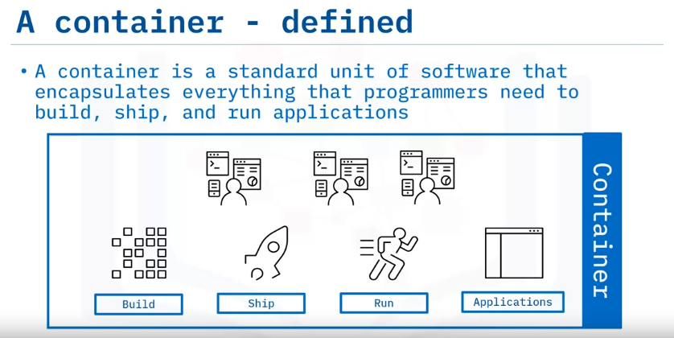
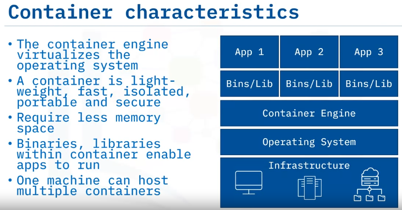
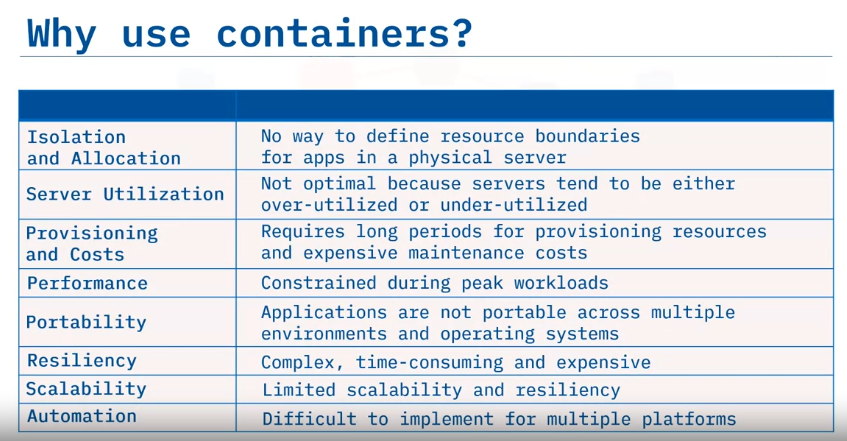

# Module 01 - Part 02 - Section 01: Introduction to Containers

## What are Containers?

Containers are a standard unit of software that encapsulates everything needed to build, ship, and run applications.

They are operating system-independent and can run on Windows, Linux, or macOS.

Containers are also programming language and IDE independent, supporting languages like Python, Node, Java, and more.

## Benefits of Containers

Containers enable organizations to:
- Quickly create applications using automation.
- Lower deployment time and costs.
- Improve resource utilization, including CPU and memory.
- Port across different environments.
- Support next-gen applications, including microservices.

--- 

## Challenges of Containers

Using containerization is not without its challenges:
- Server security can become an issue if its operating system is affected.
- Developers can become overwhelmed when managing thousands of containers.
- Converting monolithic legacy applications can be a complex process.
- Developers can experience difficulty right-sizing containers for specific scenarios.

---

## Popular Container Vendors

- **Docker**: A robust platform and the most popular container platform today.
- **Podman**: A daemon-less container engine that is more secure than Docker.
- **LXC**: Preferred by developers for data-intensive applications and operations.
- **Vagrant**: Offers the highest levels of isolation on the running physical machine.

## Recap

- Organizations are moving to containers to overcome challenges around isolation, utilization, provisioning, performance, and more
- A container is a standard unit of software that encapsulates everything needed to build, ship, and run applications
- Containers are operating system, programming language, and platform- independent
- They lower deployment time and costs, improve utilization, automate processes, and support next-gen applications (microservices)
- Container management, legacy projects migration, and right-sizing are major challenges
- Major container vendors include Docker, Podman, LXC, and Vagrant

