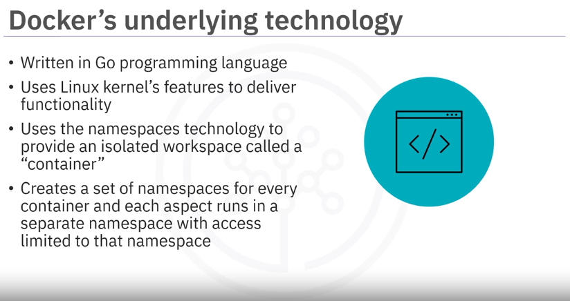
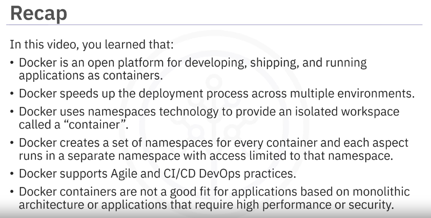

# Module 01 - Part 02 - Section 02 - Video: Introduction to Docker

## What is Docker?

Available since 2013, Docker is an open platform for developing, shipping, and running applications as containers.

It became popular with developers due to its simple architecture, massive scalability, and portability across multiple platforms, environments, and locations.

### Docker add-ons

Docker methodology inspired additional innovations:
- Tools: complementary tools such as Docker CLI Docker Compose, Prometheus
- Orchestrations Technologies: Docker Swarm or Kubernetes

## Benefits of Docker

Docker offers several benefits:
- Consistent and isolated environments result in stable application deployments.
- Fast Deployments: occur in seconds.
- Docker images are small and reusable, speeding up the development process.
- Automation capabilities help eliminate errors, simplifying the maintenance cycle.
- Supports Agile and CI/CD DevOps practices.
- Easy versioning speeds up testing, rollbacks, and redeployments.
- Helps segment applications for easy refresh, cleanup, and repair.
- Highly portable due to platform independence.

## Challenges of Docker

Docker is not suitable for applications that:
- Require high performance or security.
- Are based on monolithic architecture.
- Use rich GUI features.
- Perform standard desktop or limited functions.

## Summary - Recap

