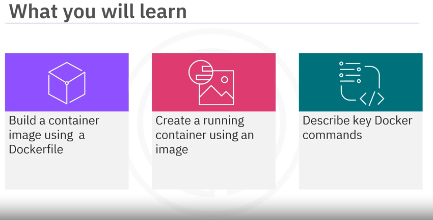
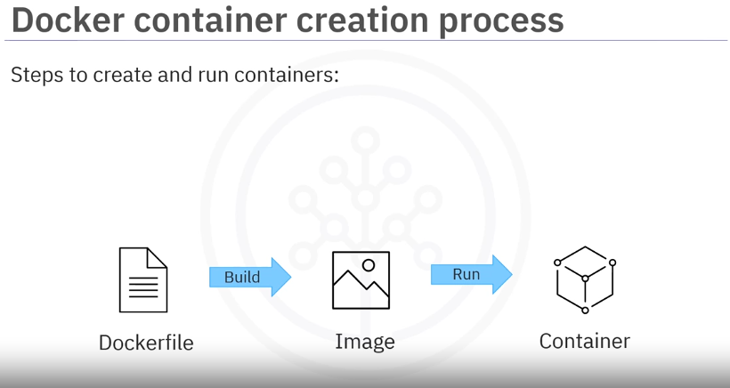
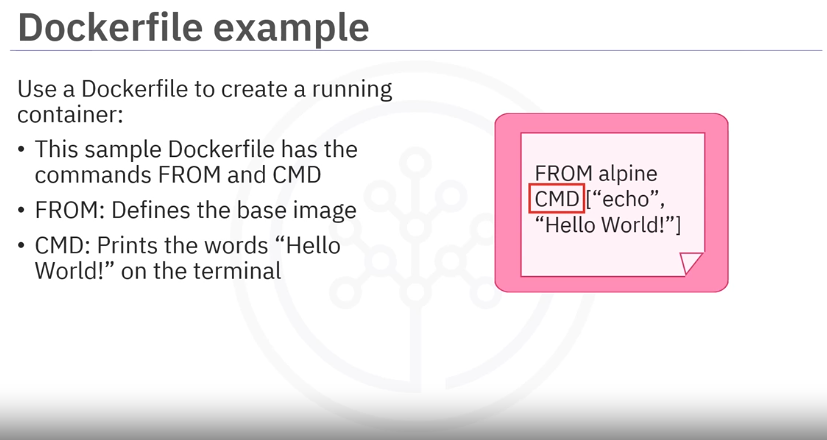
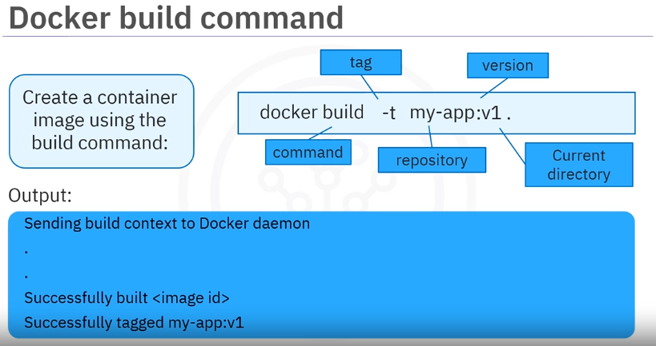
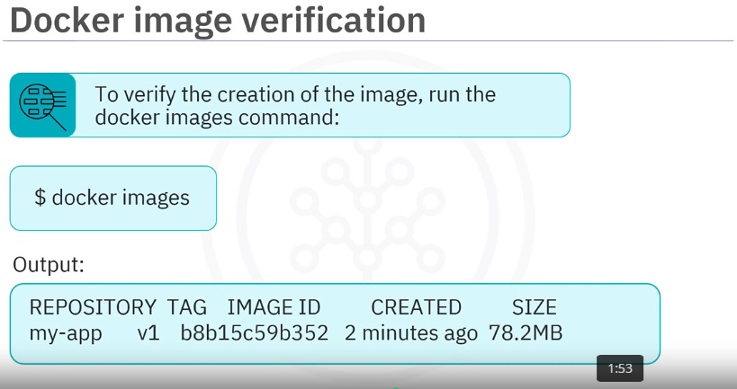
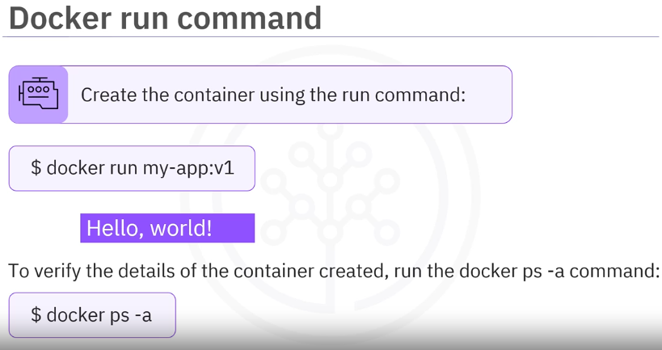
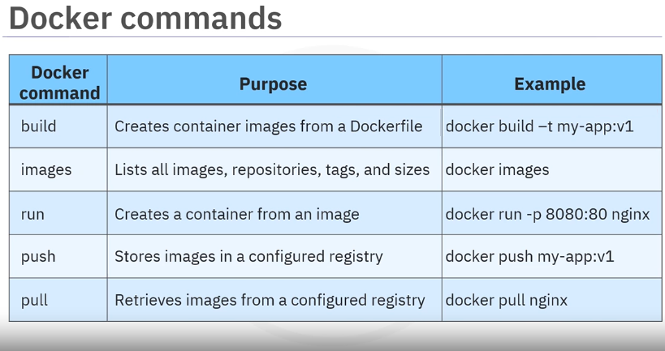

# Module 1 - Part 2 - Section 03: Video - Building and Running Container Images

## Introduction

In this section, you will learn the steps to create and run containers using Docker. This includes creating a Dockerfile, building a container image, and running the container.



## Steps to Create and Run Containers



1. **Create a Dockerfile**: A Dockerfile contains the instructions to build a Docker image. For example: 

   - `FROM` defines the base image.
   - `CMD` specifies the command to run.
 
   ```dockerfile
    FROM alpine:latest
    CMD ["echo", "Hello, World!"]
    ```

   - [Dockerfile example](resources/03/Dockerfile)

   

2. **Build the Container Image**: Use the Docker build command to create an image from the Dockerfile.

   

   ```sh
    docker build -t my-app:v1 .
    ```

    - `build`: the docker CLI command to build an image.
    - `-t` tags the image with a name and version.
    - `my-app:v1` specifies the image name and version.
    - `.` specifies the current directory as the build context.

3. **Verify the Image Creation**: Use the Docker images command to list all images.

   

   ```sh
    docker images
    ```

    - This command displays the repository, tag, image ID, creation date, and size.

4. **Run the Container**: Use the Docker run command to create and run a container from the image.

   
    
    ```sh
    docker run my-app:v1
    ```
    - This command runs the container and executes the specified command.

5. **Verify the Running Container**: Use the Docker ps command to list all running containers.
    
    ```sh
    docker ps
    ```

    - This command displays the container ID, image, command, creation time, status, ports, and names.

## Summary

Learned the steps to create and run containers using Docker.

This includes creating a Dockerfile, building a container image, and running the container.

Key Docker commands include `build`, `images`, `run`, `ps`, `push`, and `pull`.

