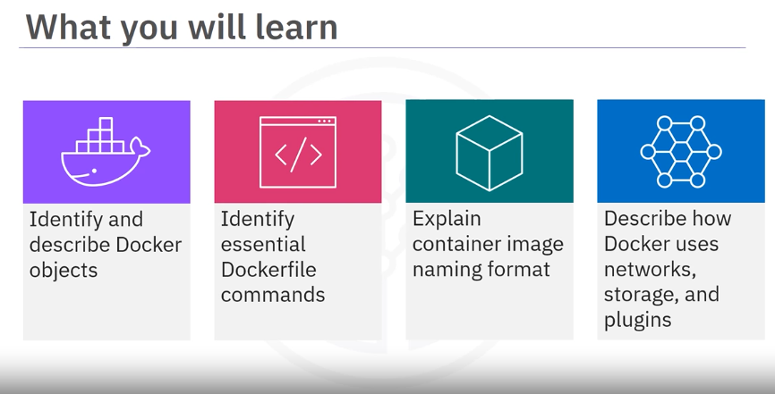
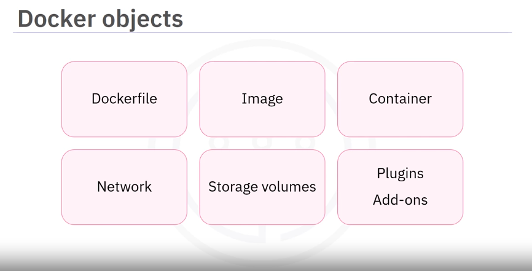
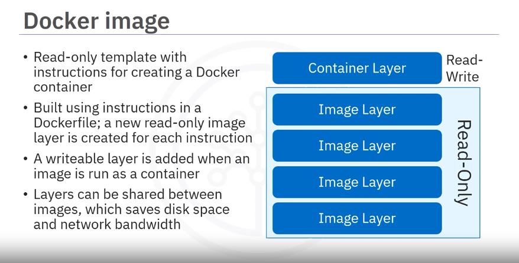
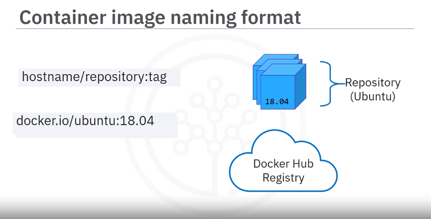
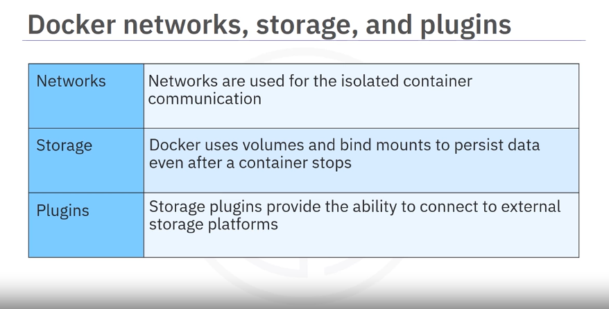

# Module 1 - Part 2 - Section 4: Video - Docker Objects

## Introduction

In this section, we will learn about various Docker objects, including essential Docker instructions,

Docker containers, image name format, networks, volumes, and plugins.

## Docker Objects

## Dockerfile

A Dockerfile is a text file that contains instructions needed to create an image

The Dockerfile is created using any editor from the console or terminal.

### Essential Docker Instructions in Dockerfile

Dockerfiles use several essential instructions to build images:
- **FROM**: Specifies the base image.
- **RUN**: Executes commands in the container.
- **CMD**: Provides the default command to run when the container starts.

## Docker Image

Docker image:
- Is a Read-only template with instructions for creating a Docker container
- Is built using instructions in a Dockerfile; a new read-only image layer is created for each instruction
- A writeable layer is added when an image is run as a container: when change the Dockerfile and rebuild the changed layer
- Layers can be shared between images, which saves disk space and network bandwidth when sending and receiving images
  - when instantiate this image, got a running container, at this point, a writable container layer is placed on top of the read only layers
  - the writable layer is needed because containers are not immutable as images.

### Image Name Format

An image name format consists of three identifiers: `hostname/repository:tag`
- **Host Name**: The registry where the image is stored.
- **Repository**: The name of the image.
- **Tag**: The version of the image.

## Docker Container

- Is a runnable instance of an image
- Can be created, stopped, started, or deleted using the Docker API or CLI
- Can connect to multiple networks, attach storage, or create a new image based on its current state
- Is well isolated from other containers and its host machine

Containers are lightweight and portable, providing isolated environments for applications.

## Docker Networks, Storage, and Plugins

### Networks

Docker uses networks to isolate container communications.

Networks provide a way for containers to communicate with each other and with external systems.

### Volumes

Docker uses volumes and bind mounts to persist data even after a container stops running.

Volumes are the preferred mechanism for persisting data generated by and used by Docker containers.

### Plugins

Plugins, such as storage plugins, provide the ability to connect to external storage platforms.

Plugins extend Docker's functionality and integrate with other systems.

## Summary

In this video, we learned about various Docker objects, including essential Docker instructions (FROM, RUN, CMD), Docker containers, image name format, networks, volumes, and plugins. These objects are fundamental to understanding and using Docker effectively.

- Docker contains objects such as Dockerfiles, images, containers, networks, storage volumes, plugins, and add-ons
- Essential Docker instructions include FROM, RUN, and CMD
- A docker container is a runnable instance of an image
- An image name consists of three identifiers: the hostname, the repository, and the tag
- When using Docker, networks help isolate container communications
- Docker uses volumes and bind mounts to persist data even after a container stops running
- Plugins, such as storage plugins, provide the ability to connect external storage platforms

