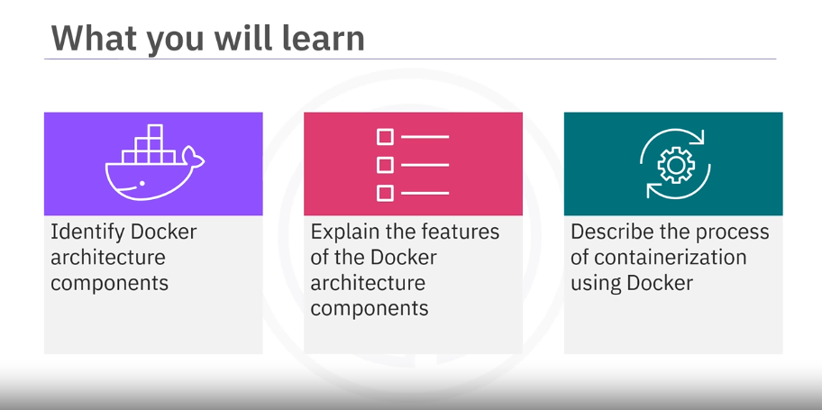
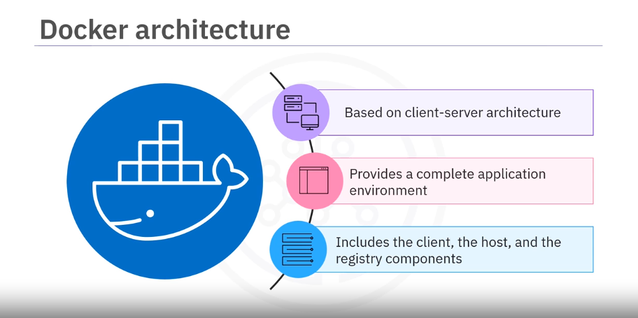
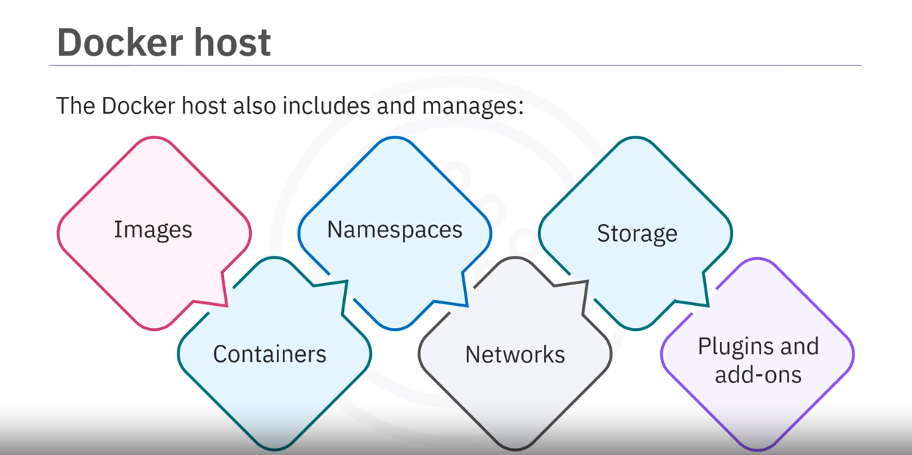
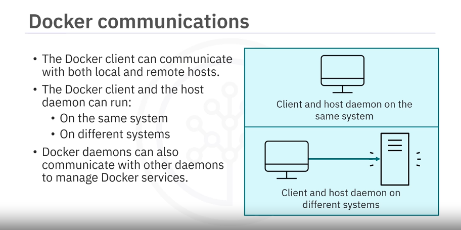
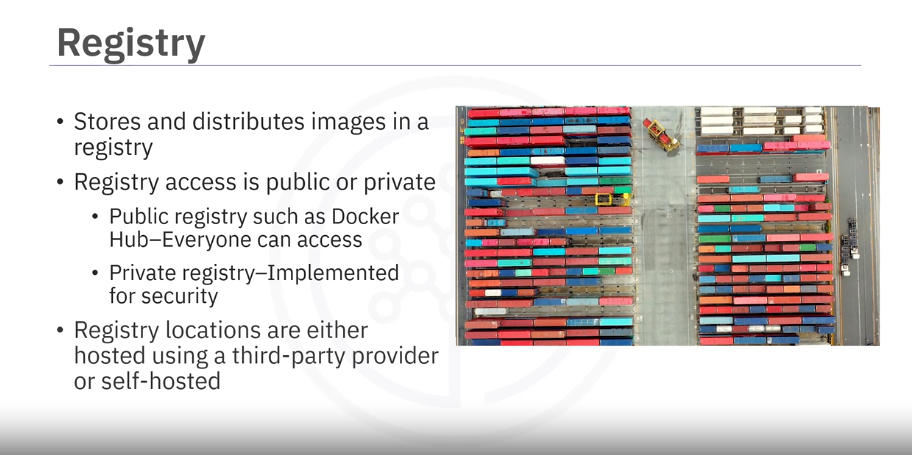
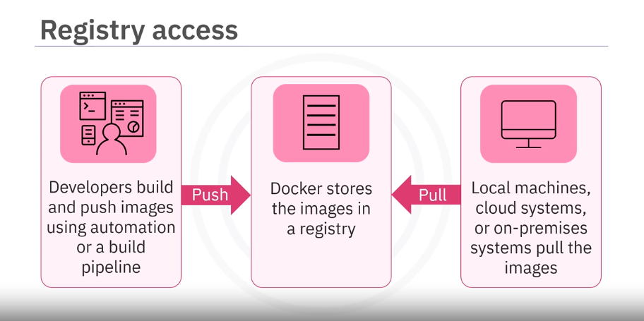

# Docker Architecture

## Introduction

In this section, you will learn about the components of Docker architecture, including the client, host, and registry, and the process of containerization using Docker.



## Components of Docker Architecture

 

### Docker process overview

1.	Using either the Docker command line interface (CLI) or REST APIs, the Docker client sends instructions or commands to the Docker host server.
2.	The Docker host server, referred to as the host, includes the Docker daemon known as `dockerd`.
3.	The daemon listens for Docker API requests or commands such as “docker run” and processes those commands.
4.	The daemon builds, runs, and distributes containers to the registry
5.	The registry stores the images.

### Docker Host



The Docker host contains the Docker daemon (`dockerd`), which listens for Docker API requests and processes commands such as `docker run`.

The daemon handles the heavy lifting of building, running, and distributing Docker containers.

The host also manages images, containers, networks, storage, plugins, and add-ons.

### Docker Client

The Docker client is the primary interface for users to interact with Docker.

It can be accessed via the command line interface (CLI) or REST APIs.

The client sends instructions to the Docker host.



### Docker Registry



The Docker registry stores and distributes Docker images.

Registries can be public, like Docker Hub, or private, often used by enterprises for security reasons.

Images are pushed to the registry by developers and pulled by local machines, cloud systems, or on-premises systems.

Some third-party provider to host registry: AWS ECR, IBM Cloud Container Registry, Azure Container Registry, Google Container Registry.



## Containerization Process

[Containerization Process flow simulating video](resources/05/docker-architecture_containerization-process-flow.mp4)

1. **Build the Image**: Use an existing base image or a Dockerfile to create a container image.
    ```sh
    docker build -t my-app:v1 .
    ```
2. **Push the Image**: Store the image in the registry.
    ```sh
    docker push my-app:v1
    ```
3. **Run the Container**: Create and run a container from the image.
    ```sh
    docker run my-app:v1
    ```
4. **Pull the Image**: If the image is not available locally, the Docker client connects to the registry and pulls the image to the host.

## Summary

In this video, we learned that Docker architecture consists of a Docker client, a Docker host, and a registry. The client interacts with the host using commands and REST APIs. The Docker host includes the daemon (`dockerd`) and manages images, containers, networks, storage, plugins, and add-ons. Containerization is the process used to build, push, and run an image to create a running container.

- Docker architecture consists of a Docker client, a Docker host, and a registry
- The client interacts with the host using commands and REST APIs
- The Docker host includes the daemon, called dockerd
- The Docker host also manages images, containers, namespaces, networks, storage, plugins, and add-ons
- Containerization is the process used to build, push, and run an image to create a running container

