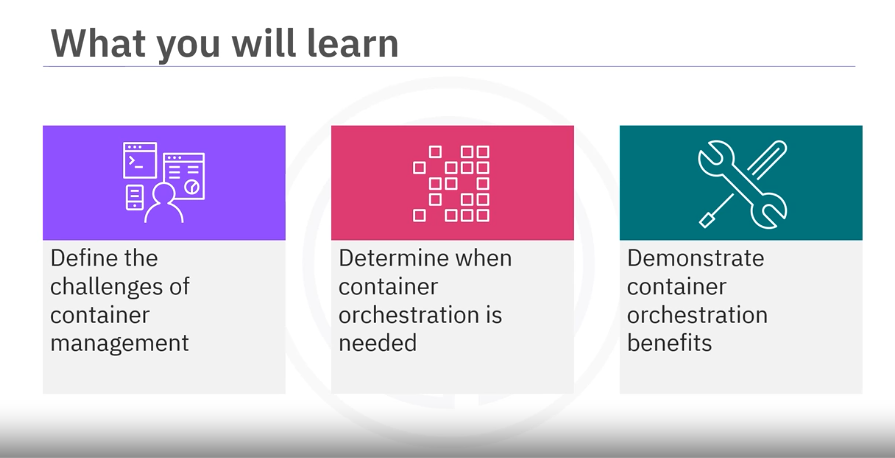
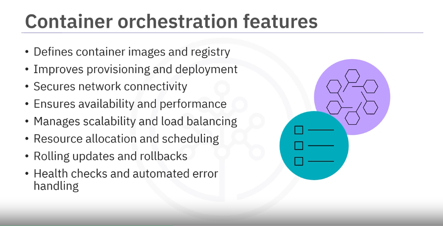
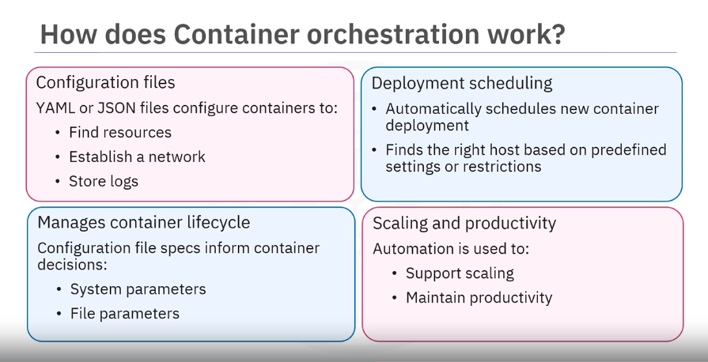
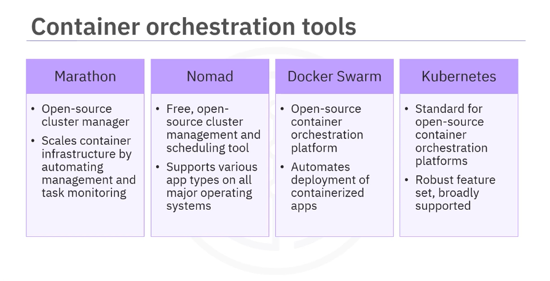
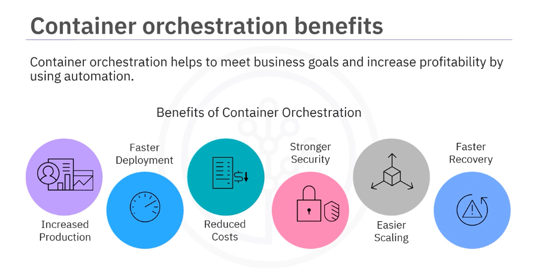

# Module 2 - Section 1: Video - Container Orchestration

## Table of Contents

- [Module 2 - Section 1: Video - Container Orchestration](#module-2---section-1-video---container-orchestration)
  - [Table of Contents](#table-of-contents)
  - [Introduction](#introduction)
  - [Challenges of Container Management](#challenges-of-container-management)
  - [Need for Container Orchestration](#need-for-container-orchestration)
  - [Container Orchestration Features](#container-orchestration-features)
  - [How does Container orchestration work?](#how-does-container-orchestration-work)
  - [Popular Container Orchestration Tools](#popular-container-orchestration-tools)
  - [Container Orchestration benefits](#container-orchestration-benefits)
  - [Summary](#summary)

## Introduction

Welcome to container orchestration.

Able to define the challenges of container management, determine when container orchestration is needed, and demonstrate container orchestration benefits.

## Challenges of Container Management

Everyone's container journey starts with one container. However, things don't stay this way for long.

Over time, new applications are written and projects are deployed globally to increase availability.

That one initial container inevitably becomes several containers. Initially, that growth is easy to handle, but soon it's overwhelming. Consider connecting, managing, and scaling hundreds or thousands of containers into a large application like a database or web app. This can easily get out of control.

## Need for Container Orchestration

To create, scale, and manage large numbers of containers, container orchestration is needed. 

Container orchestration is a process that automates the container life cycle of a container-based or containerized application.

This includes:

- deployment
- management
- scaling
- networking
- availability

Container orchestration is necessary in large dynamic environments since it:
- streamlines complexity
- enables hands-off deployment and scaling
- increases speed, agility, and efficiency
- seamlessly integrates into CI/CD workflows and DevOps practices
- allows development teams to use resources more efficiently.

## Container Orchestration Features

Container orchestration can be implemented on-premises and on public, private, or multi-cloud environments.

It is often a critical part of an organization's security, orchestration, automation, and response requirements, also known as SOAR requirements.

Container orchestration tools have a wide variety of features.

These features include defining:

- **Defines container images and registry**: which container images make up the application and where they are located, in what registry,
- **Improves provisioning and deployment**: improve provisioning and deployment of containers for a more automated, unified, and smooth process,
- **Secures network connectivity**: secure network connections between containers
- **Ensures availability and performance**: by relocating the containers to another host if an outage or shortage of system resources occurs
- **Manages scalability and load balancing**: scaling containers to meet demand and load balance requests
- **Resource allocation and scheduling**: handling resource allocation and scheduling of containers to the underlying infrastructure
- **Rolling updates and rollbacks**: performing rolling updates and rollbacks.
- **Health checks and automated error handling**: conducting health checks to ensure applications are running or performing the necessary actions when checks fail.

## How does Container orchestration work?

- **Configuration files**: container orchestration uses configuration files written in YAML or JSON to define the desired state of the application.
  - Find resources
  - Establish a network
  - Store logs

- **Deployment scheduling**:
  - Automatically schedules a new container deployment: schedules the deployment of a new container to a cluster
  - Finds the right host based on predefined settings or restrictions

- **Manages container lifecycle**: Configuration file specs inform container decisions:
  - System parameters: like CPU, memory,...
  - File parameters: like proximity and file metadata

- **Scaling and productivity**: Automation is used to:
  - Support scaling: scaling and enhance productivity through automation

## Popular Container Orchestration Tools

Here are some well-known container orchestration tools:

- **Marathon**:
  - A framework for Apache Mesos, an open-source cluster manager that was developed by the University of California at Berkeley
  - It allows you to scale container infrastructure by automating the bulk of management and monitoring tasks.
- **HachiCorps Nomad**:
  - A free and open-source cluster management and scheduling tool that supports Docker and other standalone, virtualized, or containerized applications on all major operating systems across all infrastructure, whether on-premises or in the Cloud. This flexibility lets teams work with any type and level of workload.
- **Docker Swarm**:
  - Automates the deployment of containerized applications but was designed specifically to work with Docker Engine and other Docker tools, making it a popular choice for teams already working in Docker environments.
- **Kubernetes**:
  - Developed by Google and maintained by the Cloud Native Computing Foundation (CNCF), the open-source platform Kubernetes is the de facto standard for container orchestration. Kubernetes automates a host of container management tasks, including deployment, storage provisioning, load balancing, scaling, service discovery, and self-healing, the ability to restart, replace, or remove a failed container. With broad functionality and an expanding ecosystem of open-source supporting tools, Kubernetes is widely supported by leading Cloud providers, many of whom now offer fully managed Kubernetes services.

## Container Orchestration benefits

- Increased productivity by removing the burden of individually installing and managing each container, reducing errors, and freeing development teams to focus on application improvement.
- Faster deployments by iteratively releasing new features and capabilities faster and deploying containers and containerized applications rapidly.
- Reduced costs as service containers have lower overhead and use fewer resources than virtual machines or traditional servers.
- Stronger security by sharing resources and isolating application processes, improving the container's overall security.
- Easier scalability by scaling applications using a single command.
- Faster error recovery by maintaining high availability and automatically detecting and resolving issues like infrastructure failures.

## Summary

- Managing tons of containers is difficult
- Container orchestration automates the container lifecycle resulting in faster deployments, reduced errors, higher availability, and stronger security
- Popular container orchestration tools include Marathon, Nomad, Docker Swarm, and Kubernetes
- Container orchestration improves productivity, deployments, costs, security, scalability, and error recovery
