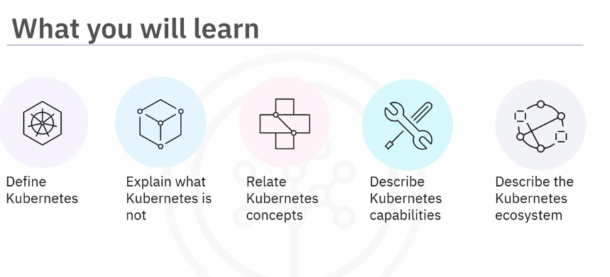
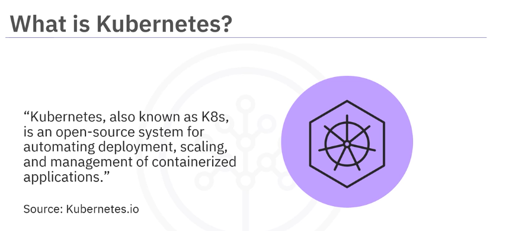
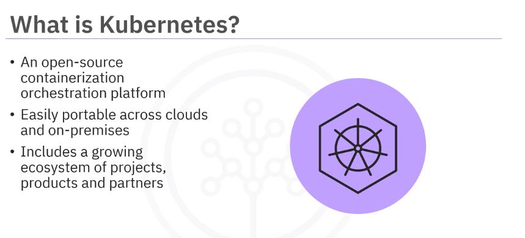
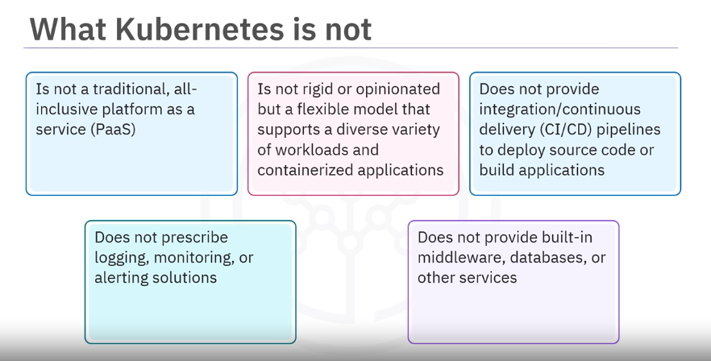
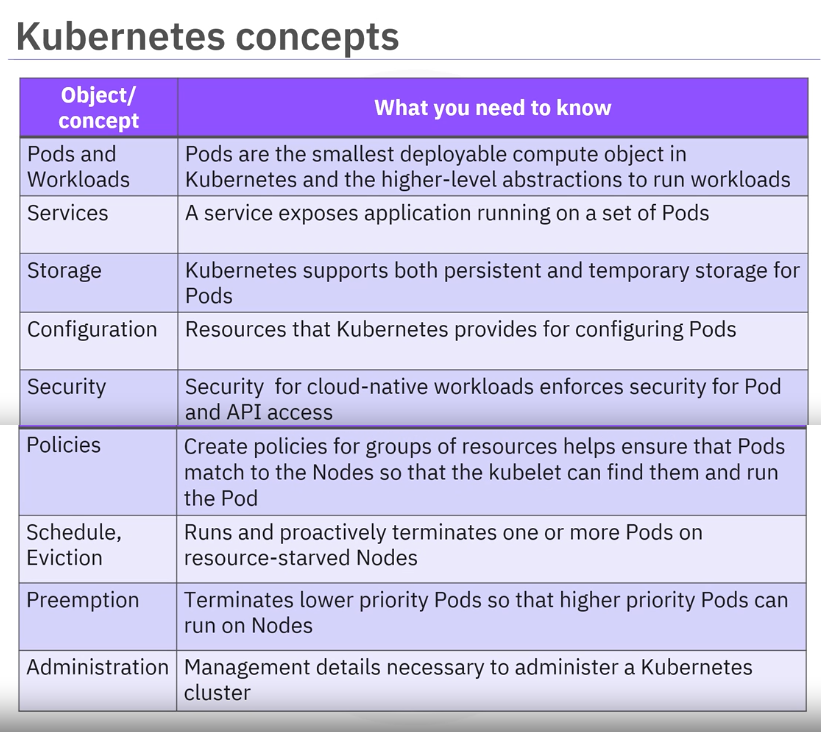
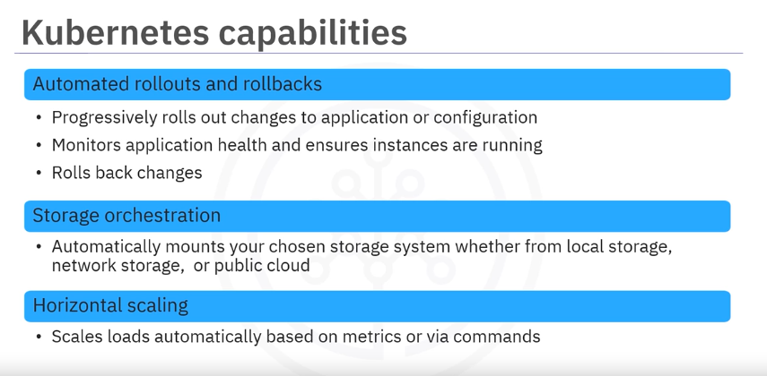

# Module 2 - Section 2: Video - Introduction to Kubernetes

## Introduction

Welcome to the introduction to Kubernetes, you will be able to define Kubernetes, explain what Kubernetes is not, relate Kubernetes concepts, describe Kubernetes capabilities, and describe the Kubernetes ecosystem.

## What is Kubernetes?

The official Kubernetes documentation describes Kubernetes as an open-source system for automating the deployment, scaling, and management of containerized applications.

Kubernetes is widely available and has positioned itself as the de facto choice for [container orchestration](01_v_container-orchestration.md)

- It is an open-source containerization orchestration platform developed by Google and currently maintained by the Cloud Native Computing Foundation (CNCF).
- Kubernetes is easily portable across clouds and on-premises environments. 
- Includes a growing ecosystem of projects, products and partners (both member and non-member).
- Kubernetes is recognized as the go to container orchestration solution. Kubernetes as a service grew as an extension of container as a service (CaaS).
- Kubernetes facilitates declarative management in which it automatically performs the necessary operations towards achieving the called for state.

## What Kubernetes is Not

- Kubernetes is not a traditional all-inclusive platform as a service(PaaS).
- It is not rigid or opinionated but a flexible model supports diverse variety of workloads, including stateless, stateful, and data processing workloads. It can work with all applications that can be containerized.
- It does not provide continuous integration/continuous delivery (CI/CD) pipelines to build applications or deploy source code.
- It does not prescribe logging, monitoring, and alerting solutions. Organizations are free to select and integrate third party and open-source tools.
- It does not provide built-in middleware, databases, or other services.

## Kubernetes Concepts

- **Pods**: Represent the smallest deployable compute object and the higher-level abstractions to run workloads.
- **Services**: Expose applications running on sets of pods. Each pod is assigned a unique IP address, and sets of pods have a single DNS name.
- **Storage**: Supports both persistent and temporary storage for pods.
- **Configuration**: Refers to the provisioning of resources for configuring pods.
- **Security**: Enforces security for pod and API access.
- **Policies**: Ensure that pods match to nodes so that the **kubelet** can find them and run the pods.
- **Scheduling and Eviction**: Runs and proactively terminates one or more pods on resource-starved nodes.
- **Preemption**: which is all about prioritization Terminates lower priority pods so that higher priority pods can schedule and run on nodes.
- **Cluster Administration**: Provides the details necessary to create or administer a cluster.

## Kubernetes Capabilities

- **Automated Rollouts and Rollbacks**: automated rollouts of changes to application or configuration.
- **Health Monitoring**: Rolling back changes if necessary.
- **Storage Orchestration**: Mounts a chosen storage system, including local storage, network storage, or public cloud.
- **Horizontal Scaling**: Scales workloads based on metrics or via commands.
- **Automated Bin Packing**: Increases utilization and cost-saving using a mix of critical and best-effort workloads.
- **Secret and Configuration Management**: Manages sensitive information, including passwords, OAuth tokens, and SSH keys.
- **IPv4/IPv6 Dual Stack Support**: Assigns both IPv4 and IPv6 addresses to pods and services.
- **Batch Execution**: Manages batch and continuous integration workloads.
- **Self-Healing**: Automatically replaces failed containers.
- **Service Discovery and Load Balancing**: Discovers pods using IP addresses or a DNS name and load balances traffic for better performance and high availability.
- **Designed for Extensibility**: Adds features to your cluster without modifying source code.

## Kubernetes Ecosystem

The Kubernetes ecosystem is a large, rapidly growing ecosystem with services, support, and tools that are widely available. Running containerized applications require separate tools. In addition to the Kubernetes orchestration tool, the ecosystem includes services like building container images, storing images in a container registry, application logging and monitoring, and CI/CD capabilities.

### Public Cloud Providers
- Prisma
- IBM
- Google
- AWS

### Open Source Framework Providers
- Red Hat
- VMware
- SUSE
- Mesosphere
- Docker
- Cloud Foundry

### Management Providers
- Digital Ocean
- Loodse
- SUPERGIANT
- CloudSoft
- Turbonomic
- Tectonic
- Weaveworks

### Tool Providers
- JFrog
- Univa
- Aspen Mesh
- Bitnami
- Cloud 66

### Monitoring and Logging Providers
- Sumo Logic
- Datadog
- New Relic
- Iguazio
- Grafana
- SignalFX
- Sysdig
- Dynatrace

### Security Providers
- Guardicore
- Black Duck
- Yubico
- Cilium
- Aqua
- Twistlock
- Alcide

### Load Balancing Providers
- AVI Networks
- VMware
- NGINX

## Summary

In this video, you learned that Kubernetes is a highly portable, horizontally scalable open-source container orchestration system with automated deployment and simplified management capabilities. Its concepts include pods and workloads, services, storage, configuration, security, policies, scheduling and eviction, preemption, and administration. Kubernetes capabilities include automated rollouts and rollbacks, storage orchestration, horizontal scaling, automated bin packing, secret and configuration management, IPv4/IPv6 dual stack support, batch execution, self-healing, service discovery and load balancing, and extensibility. The Kubernetes ecosystem includes public cloud providers, frameworks, management, tools, monitoring and logging, security, and load balancing.