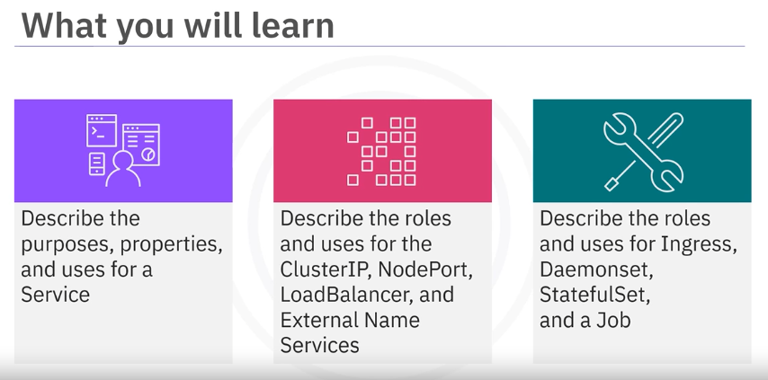

# Module 2 - Section 5: Video - Kubernetes Objects Part 2

## Table of Contents

- [Introduction](#introduction)
- [DaemonSet](#daemonset)
- [External Name Service](#external-name-service)
- [StatefulSet](#statefulset)
- [Job](#job)

## Introduction

In this section, we will continue exploring Kubernetes objects, focusing on DaemonSets, External Name Services, StatefulSets, and Jobs.

## DaemonSet

A DaemonSet ensures that there is at least one instance of the Pod on all your nodes.

## External Name Service

You can use External Name to create a Service that represents external storage and enables Pods from different namespaces to talk to each other.

## StatefulSet

A StatefulSet manages stateful applications, manages Pod deployment and scaling, maintains a sticky identity for each Pod request, and provides persistent storage volumes for your workloads.

## Job

A Job creates Pods and tracks the Pod completion process. Jobs are retried until completed.

## Summary
