# Module 2 - Section 5: Video - Kubernetes Objects Part 2

## Table of Contents

- [Module 2 - Section 5: Video - Kubernetes Objects Part 2](#module-2---section-5-video---kubernetes-objects-part-2)
  - [Introduction](#introduction)
  - [Service](#service)
    - [Service Properties](#service-properties)
    - [Why is a Service needed?](#why-is-a-service-needed)
    - [Service Types](#service-types)
    - [Cluster IP Service](#cluster-ip-service)
    - [NodePort Service](#nodeport-service)
    - [External Load Balancer (ELB) Service](#external-load-balancer-elb-service)
    - [External Name Service](#external-name-service)
  - [Ingress](#ingress)
  - [DaemonSet](#daemonset)
  - [StatefulSet](#statefulset)
  - [Job](#job)
  - [Summary]

## Introduction

In this video, you will learn about various Kubernetes objects and their functionalities.

## Service

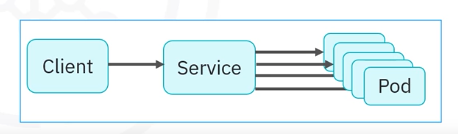

A service in Kubernetes:

- Is a REST object , like Pods.
- Is a logical abstraction that represents a set of Pods in a cluster.
- Provides policies that define how to access the associated Pods and cluster.
- Acts as a load balancer across the Pods.
- Is assigned a unique IP address for accessing applications deployed on Pods.
- Eliminates the need for a separate service discovery process/mechanism.

### Service Properties

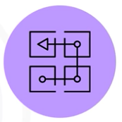

- Support multiple protocols such as TCP (default), UDP, SCTP, others.
- Support multiple ports definitions.
  - The port number with the same name can vary in each backend Pod.
- A Service can have an optional selector.
- Optionally map incoming ports to a target port.

### Why is a Service needed?

- Pods in a cluster are volatile
  - A service is needed because Pods in a Kubernetes cluster are ephemeral:
    - Can be destroyed and new Pods can be created at any time.
- The volatility leads to discoverability issues because of changing IP addresses.
- A service keeps track of the changes and exposes a single IP addresses or a DNS name.
- A service utilize selectors to target a set of Pods.

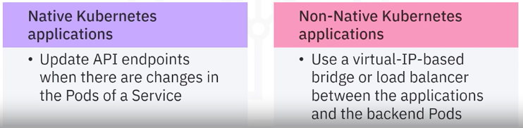

- For native Kubernetes applications, API endpoints are updated whenever changes are detected to the Pods in the service.
- For non-native applications, Kubernetes uses a virtua- IP-based bridge or load balancer in between the applications and the backend Pods.

### Service Types

There are four types of Services in Kubernetes:

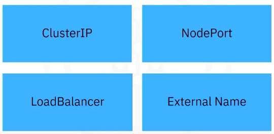

### Cluster IP Service

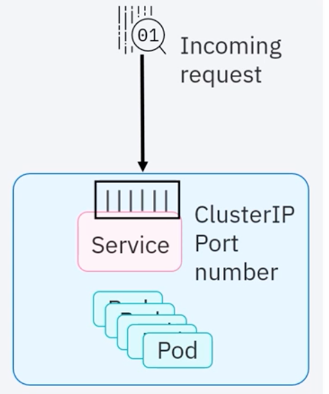

- Cluster IP is the default and most common service type.
- Cluster IP is assigned a Cluster-internal IP address to the Cluster IP Service that makes the Service only reachable within the cluster.
- A Cluster IP service cannot make requests to Service(Pods) from outside the cluster.
- Cluster IP address can be set in the Service definition file.
- Cluster IP service provides inter-service communication within the cluster.
  - For example, communication between a frontend and backend components of an application.

[More about Kubernetes Service](05_01_kubernetes-service.md)

### NodePort Service

- An extension of Cluster IP Service
- NodePort Service creates and routes the incoming requests automatically to the Cluster IP Service.
- Exposes the Service on each Node's IP address at a static port: Exposure of the service on each Node's IP address at a static port.
  - **Note**: for security purposes, production use is not recommended.
- Kubernetes exposes a single service with no load balancing requirements for multiple services.

### External Load Balancer (ELB) Service

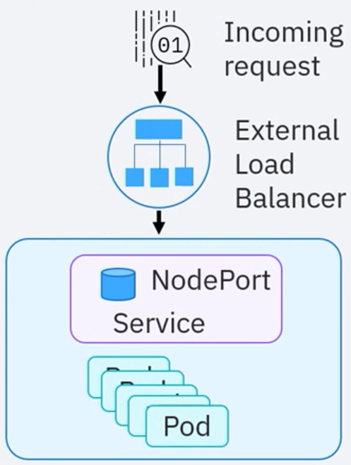

- An extension of the NodePort Service, an External Load Balancer creates NodePort and Cluster IP Services automatically.
- ELB integrates and automatically directs traffic to the NodePort Service with a Cloud Provider's ELB.
- To expose a Service to the Internet, need a new ELB with an IP address.
- Can use a Cloud Provider's ELB to host the cluster.

### External Name Service

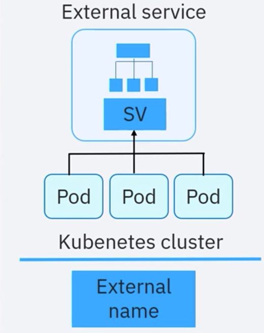

- External Name service maps to a DNS name and not to any selector.
- Requires a `spec.externalName` parameter in the Service definition file.
- Maps the Service to the contents of the `externalName` field that returns a CNAME record and its value.
- Used to create a Service that represents external storage and enables Pods from different namespaces to communicate with each other.

## Ingress

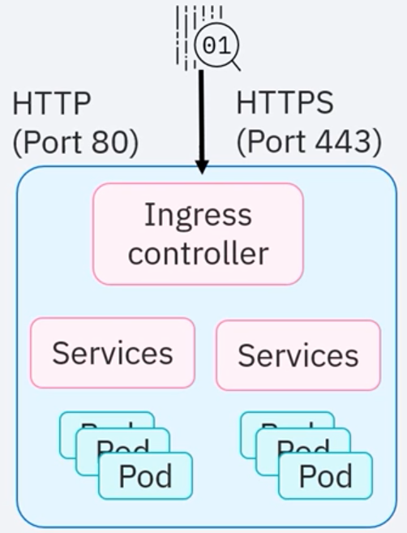

- Is an API object (combined with a controller) that provides routing rules to manage external users' access to multiple services in a Kubernetes cluster.
- In production, Ingress exposes applications to the Internet via port 80 for HTTP or port 443 for HTTPS.
- While the cluster monitors Ingress, an external load balancer is expensive and is managed outside the cluster.

## DaemonSet

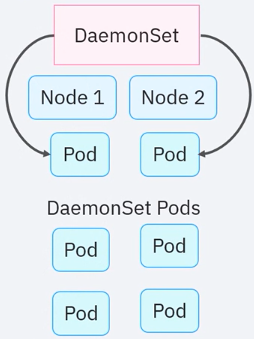

- Is an object that ensures that Nodes run a copy of a Pod.
- As Nodes are added to a cluster, Pods are added to the Nodes.
- Pods are garbage collected when removed from a cluster.
- If you delete a DaemonSet, all Pods are removed.
- DaemonSets are ideally used for storage, logs, and monitoring Nodes.

## StatefulSet

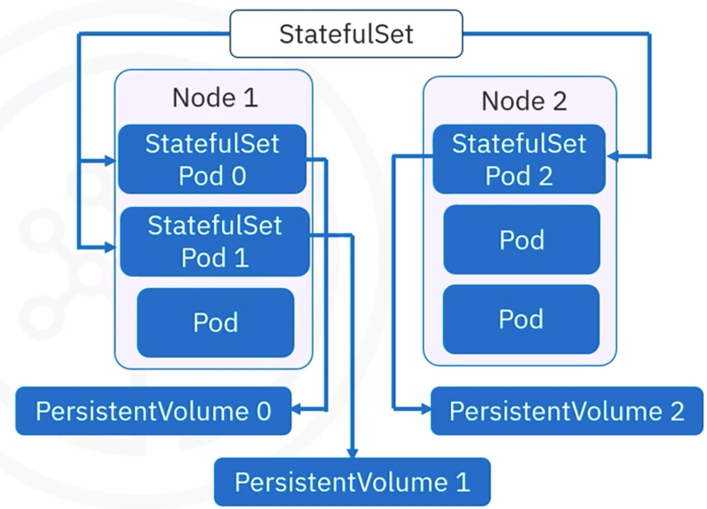

- A StatefulSet is an object that manages stateful applications
- Manages deployment and scaling of Pods
- Provides guarantees about the ordering and uniqueness of Pods.
- Maintains a sticky identity for each Pod.
- Provides persistent storage volumes for the workloads.

## Job

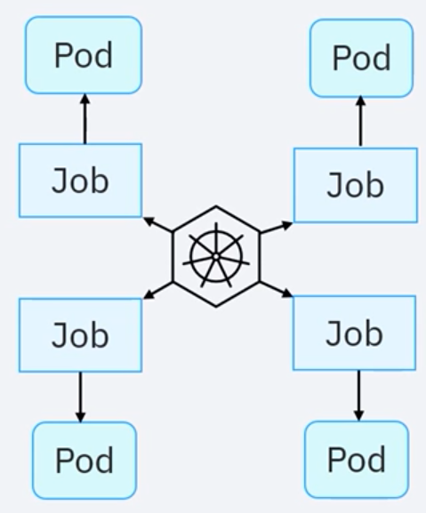

- A Job creates Pods and tracks the Pod completion process.
- Jobs are retried until completed.
- Deleting a Job will remove the created Pods.
- Suspending a Job will delete its active Pods until the Job resumes.
- A Job can run several Pods in parallel.
- A _CronJob_ is regularly used to create Jobs on an iterative schedule.

## Summary

Recap

- A service in K8S is a REST object that provides policies for accessing the Pods and cluster.
- Cluster IP is the default and most common service type and provides inter-service communication within the cluster.
- A NodePort Service creates and routes the incoming requests automatically to the Cluster IP Service.
- The External Load Balancer creates NodePort and Cluster IP Services automatically.
- Ingress is an API object that, when combined with a controller, provides routing rules to manage external users' access to multiple services in a Kubernetes cluster.
- Using a DaemonSet ensures that there is at least one instance of the Pod on all your nodes.
- Can use External Name to create a Service that represents external storage and enables Pods from different namespaces to talk to each other.
- A StatefulSet manages stateful applications, manages Pod deployment and scaling, maintains a sticky identity for each Pod request, and provides persistent storage volumes for your workloads.
- A Job creates Pods and tracks the Pod completion process. Jobs are retried until completed.
