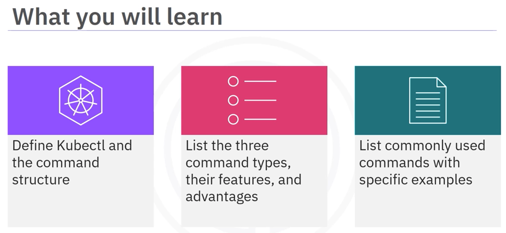
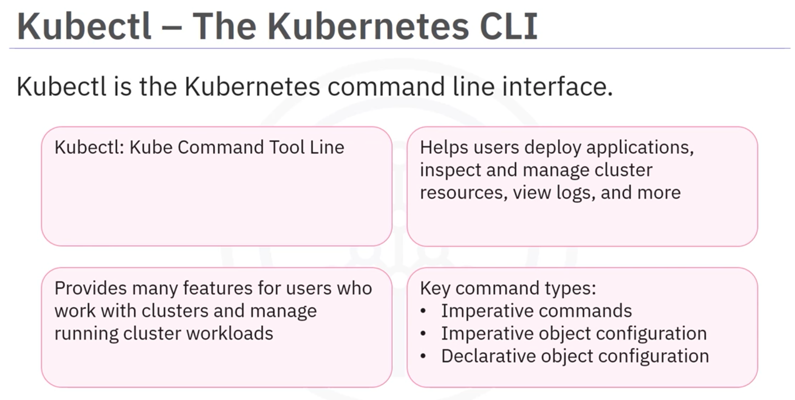
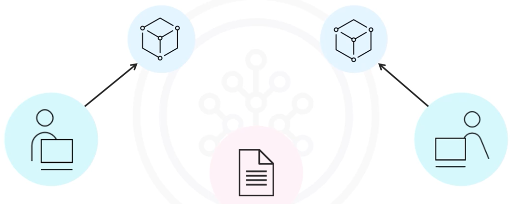
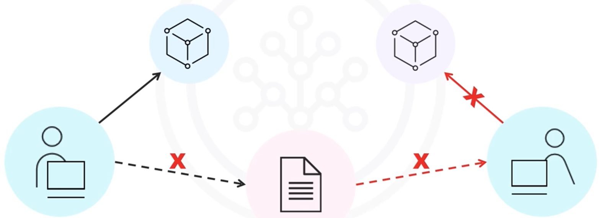
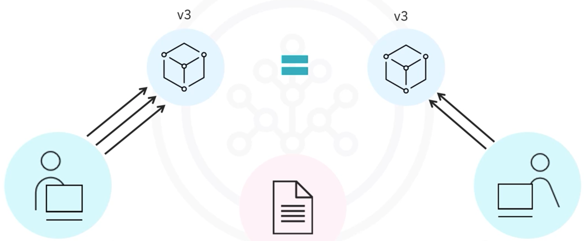
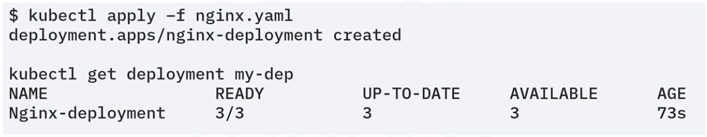

# Module 2 - Section 6: Using kubectl

## Table of Contents

- [Introduction](#introduction)
- [Command Structure](#kubectl-command-structure)
- [Command Types](#command-types)
  - [Imperative Commands](#imperative-commands)
  - [Imperative Object Configuration](#imperative-object-configuration)
  - [Declarative Object Configuration](#declarative-object-configuration)
- [Commonly Used kubectl Commands](#commonly-used-kubectl-commands)
- [Summary](#summary)

## Introduction

The Kubernetes command-line interface (CLI). 

## Kubectl - The Kubernetes Command-Line Interface

`kubectl` stands for kube command tool line

- Is essential for deploying applications, inspecting and managing cluster resources, viewing logs, and more.
- Provides many features for users who work with Kubernetes clusters and manage running cluster workloads.

### Kubectl Command Structure

`kubectl [command] [type] [name] [flags]`

`kubectl` commands follow a specific structure:
- **Command**: The operation to be performed (e.g., create, get, apply, delete).
- **Type**: The resource type (e.g., pod, deployment, replica set).
- **Name**: The resource name, if applicable.
- **Flags**: Special options or modifiers that override default values.

## Command Types

- There are three main types of `kubectl` commands:
  - Imperative commands
  - Imperative object configuration
  - Declarative object configuration

### Imperative Commands

Imperative commands allow to create, update, and delete live objects directly:

- Operations specified as arguments or flags.
- They are easy to learn and run
  - Example: to create a pod with a specific container: `kubectl run nginx --image=nginx`
- Do not provide an audit trail: which is important for tracking changes.
- Not flexible(no templates, no integration): since options are limited, they don't use templates, and they cannot integrate with change review processes
- Ideal for development and test environments.

Imperative Commands Limitations

- Example scenario:
    - 
    - Suppose a developer runs a command to deploy an application.
    - Another developer wants to deploy the same application, but they cannot because there is no configuration file
    - The second developer must check with the first developer for the exact command to deploy then run it

-> It would be best if both developers used a template for the deployment, since it overcomes the limitations of working with imperative commands.

### Imperative Object Configuration

- The kubectl command specifies required operations, optional flags, and at least one file name.
  - The specified configuration file must contain a full definition of the objects in YAML or JSON format.
    - To create the objects defined in the file, run the command `kubectl create -f nginx.yaml`
  - Configuration templates help replicate identical results
    - using the same configuration templates in multiple environments will produce identical results.

- Advantages:
  - Configuration files may be stored in a source control system like Git.
  - It can integrate with change processes
  - Provides audit trails and templates for creating new objects.
- Disadvantages:
  - Requires understanding of the object schema
  - Requires writing a YAML or JSON file

- Imperative approach limitations:
  - Need to specify all necessary command operations.
    - Example: if a developer performs an update operation that isn't merged into the configuration file, then another developer cannot use the updated configuration in future deployments.
    - 

### Declarative Object Configuration

It is better to define the desired state in a shared configuration file than when you deploy. Kubernetes automatically determines the necessary operations. This is known as declarative object configuration.

Declarative object configuration stores configuration data in files. 

- Operations are identified by Kubectl, not user
- Works on directories or individual files
  - Example: `kubectl apply -f ./config-directory/` -> applies configuration data to all files in that directory. the user is not required to perform any operations since they are performed by the system automatically.
- Configuration files define a desired state, and Kubernetes actualizes that state.
- This approach is the ideal method for production systems.

Example of Declarative Configuration benefits:

- 
- A developer performs updates to a running application. Since configuration data is stored in the shared template, there is still one source of truth for the configuration of this project.
- Even if another developer misses several of these updates, all they need to do is apply the current configuration template to ensure the deployed object is as expected.

## Commonly Used kubectl Commands

| Command   | Description                                                                                              |
|-----------|----------------------------------------------------------------------------------------------------------|
| apply     | Apply/change a configuration of a resource using a file or stdin                                         |
| create    | Create one or more resources using a file or stdin                                                       |
| describe  | Describe or detail a file/container                                                                      |
| get       | Access a file/container or other resource                                                                |
| delete    | Delete a file/container                                                                                  |
| autoscale | Apply autoscaling to the selected file/container                                                         |
| edit      | Make changes to a file/container                                                                         |
| exec      | Execute a command on a container in a specific pod                                                       |
| expose    | Make a running file/container available                                                                  |
| label     | Apply a label to a file/container                                                                        |

Here are a few commonly used `kubectl` commands and their descriptions:

- `kubectl get`: Accesses a file, container, or any other resource.
- `kubectl delete`: Deletes a file or container.
- `kubectl autoscale`: Applies the auto-scaling process to the selected file or container.
- `kubectl apply`: Creates resources using YAML or JSON files.
- `kubectl scale`: Scales the number of replicas.

### Kubectl command Example

- Kubectl `get` commands deal with listing different objects or resources in a Kubernetes cluster.
  - `kubectl get services` - List services in the current namespace.
  - `kubectl get pods --all-namespaces` - List pods in all namespaces.
  - `kubectl get deployment my-deployment` - List a particular deployment.
  - `kubectl get pods` - List pods in the current namespace.
- Kubectl `apply` commands create resources using YAML or JSON files.
  - `kubectl apply -f my-config.yaml -f my-config2.yaml`: They use extensions like `.yaml`, `.yml`, or `.json`
  - `kubectl apply -f https://examples.com/kubernetes/nginx-app.yaml`: You can use apply commands to create resources from multiple files or from a URL
- Kubectl `scale` commands scale the number of replicas.
  - `kubectl scale --replicas=3 -f my-deployment.yaml`: Can use scale commands to scale a replica set named `foo` to 3 
  - `kubectl scale --replicas=3 -f my-resource.yaml`: Can use scale commands to scale a resource in a `.yaml` file to 3

Create a resource (cmd + output): create a deployment with 3 replicas of the nginx image
- Creat the deployment: `kubectl apply -f nginx.yaml` -> output confirms the deployment creation: `deployment.apps/nginx-deployment created`
- Get the deployment: `kubectl get deployment` -> output confirms the creation of three replicas ready, up to date, and available

> Find all `kubectl` commands at [Kubernetes.io](https://kubernetes.io/docs/reference/kubectl/)

## Summary

- Kubectl is the Kubernetes command line interface
- The kubectl command structure is: `kubectl [command] [type] [name] [flags]`
- Imperative commands are the easiest to learn, have no audit trail, and are not flexible
- Imperative object configuration uses templates to ensure proper deployment replication
- Declarative object configuration is automated, requires no user input, and is ideal for production systems