# Module 3 - Section 01: ReplicaSet

## Introduction

In this section, we will learn about ReplicaSets in Kubernetes. A ReplicaSet ensures that a specified number of pod replicas are running at any given time.

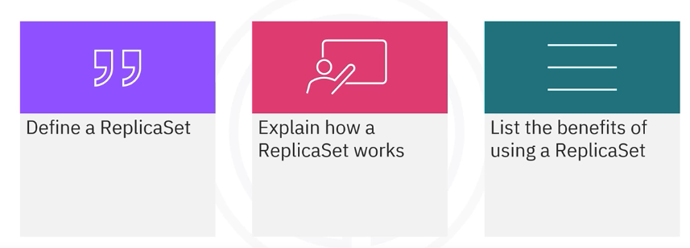

## Key Concepts

### Single pod deployment limitations

If an application is deployed on a single pod, it may not be able to handle increased requests, outages, or load balancing across pods.

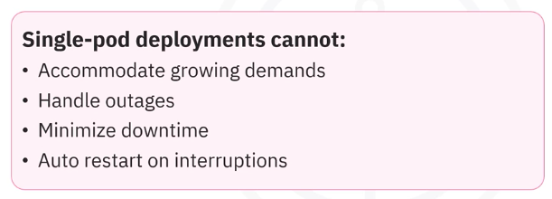

- Single pod deployments cannot accommodate the growing demands of an application and load balancing across pods.
- Handle outages by eliminating a single point of failure.
- Minimize downtime and service interruptions by providing high availability through redundant pods.
- Automatically restart deployments if something goes wrong. 

-> Can work around these limitations with a ReplicaSet: A ReplicaSet is used to overcome these limitations.

### ReplicaSet: Introduction - Definition

A ReplicaSet is a Kubernetes resource that ensures a specified number of pod replicas are running at any given time. It replaces the older ReplicationController and provides additional features.

A ReplicaSet ensures the right number of pods are always up and running. It always tries to match the actual state of the replicas to the desired state.

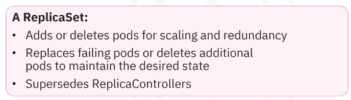

- A ReplicaSet adds or deletes pods for scaling and redundancy, which helps maintain availability. 
- Replaces failing pods or deletes additional pods to maintain the desired state.
- Supersedes a ReplicaController and should be used instead.

A ReplicaSet is created when you create a deployment in your cluster. Deployments manage ReplicaSets, send pods declarative updates, and have many other useful features. That's why a ReplicaSet is best managed by a deployment.

### ReplicaSet | Deployments | Pods - How it Works

Kubernetes keeps object types independent. 

A ReplicaSet does not own any of the pods. Instead, it uses pod labels to decide which pods to acquire when bringing a deployment to the desired state.

- A ReplicaSet maintains the desired number of pod replicas by creating or deleting pods as needed.
- It uses pod labels to identify which pods it should manage.
- The ReplicaSet controller continuously monitors the actual state of the pods and compares it to the desired state, making adjustments as necessary.

Deployment Template:

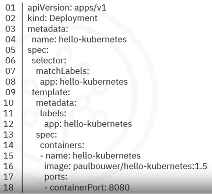

- The template metadata defines the labels and spec of potential pod candidates to add or delete.

## Create ReplicaSet from Deployment

A ReplicaSet is automatically created for you when you create a deployment. 

To check this, create a deployment and then use the `get replicaset` command to verify that the ReplicaSet is generated.

By default, the ReplicaSet only replicates to a single pod. 

Additionally, if you describe the pod, you will see the pod's details and that it is controlled by the same ReplicaSet.

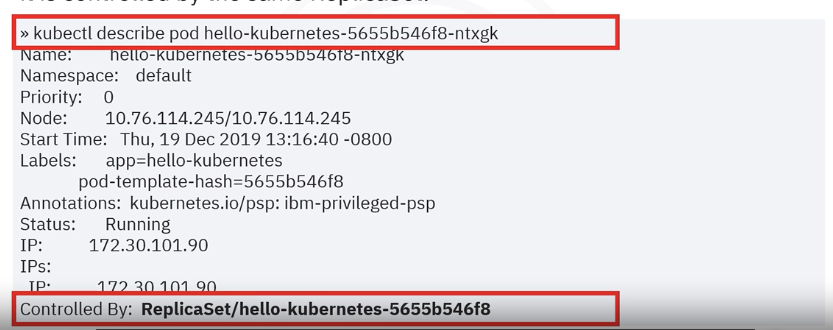

### Create ReplicaSet from Scratch

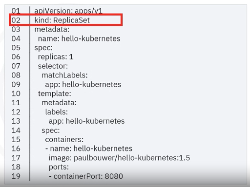

- To create a ReplicaSet from scratch, apply a YAML file with the kind attribute set to `ReplicaSet`.
- If you define the number of replicas as 1, you get one pod.

#### Steps:

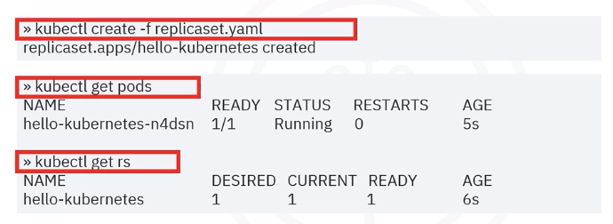

- Use the `kubectl create replicaset` command: The output shows a ReplicaSet was created.
- Confirm it was created by using the `kubectl get pods` command and observe the status as running.
- Use the `kubectl get rs` command: The output shows the name and other details of the newly created ReplicaSet and its pod.

> Creating a deployment that includes a ReplicaSet is recommended over creating a standalone ReplicaSet.

### ReplicaSet: Create deployment

Before you scale a deployment, you must ensure you have a deployment and a pod.

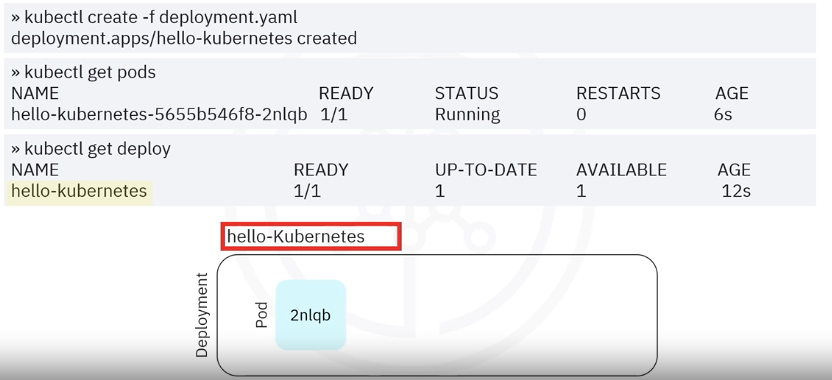

- Create a deployment using the `kubectl create` command: The output will confirm a deployment was created.
- The deployment creates a pod by default and you can confirm this with the `kubectl get pods` command: The output shows the pod name and other details.
- Check the deployment details with the `kubectl get deploy` command: The output shows the deployment is named `hello-kubernetes`.

### ReplicaSet: Scale deployment

Once the deployment and pod are in place, use the `scale` command to scale the deployment and set the desired number of replicas.

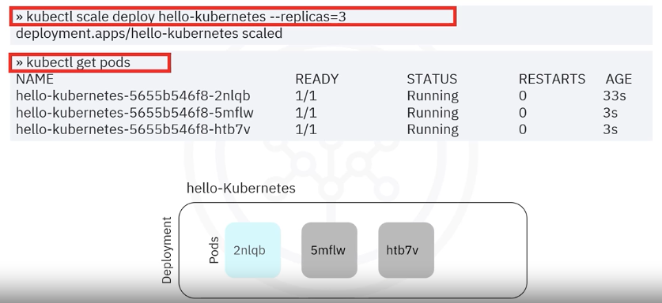

- Use the `kubectl scale` command: Here we set the number of replicas to three and the output confirms the deployment is scaled: `deployment.apps/hello-kubernetes scaled`.
- If you use the `kubectl get pods` command, you will see three pods running.

### ReplicaSet: Maintain Desired State

#### **Let's observe how the ReplicaSet maintains the desired state when the pod is deleted.**

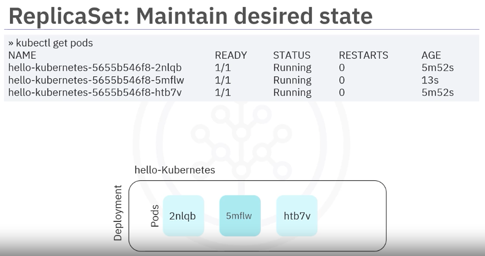

- Use the `kubectl get pods` command: Our three pods appear in the output as expected.

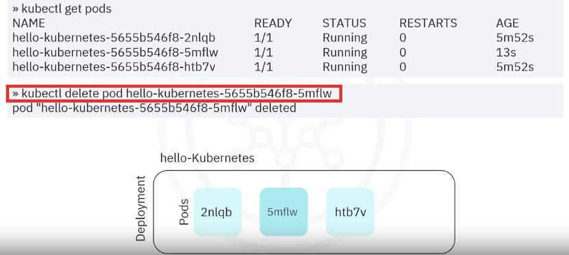

- Use the `kubectl delete pod` command to delete the pod ending in `5mflw`: the output shows the pod ending in `5mflw` is deleted.
  - Notice that the desired state does not match the actual state 
  - And that the deleted pod is replaced by a new pod automatically.

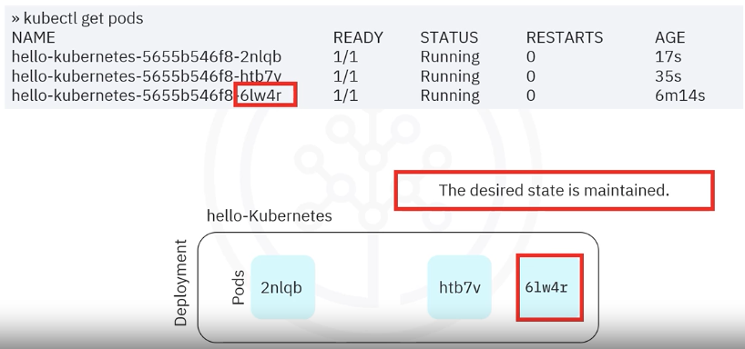

- Use the `kubectl get pods` command again: The output shows the ReplicaSet immediately created a new pod ending in `6lw4r`.
  - The desired state is maintained.

#### **Let's now observe how the ReplicaSet maintains the desired state when a pod is created.**

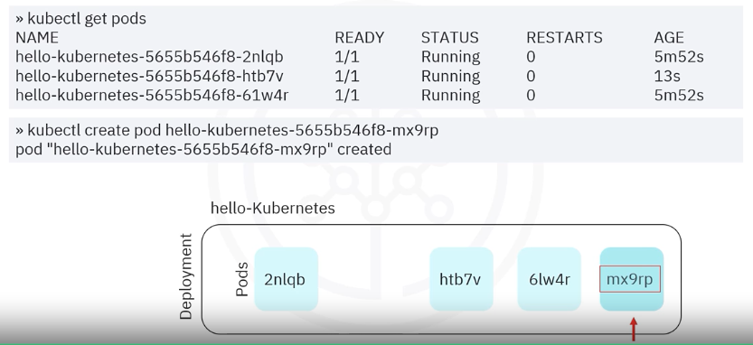

- Use the `kubectl get pods` command: Our three pods from before appear in the output as expected.
- Use the `kubectl create pod` command to create a pod ending in `mx9rp`.

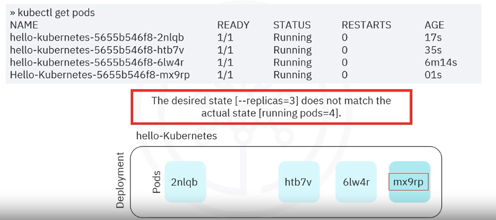

- Use the `kubectl get pods` command again: The output now shows four pods.
  - The desired state [--replicas=3] does not match the actual state [running pods = 4].
  - -> since the ReplicaSet always strives to match the actual state to the desired state.
  - The new pod ending in `mx9rp` is marked for deletion and removed automatically.

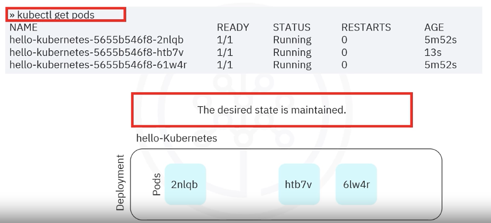

- Use the `kubectl get pods` command again: The total number of pods is restored to three.
  - The ReplicaSet maintains the desired state.

## Summary - Recap

- **High Availability**: Provides redundancy by ensuring multiple pod replicas are running.
- **Scalability**: Automatically adds or removes pods to match the actual state to the desired state.
- **Self-Healing**: Replaces failed pods to maintain the desired number of replicas.

* You can create a ReplicaSet using the CLI or the YAML descriptor
* A best practice is to use a Deployment instead of a ReplicaSet directly