# Module 3 - Section 2: Autoscaling

## Introduction

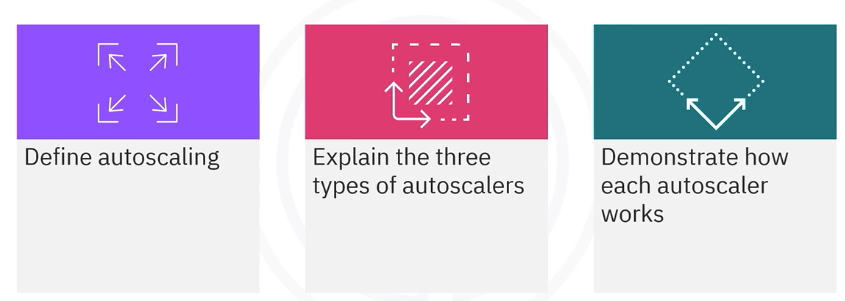

In this section, we will learn about auto-scaling in Kubernetes. Auto-scaling ensures that your applications can handle varying loads by automatically adjusting the number of running pods or nodes.

## Introduction

ReplicaSet provides a good start for scaling, but you don't always want ten instances of your resource running. You should be able to scale as needed. Kubernetes auto-scaling helps optimize resource usage and costs by automatically scaling a cluster in line with demand.

Kubernetes auto-scaling helps optimize resource usage and costs by automatically scaling a cluster in line with demand.

- Auto-scaling enables scaling as needed
- Auto-scaling occurs at two different layers:
  - Cluster or node level 
  - Pod level
- Auto scaler types:
  - **Horizontal Pod Autoscaler (HPA)**
  - **Vertical Pod Autoscaler (VPA)**
  - **Cluster Autoscaler (CA)**

## Create Auto-Scaling with Kubectl

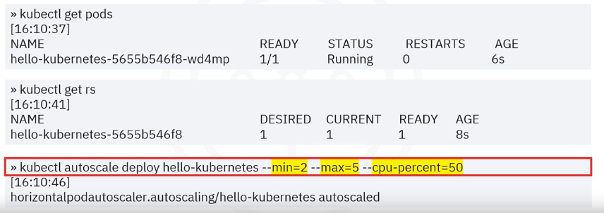

To create auto-scaling for a deployment or ReplicaSet:

- List the current number and state of pods: `kubectl get pods`: in the above example, there is one pod running.
- The ReplicaSet is automatically created when you create a deployment.
- To auto-scale, use the `autoscale` command with the requisite attributes.
  - min: the number of minimum pods
  - max: the number of maximum pods
  - CPU percent: acts as a trigger that tells the system to create a new pod when the CPU usage reaches 50% across the cluster.

### Describe ReplicaSet

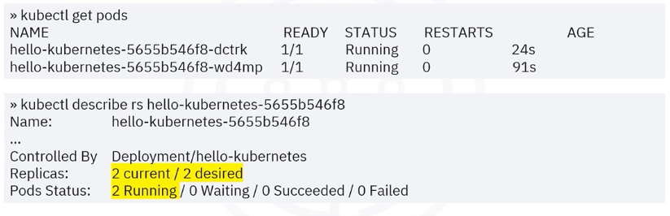

In the background, The deployment still uses the ReplicaSet to scale up and down. 

The numbers of replicas in this auto-scaled ReplicaSet have changed to two since the minimum number specified in the previous autoscale command was changed to two.

## Types of Auto-Scalers - Behind the scenes

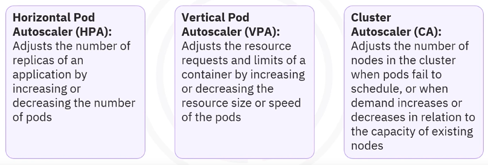

- Auto scaler types:
  - **Horizontal Pod Autoscaler (HPA)**: adjusts the number of replicas of an application by increasing or decreasing the number of pods.
  - **Vertical Pod Autoscaler (VPA)**: adjusts the resource requests and limits of a container by increasing or decreasing the resource size or speed of the pods.
  - **Cluster Autoscaler (CA)**: adjusts the number of nodes in the cluster when pods fail to schedule or demand increases or decreases in relation to the nodes' capacity.

### Horizontal Pod Autoscaler (HPA)

An HPA automatically updates a workload resource like a deployment by horizontally scaling the workload to match the demand.

Horizontal scaling or scaling out automatically increases or decreases the number of running pods as application usage changes.

An HPA uses a cluster operator that sets targets for metrics like CPU or memory utilization and the maximum and minimum desired number of replicas.

#### HPA example

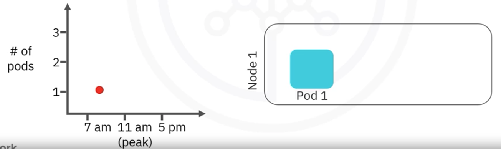

The system load is low early in the morning, so one pod is sufficient. The HPA auto-scales the workload resource to meet usage demands.

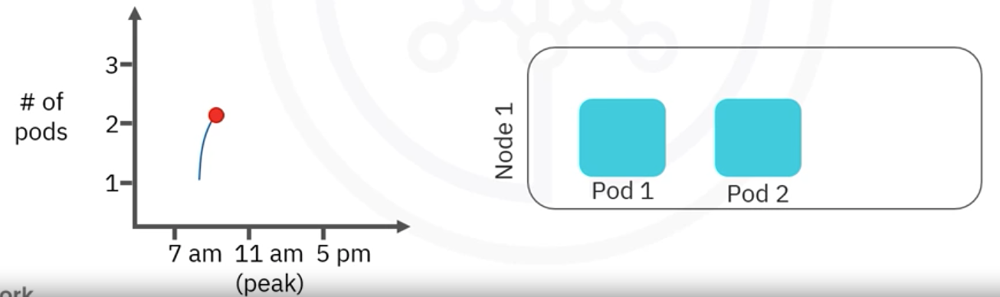

By 11:00 A.M., peak load drives a need for three pods. The HPA auto-scales the workload resource to meet usage demand.

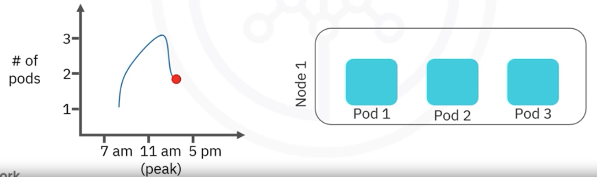

Usage drops in the afternoon, so the third pod is marked for deletion and removed

Usage drops even lower by 5:00 P.M., another pod is marked for deletion and removed.

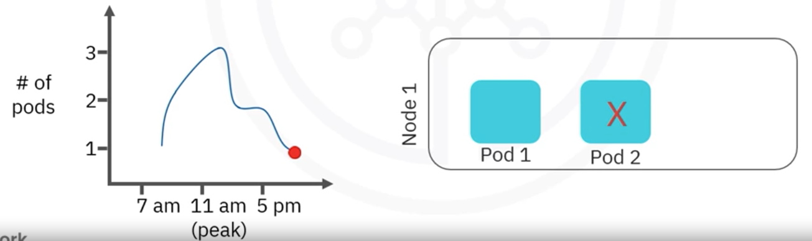

#### Create HPA from YAML file - Autoscaling with HPA from scratch

Another way to enable auto-scaling is to manually create the HPA object from a YAML file. Similar to the autoscale command, you can set the minimum and maximum number of pods.

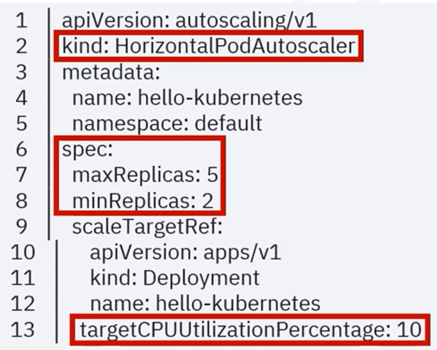

Similar to the autoscale command, you can set the minimum and maximum number of pods. 

The CPU percent flag shows up as target CPU utilization percentage.

Even though you can create an HPA autoscaler from scratch, you should use the autoscale command instead.

Best practice is to scale horizontally, but there are some services you may want to run in a cluster where horizontal scaling is impossible or not ideal.

### Vertical Pod Autoscaler (VPA)

Vertical Scaling adds resources to an existing machine. A VPA lets you scale a service vertically within a cluster.

The cluster operator sets targets for metrics like CPU or memory utilization, similar to an HPA.

The cluster then reconciles the size of the service's pod or pods based on their current usage and the desired target.

#### VPA example

The system load is low early in the morning, so system resources used by the pod are low. 

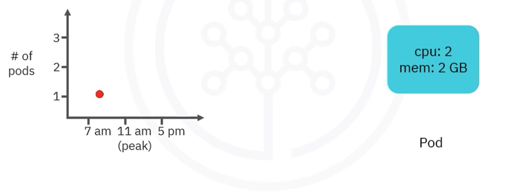

By 11:00 A.M., peak load drives a need for more capacity. The VPA auto-scales the pod by adding more system resources, CPU, and memory to meet the demand.

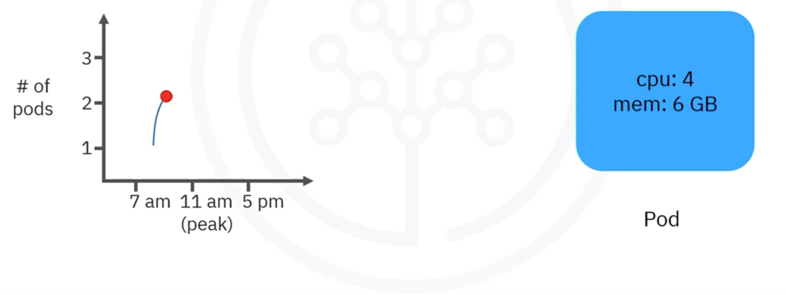

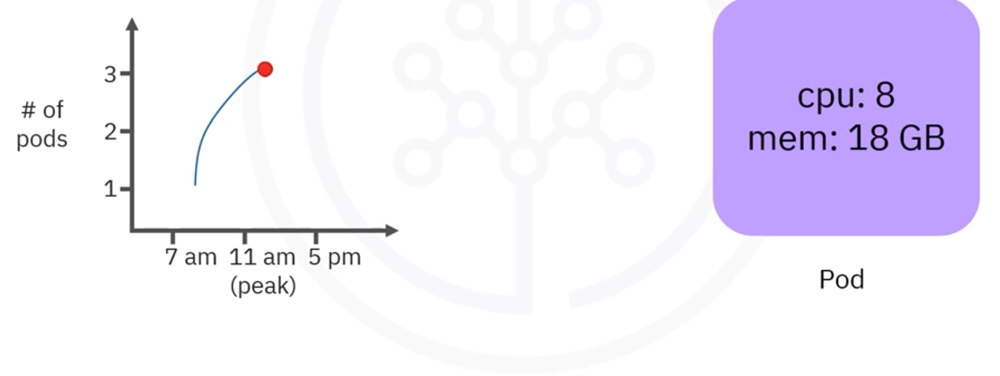

Usage drops in the afternoon. The pod is auto-scaled to use fewer system resources

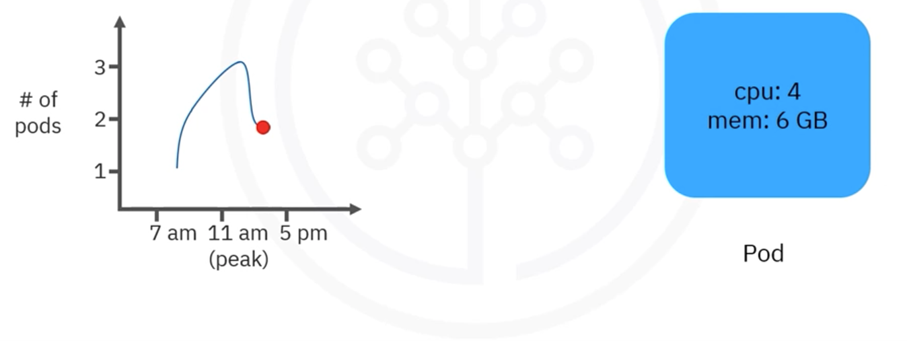

Usage drops even lower by 5:00 P.M. The pod is auto-scaled further to match the 7:00 A.M. levels.

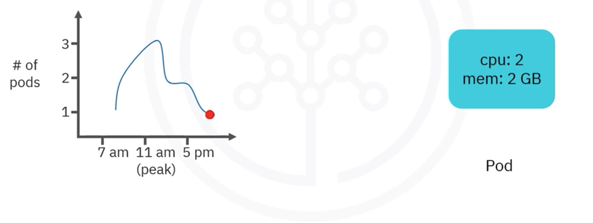

You should not use VPAs with HPAs on resource metrics like CPU or memory.  However, you can use them together on custom or external metrics.

### Cluster Autoscaler (CA)

A CA auto-scales the cluster itself, increasing or decreasing the number of available nodes that pods can run on.

Pods are auto-scaled using HPA or VPA. But when the nodes themselves are overloaded with pods, you can use a CA to auto-scale the nodes so that the pods can rebalance themselves across the cluster.

#### CA example

The system load is low early in the morning, so existing nodes can handle the load.

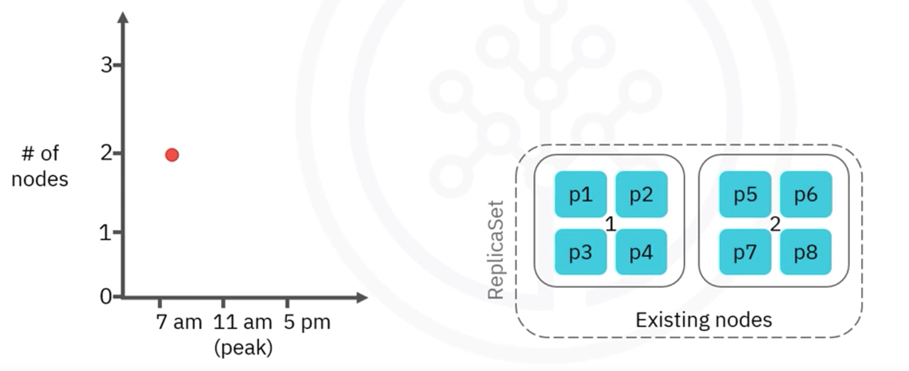

When demand increases, new pod requests come in, and the CA auto-scales the cluster by adding a new node and pod to meet the demand.

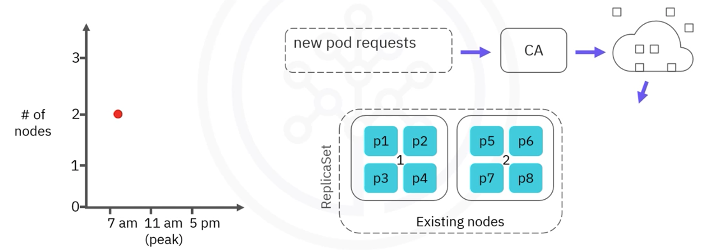

By 11:00 A.M., peak load brings the new node to full capacity.

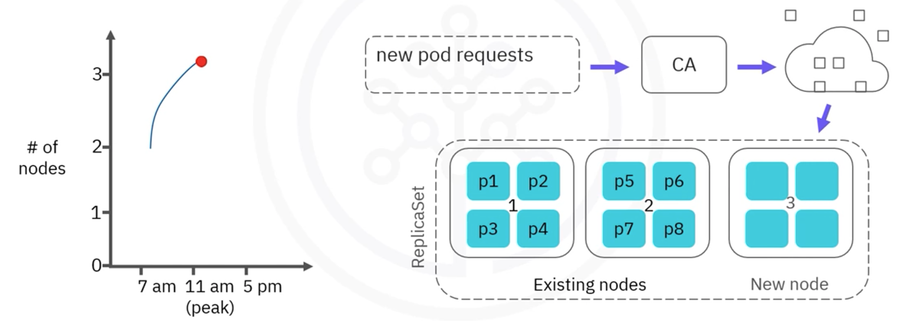

When usage drops in the afternoon, unused pods are marked for deletion and removed.

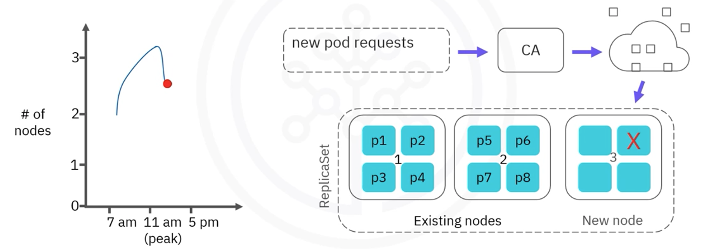

When usage drops even lower by 5:00 P.M., all pods in the new node are marked for deletion and removed.

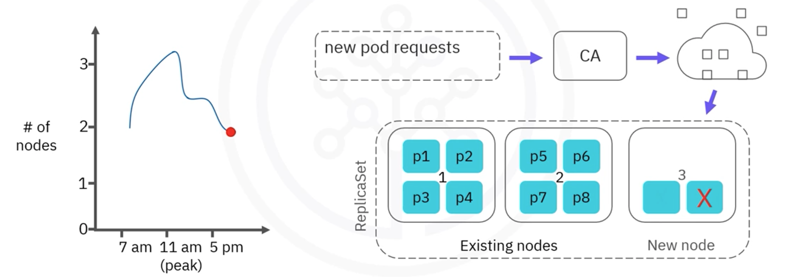

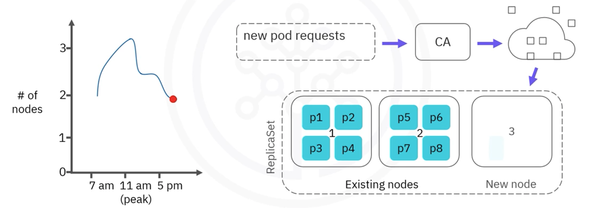

Then the node itself is marked and removed.

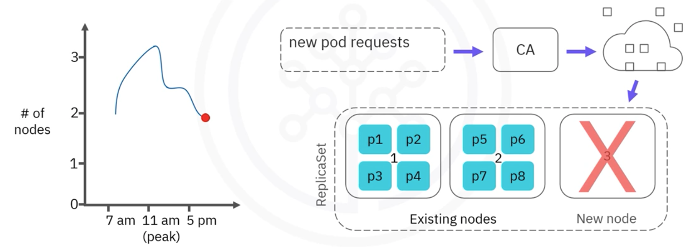

A cluster auto-scaler ensures there is always enough computer power to run your tasks and that you aren't paying extra for unused nodes.

For example, nights and weekends may have pure development or continuous integration testing loads, and clusters may have periods where all batch processing jobs are complete, and the new batch doesn't start until later in the day.

### Selecting the Right Auto-Scaler

Each auto-scaler type is suitable in specific scenarios. You should analyze the pros and cons of each to find the best choice.

Using a combination of all three types ensures that:
 
- Services run stably at peak load times
- Costs are minimized in times of lower demand.

## Summary - Conclusion

- Auto-scaling enables scaling as needed at the cluster or node level and the pod level.
- Cou can auto-scale a deployment or a ReplicaSet.
- Autoscaler types include Horizontal Pod or HPA, Vertical Pod or VPA, and Cluster or CA.
- A combination of all three autoscaler types often provides the most optimized solution.
