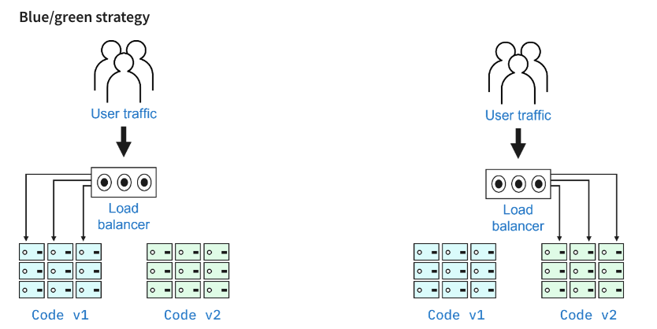
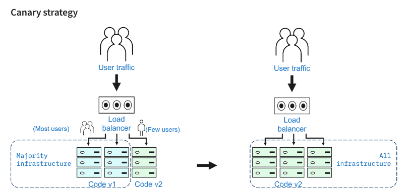
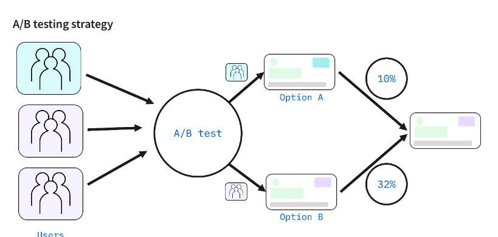
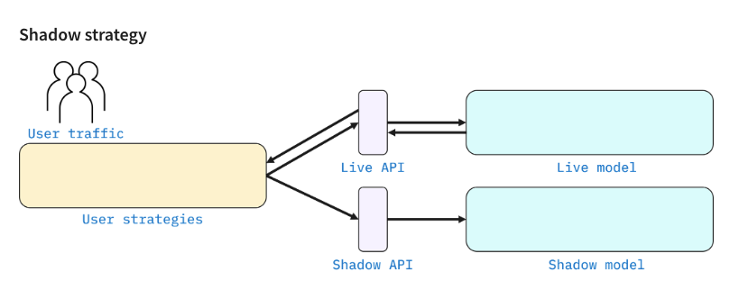

# Module 3 - Section 3: Deployment Strategies

## Overview

A Kubernetes deployment strategy defines an application’s lifecycle that achieves and maintains the configured state for objects and applications in an automated manner. Effective deployment strategies minimize risk.

Kubernetes deployment strategies are used to:

- Deploy, update, or rollback ReplicaSets, Pods, Services, and Applications
- Pause/Resume Deployments
- Scale Deployments manually or automatically

## Types of Deployment Strategies

The following are six types of deployment strategies:

- Recreate
- Rolling
- Blue/green
- Canary
- A/B testing
- Shadow

You can use either a single deployment strategy or a combination of multiple deployment strategies.

### Recreate Strategy

In the recreate strategy, Pods running the live version of the application are all shut down simultaneously, and a new version of the application is deployed on newly created Pods.

Recreate is the simplest deployment strategy. There is a short downtime between the shutdown of the existing deployment and the new deployment.

**Recreate strategy steps include:**

1. A new version of the application (v2) is ready for deployment.
2. All Pods running the current version (v1) are shut down or deleted.
3. New (v2) Pods are created.
4. The rollback process is completed in the reverse order, replacing version 2 (v2) with version 1 (v1).

**Pros:**

- Simple setup
- Application version completely replaced

**Cons:**

- Short downtime occurs between shutdown and new deployment

### Rolling (Ramped) Strategy

-strategy.png)

In a rolling strategy, each Pod is updated one at a time. A single v1 Pod is replaced with a new v2 Pod. Each v1 Pod is updated in this way until all Pods are v2. During a rolling strategy update, there is hardly any downtime since users are directed to either version.

**Rolling strategy steps include:**

1. A new version of the application (v2) is ready for deployment.
2. One of the Pods running the current version (v1) is shut down or deleted.
3. A new (v2) Pod is created to replace the (v1) Pod that was removed.
4. Steps 2 and 3 are repeated until all (v1) Pods are removed and replaced with (v2) Pods.
5. The rollback process is reversed, where v2 Pods are replaced by v1 Pods.

| **Pros:**                                                                       | **Cons:**                               |
|---------------------------------------------------------------------------------|-----------------------------------------|
| Simple setup                                                                    | Rollout/rollback takes time             | 
| Suitable for stateful applications that need to handle re-balancing of the data | You cannot control traffic distribution |

### Blue/Green Strategy

In a blue/green strategy, the blue environment is the live version of the application. The green environment is an exact copy that contains the deployment of the new version of the application. The green environment is thoroughly tested. Once all changes, bugs, and issues are addressed, user traffic is switched from the blue environment to the green environment.

**Blue/green strategy steps include:**

1. Create a new environment identical to the current production environment.
2. Design the new version and test it thoroughly until it is ready for production.
3. Route all user traffic to the new version.
4. To perform a rollback, switch the environments back.

| **Pros:**                                         | **Cons:**                                                |
|---------------------------------------------------|----------------------------------------------------------|
| Instant rollout/rollback (no downtime)            | Expensive (requires double resources)                    |
| New version is available immediately to all users | Rigorous testing required before releasing to production |
|                                                   | Handling stateful applications is difficult              |

### Canary Strategy

In a canary strategy, the new version of the application is tested using a small set of random users alongside the current live version of the application. Once the new version of the application is successfully tested, it is then rolled out to all users.

**Canary strategy steps include:**

1. Design a new version of the application.
2. Route a small sample of user requests to the new version.
3. Test for efficiency, performance, bugs, and issues, and rollback as needed.
4. Repeat steps 1 to 3. Once all issues are resolved, route all traffic to the new version.

| **Pros:**                                                     | **Cons:**                         |
|---------------------------------------------------------------|-----------------------------------|
| Convenient for reliability, error, and performance monitoring | Slow rollout, gradual user access |
| Fast rollback                                                 | - - -                             |

### A/B Testing Strategy

The A/B testing strategy, also known as split testing, evaluates two versions of an application (version A and version B). With A/B testing, each version has features that cater to different sets of users. You can select which version is best for global deployment based on user interaction and feedback.

**A/B testing strategy steps include:**

1. Design a new version of the application by adding mostly UI features.
2. Identify a small set of users based on conditions like weight, cookie value, query parameters, geolocalization, browser version, screen size, operating system, and language.
3. Route requests from the user set to the new version.
4. Check for bugs, efficiency, performance, and issues.
5. Once all issues are resolved, route all traffic to the new version.

| **Pros:**                              | **Cons:**                                                                                   |
|----------------------------------------|---------------------------------------------------------------------------------------------|
| Multiple versions can run in parallel  | Requires intelligent load balancer                                                          |
| Full control over traffic distribution | Difficult to troubleshoot errors for a given session, distributed tracing becomes mandatory |

### Shadow Strategy

In a shadow strategy, a “shadow version” of the application is deployed alongside the live version. User requests are sent to both versions, and both handle all requests, but the shadow version does not forward responses back to the users. This lets developers see how the shadow version performs using real-world data without interrupting user experience.

| **Pros:**                                   | **Cons:**                                                |
|---------------------------------------------|----------------------------------------------------------|
| Performance testing with production traffic | Expensive (double resources)                             |
| No user impact                              | Not a true user test, can lead to misinterpreted results |
| No downtime                                 | Complex setup                                            |
|                                             | Requires monitoring for two environments                 |

## Deployment Strategies Summary

| Strategy                                                                                                  | Zero Downtime | Real Traffic Testing | Targeted Users | Cloud Cost | Rollback Duration | Negative User Impact | Complexity of Setup |
|-----------------------------------------------------------------------------------------------------------|---------------|----------------------|----------------|------------|-------------------|----------------------|---------------------|
| **Recreate**: Version 1 is removed then version 2 is rolled out                                           | X             | X                    | X              | •--        | •••               | •••                  | - - -               |
| **Ramped**: Version 1 is replaced by a slow rollout of version 2                                          | ✓             | X                    | X              | •--        | •••               | •--                  | •--                 |
| **Blue/Green**:Version 2 is released together with version 1, then the traffic is switched to version 2   | ✓             | X                    | X              | •••        | - - -             | ••-                  | ••-                 |
| **Canary**: Version 2 is first released to a subset of users, then fully rolled out when production ready | ✓             | ✓                    | X              | •--        | •--               | •--                  | ••-                 |
| **A/B Testing**: Version 2 is only released to a subset of users with specific traits                     | ✓             | ✓                    | ✓              | •--        | •--               | •--                  | •••                 |
| **Shadow**: Version 2 receives real-world traffic together with version A but doesn’t respond to users    | ✓             | ✓                    | X              | •••        | - - -             | - - -                | •••                 |

## To Create a Good Strategy:

- Consider the product type and the target audience
- Shadow and canary strategies use live user requests, as opposed to using a sample of users.
- The A/B testing strategy is useful if the version of the application requires minor tweaks or UI feature changes.
- The blue/green strategy is useful if your version of the application is complex or critical and needs proper monitoring with no downtime during deployment.
- The canary strategy is a good choice if you want zero downtime and are comfortable exposing your version of the application to the public.
- A rolling strategy gradually deploys the new version of the application. There is no downtime, and it is easy to roll back.
- The recreate strategy is a good choice if the application is not critical and users aren’t impacted by a short downtime.