# Module 3 - Section 4: Rolling Updates

## Introduction to Rolling Updates

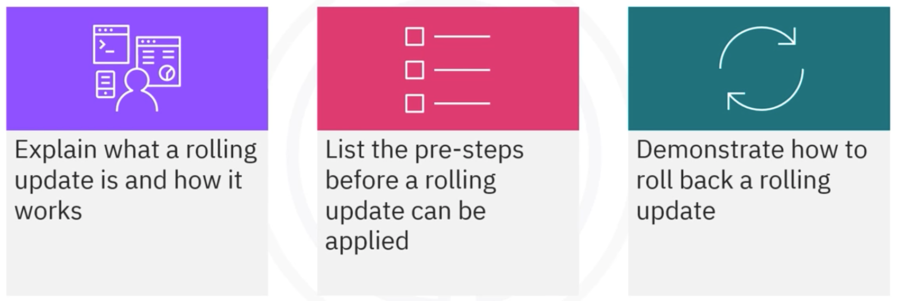

In this section, we will learn about rolling updates in Kubernetes. After this, you will be able to:
- Explain what a rolling update is and how it works.
- List the pre-steps before a rolling update can be applied.
- Demonstrate how to roll back a rolling update.

## Rolling updates

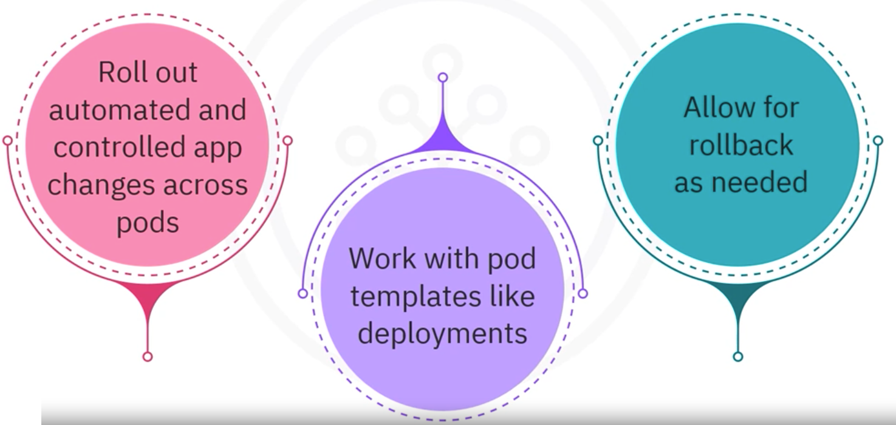

Rolling updates are automated updates that occur on a scheduled basis. 

- Roll out automated and controlled app changes across pods. 
- Rolling updates work with pod templates like deployments
- Allow for rollback as needed.

## Example of a rolling update 

To prepare the application to enable rolling updates

**Step 1: Add liveness and readiness probes to deployments**

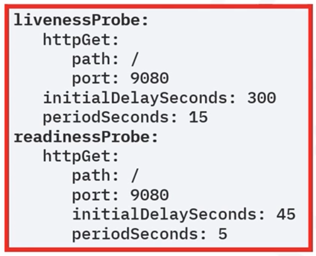

That way deployments are appropriately marked as ready.

**Step 2: Add a rolling update strategy to the YAML file**

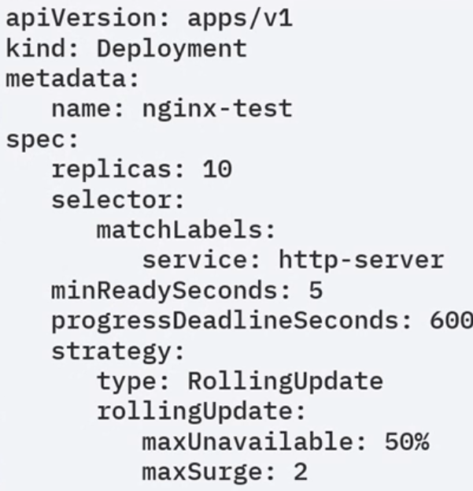

In the example:

- Creating a deployment with ten pods: `replicas: 10`
- The strategy is to have at least 50% of the pods always available.
- The `maxSurge: 2` says that there can only be two pods added to the ten you defined earlier. 
- For a zero downtime system, set the `maxUnavailable` to zero.
- Setting the max surge to 100% would double the number of pods and create a complete replica before taking the original set down after the rollout is complete.
- Sometimes it is also useful to use the `minReadySeconds ` attribute to wait a few seconds before moving to the next pod in the rollout stage.

**Current state**

Let's look at a working example of rolling out an application update.

```sh
>> kubectl get pods
NAME                                READY   STATUS    RESTARTS   AGE
hello-kubernetes-55fd6f66c5-wv5tg   1/1     Running   0          5m51s
hello-kubernetes-55fd6f66c5-z6tn7   1/1     Running   0          6m33s
hello-kubernetes-55fd6f66c5-zwwqt   1/1     Running   0          5m51s                                                                                                                                                                                                                                                                           5m51s                                                     0
```

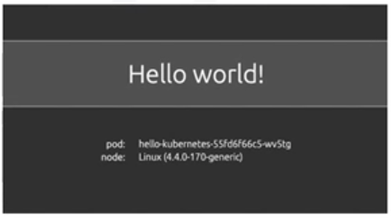

We have a deployment with three pods in the replica set. The application displays the message `hello world`.

**Update versions**

The client has submitted a new request, and you have a new image for the application with a different message instead of the original text. 

You need to show `hello world v2` to the users, but you cannot have any downtime in the application.

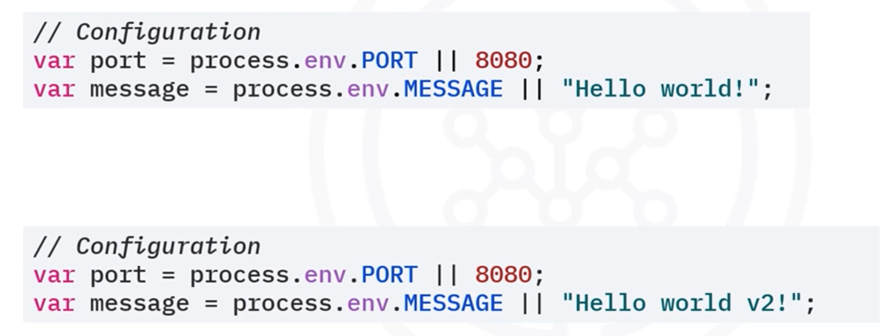

**Build, tag, and upload this new image to Docker Hub.**

First, you need to build, tag, and upload this new image to Docker Hub.

```sh
>> docker build -t hello-kubernetes.
Sending build context to Docker daemon  59.39KB
Step 1/11 : FROM node:8.1.0-alpine
8.1.0-alpine: Pulling from library/node
2aecc7e1714b: Pull complete
8c951048fb77: Pull complete
efe91b1aaaa1: Pull complete

>> docker tag hello-kubernetes upkar/hello-kubernetes:2.0

>> docker push upkar/hello-kubernetes:2.0u
```

The new software has been Dockerized and then updated to Docker Hub, with the name and tag `hello-kubernetes upkar/hello-kubernetes:2.0`.

These are simple Docker commands, not related to Kubernetes at all.

**Apply the new image to the deployment**

```sh
>> kubectl get deployments

NAME               READY   UP-TO-DATE   AVAILABLE   AGE
hello-kubernetes   3/3     3            3           21m

>> kubectl set image deployments/hello-kubernetes hello-kubernetes=upkar/hello-kubernetes:2.0
deployment.extensions/hello-kubernetes image updated
```

We have the three pods from the first command. The second command sets the image flag to the updated tag image on Docker Hub.

The output says the image has been updated, but let's verify if that actually happened.

**Version 2 is deployed.**

Observe that version 2 deployment has been rolled out. You can see the status of the rollout by using the `rollout status` command.

```shell
>> kubeclt rollout status deployments/hello-kubernetes

deployment "hello-kubernetes" successfully rolled out
```

Now if we go back to the URL, we will see the new message `hello world v2`.

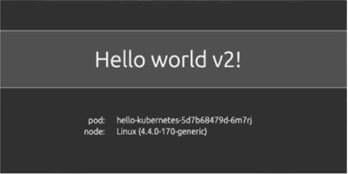

**Rollback to version 1**

Sometimes there are errors in a deployment, or the client can change their minds. Rollbacks are easy to implement in Kubernetes.

Use an `undo` command on the rollout.

```sh
>> kubectl rollout undo deployments/hello-kubernetes
deployment.extensions/hello-kubernetes rolled back
```

Use the `get pods` command to confirm the rollout pods are terminated.

```sh
>> kubectl get pods
NAME                                READY   STATUS        RESTARTS   AGE
hello-kubernetes-55fd6f66c5-2jv8m   1/1     Running       0          2s
hello-kubernetes-55fd6f66c5-5z5zv   1/1     Running       0          6s
hello-kubernetes-55fd6f66c5-6z5zv   1/1     Running       0          4s
hello-kubernetes-55fd6f66c5-wv5tg   1/1     Terminating   0          24m
hello-kubernetes-55fd6f66c5-z6tn7   0/1     Terminating   0          24m
hello-kubernetes-55fd6f66c5-zwwqt   0/1     Terminating   0          24m
```

You will also see three new pods that are created as part of this rollback.

If we visit the site again, we will see the original message, and that's how we roll back changes to your application.

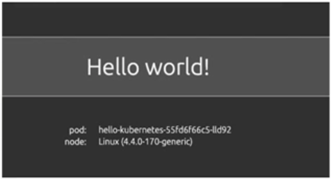

## Practical demonstration

Let's take a look at how rolling updates work, both all-at-once and one-at-a-time.

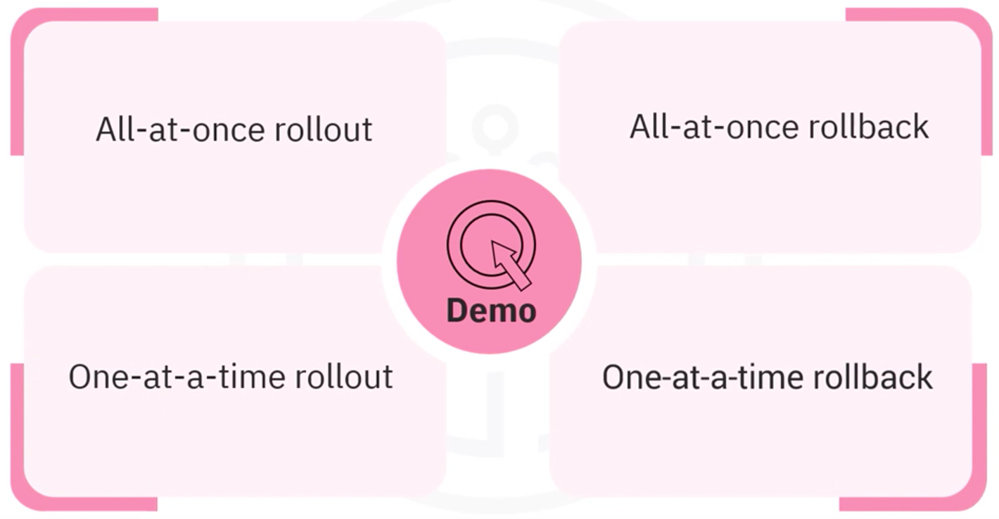

### Scenario 1: All-at-once rollout

In an all-at-once rollout, all v1 objects must be removed before v2 objects can become active.

Here you see version 1 of an app with three pods running that users can access.


When version 2 is deployed, new pods are created


The version 1 pods are marked for deletion 


And then removed. User access is blocked.

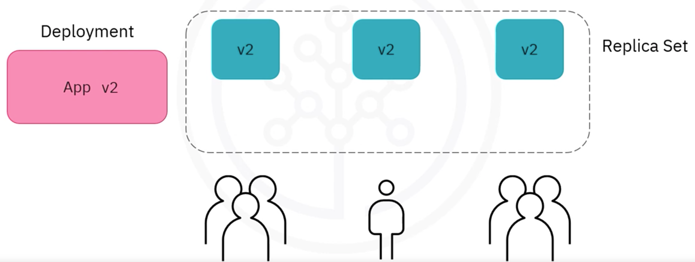

Once the version 1 pods are removed, the version 2 pods become active, and user access is restored.

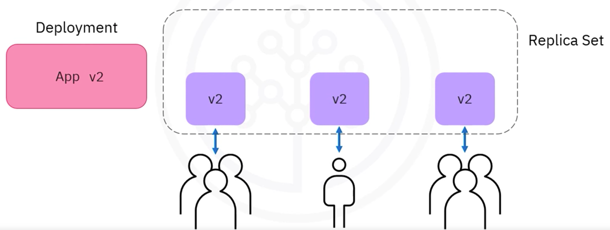

Notice the time lag between deployment and pod updates.

### Scenario 2: All-at-once rollback

In an all-at-once rollback, all v2 objects must be removed before v1 objects can become active.

Here we see version 2 of an app with three pods running that users can access.


When version 1 of the app is deployed, new pods are created


The version 2 pods are marked for deletion

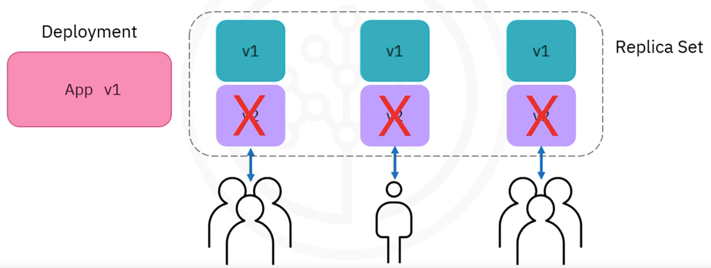

And then removed. User access is blocked.


Once the version 2 pods are removed, the version 1 pods become active, and user access is restored.


### Scenario 3: One-at-a-time rollout

In a one-at-a-time rollout, the update is staggered so user access is not interrupted.

Here we see version 1 of an app with three running pods that users can access.


When version 2 is deployed, a new pod is created.

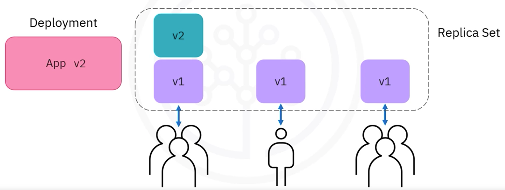

The first version 1 pod is marked for deletion and removed

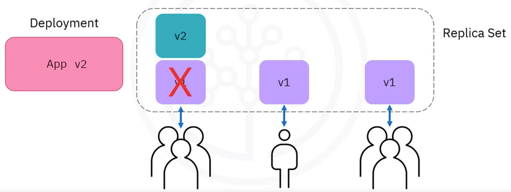

The v2 pod becomes active.


Then a second v2 pod is created

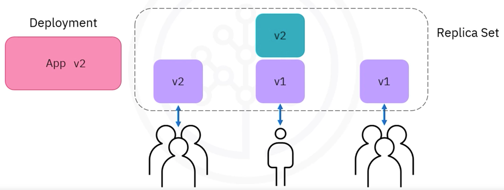

The second version 1 pod is marked for deletion and removed

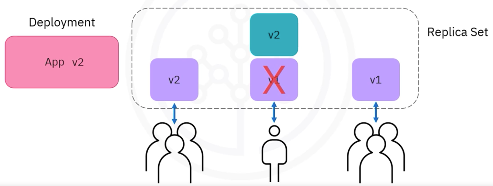

The second v2 pod becomes active

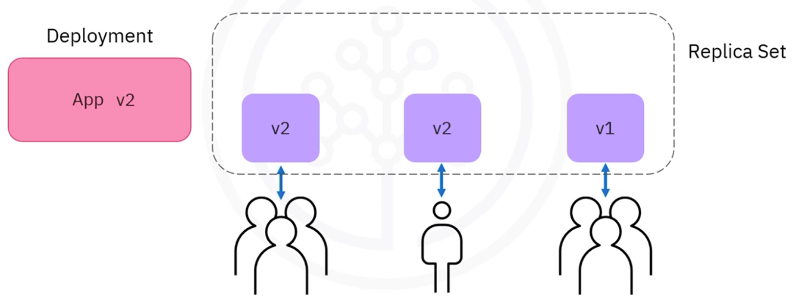

The third v2 pod is created

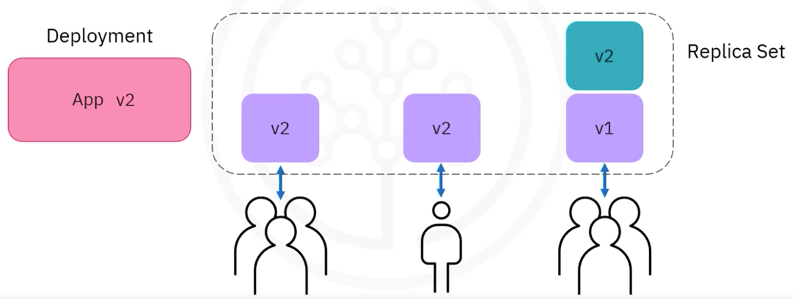

The third version 1 pod is marked for deletion and removed.

And now the third v2 pod becomes active with a staggered update.


With a staggered update, user access is not interrupted.

### Scenario 4: One-at-a-time rollback

In a one-at-a-time rollback, the update rollback is staggered so user access is not interrupted.

Let's see what a one-at-a-time rollback looks like.

Here we see version 2 of an app with three running pods that users can access.


When version 1 of the app is deployed, a new pod is created.

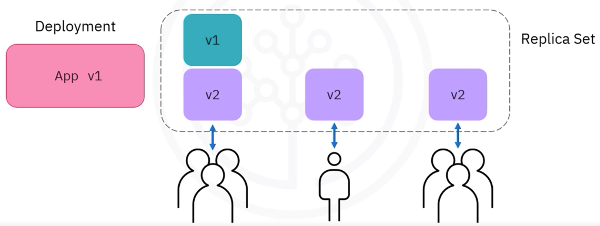

The first version 2 pod is marked for deletion and removed

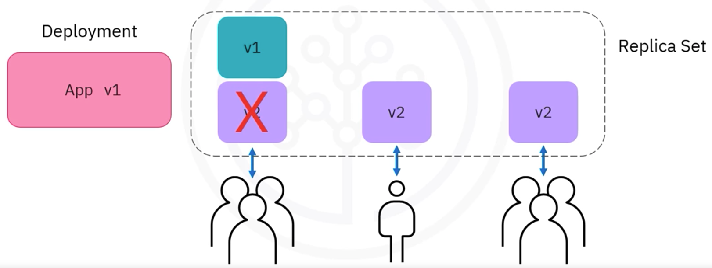

The v1 pod becomes active

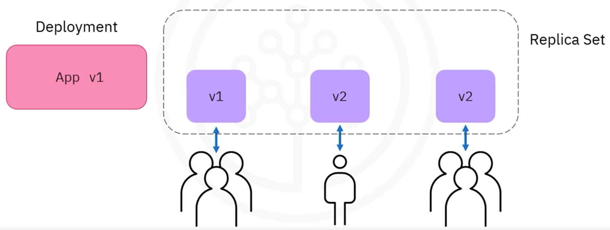

The second v1 pod is created, the second version 2 pod is marked for deletion and removed

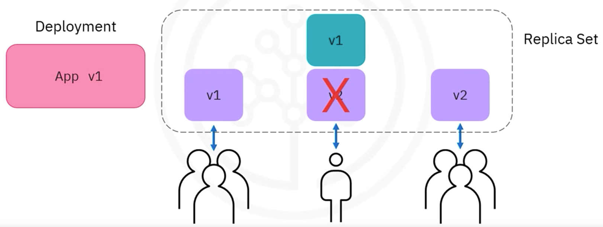

The second v1 pod becomes active


The third v1 pod is created, the third version 2 pod is marked for deletion and removed

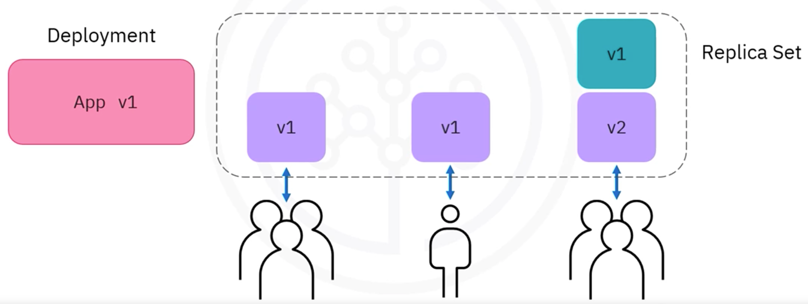

The third v1 pod becomes active


## Conclusion - Recap

- Rolling updates roll out app changes in a controlled and automated way.
- Rolling updates publish changes to applications without noticeable interruption to end-users.
- Rolling updates can roll back changes when an application needs to revert to a stable state.
- Rolling updates and rollbacks can be performed using all-at-once and one-at-a-time strategies.

