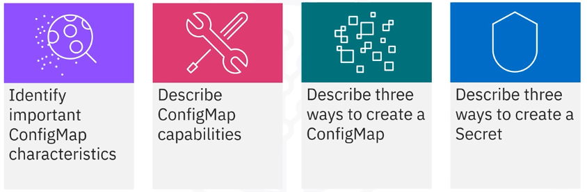
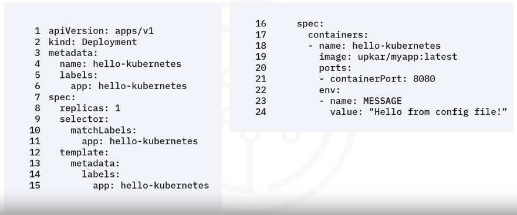
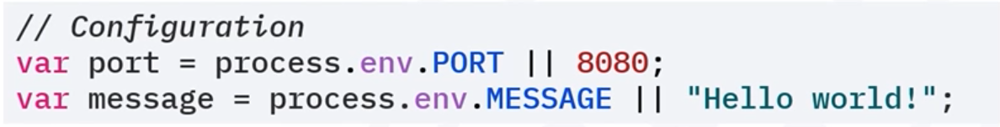
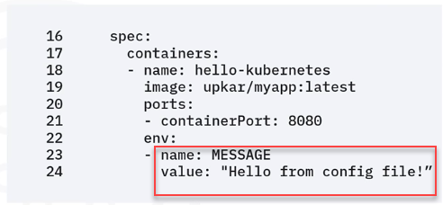
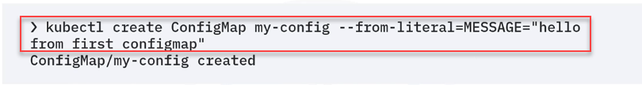
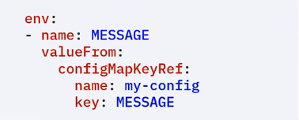
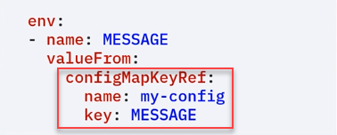
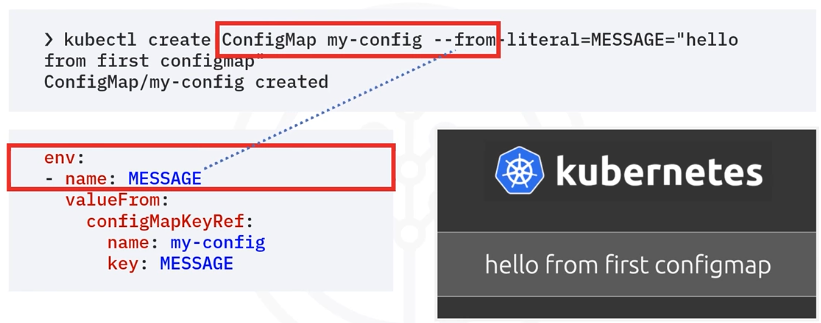
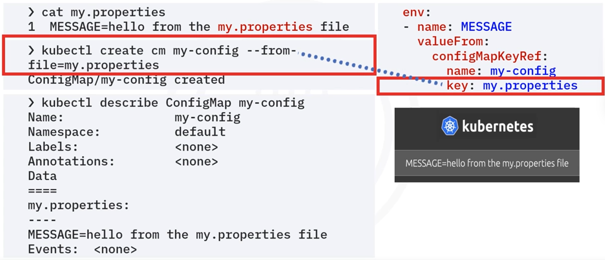

# Module 3 - Section 5: ConfigMaps and Secrets

## Introduction to ConfigMaps and Secrets



After this section, you will be able to:

- Identify important ConfigMap characteristics.
- Describe ConfigMap capabilities.
- Describe three ways to create a ConfigMap.
- Describe three ways to create a Secret.

## ConfigMaps

- Helps developers avoid hard-coding configuration variables in the application code: As software developers, a good practice to adopt is to avoid hard-coding configuration variables in application code by keeping the configuration variables separate so that any changes in configuration settings do not require code changes.
- Is an API object that stores non-confidential data in key-value pairs and is meant for non-sensitive information as they do not provide secrecy or encryption.
- Provides configuration data to pods and deployments so that the configuration data is not hard-coded inside the application code.
- Data stored in a ConfigMap cannot exceed one megabyte(1MB). 
  - For larger amounts of data, consider mounting a volume or use a separate database or file service.
- Has optional data and `binaryData` fields and in this case, there is no spec field in the template, and the ConfigName must be a valid DNS subdomain name.
- The config name must be a valid DNS subdomain name.

### ConfigMap capabilities

- Easy portable as a ConfigMap is reusable across the deployments: a ConfigMap is reusable for multiple deployments thus, decoupling the environment from the deployments themselves.
- Multiple ways to create:
  1. Using string literals.
  2. Using an existing properties or key equals value - `"key"="value"` file.
  3. Providing a ConfigMap YAML descriptor file.
  - The 1st and 2nd ways can help create such a YAML file.
- Multiple ways to reference from pod/deployment: the deployment or pods consume a ConfigMap by using environment variables with
  - Reference as an environment variable with the ConfigMap `keyRef` attribute.
  - Mount as a volume using the volumes plugin.
- Kubernetes applies the ConfigMap to the pod or the deployment just before running the pod or deployment.

### Configure Environment Variables

We will use the environment variable directly in the YAML file.




- The `message` variable is used in the JavaScript file as `process.env.message`.
  
  

  

  - Apply this development descriptor to our deployment and the application displays the string `Hello from the config file`.
  

- The result is excellent, but the message is hard-coded in the descriptor file.

-> To change this situation, we will use a ConfigMap.

### Configure ConfigMap string literal

The simplest way to provide a ConfigMap: is to provide a key-value pair in the center of the ConfigMap command.

**Step 1**: 



**Step 2**: After this first step, The second step is to tell our deployment about the new message variable and specify its location for pickup.

To do that, add the `env` section in the deployment descriptor as shown 



Use the `valueFrom` attribute to point to the ConfigMap created in the first step.



In this case, the deployment will look for a key named `message` in the ConfigMap named `my-config`.



### Configure ConfigMap from properties file

Another way to add the `message` variable in the ConfigMap is to use a file that contains all environment variables in the `key=value` format.

Such a file is useful for adding many variables instead of listing those variables one by one on the command line.

```shell
>> cat my.properties
1 MESSAGE=hello from the my.properties file
```

Then, create the ConfigMap by using the `--from-file` flag.

Notice that the key is `my.properties` in the deployment descriptor section.

```shell
>> kubectl create configmap my-config --from-file=my.properties
ConfigMap/my-config created
```

```shell
>> kubectl describe Configmap my-config
Name:         my-config
Namespace:    default
Labels:       <none>
Annotations:  <none>
Data
===
my.properties:
----
MESSAGE=hello from the my.properties file
Events:  <none>
```
To use the ConfigMap in the `server.js` file, refer to it as `process.env.message.message`.




```shell
kube
```


WEBVTT

1
00:00:06.530 --> 00:00:10.785
Welcome to ConfigMaps
and Secrets.

2
00:00:10.785 --> 00:00:12.600
After watching this video,

3
00:00:12.600 --> 00:00:14.760
you will be able to identify

4
00:00:14.760 --> 00:00:17.305
important config map
characteristics,

5
00:00:17.305 --> 00:00:19.810
describe config
map capabilities,

6
00:00:19.810 --> 00:00:21.580
describe three ways to create

7
00:00:21.580 --> 00:00:26.700
a config map and describe
three ways to create a secret.

8
00:00:26.700 --> 00:00:30.100
As software developers,
a good practice to

9
00:00:30.100 --> 00:00:33.300
adopt is to avoid hard-coding
configuration variables in

10
00:00:33.300 --> 00:00:35.140
application code by keeping

11
00:00:35.140 --> 00:00:37.020
the configuration
variables separate

12
00:00:37.020 --> 00:00:38.380
so that any changes in

13
00:00:38.380 --> 00:00:41.680
configuration settings do
not require code changes.

14
00:00:41.680 --> 00:00:43.100
A config map is

15
00:00:43.100 --> 00:00:46.220
an API object that stores
non-confidential data in

16
00:00:46.220 --> 00:00:48.710
key-value pairs and is meant for

17
00:00:48.710 --> 00:00:50.760
non-sensitive
information as they

18
00:00:50.760 --> 00:00:53.220
do not provide secrecy
or encryption.

19
00:00:53.220 --> 00:00:55.880
In addition, a
config map provides

20
00:00:55.880 --> 00:00:58.460
configuration data to
pods and deployments,

21
00:00:58.460 --> 00:01:00.680
so that the configuration
data is not

22
00:01:00.680 --> 00:01:03.370
hard-coded inside the
application code.

23
00:01:03.370 --> 00:01:07.460
Data stored in a config map
cannot exceed one megabyte.

24
00:01:07.460 --> 00:01:09.220
For larger amounts of data,

25
00:01:09.220 --> 00:01:11.160
consider mounting a volume or

26
00:01:11.160 --> 00:01:13.940
use a separate database
or file service.

27
00:01:13.940 --> 00:01:16.440
A config map has
optional data and

28
00:01:16.440 --> 00:01:19.280
binary data fields
and in this case,

29
00:01:19.280 --> 00:01:21.940
there is no spec field
in the template,

30
00:01:21.940 --> 00:01:27.010
and the config name must be
a valid DNS subdomain name.

31
00:01:27.010 --> 00:01:31.525
A config map is reusable for
multiple deployments thus,

32
00:01:31.525 --> 00:01:32.940
decoupling the environment

33
00:01:32.940 --> 00:01:34.985
from the deployments themselves.

34
00:01:34.985 --> 00:01:38.680
You can create a config map
by using string literals

35
00:01:38.680 --> 00:01:43.180
by using an existing properties
or key equals value file,

36
00:01:43.180 --> 00:01:47.620
or by providing a ConfigMap
YAML descriptor file.

37
00:01:47.620 --> 00:01:49.940
You can use the first
and second ways

38
00:01:49.940 --> 00:01:52.115
to help create such a YAML file.

39
00:01:52.115 --> 00:01:55.560
The deployment or pods
consume a config map by

40
00:01:55.560 --> 00:01:57.360
using environment variables with

41
00:01:57.360 --> 00:01:59.800
the ConfigMap key RF attribute,

42
00:01:59.800 --> 00:02:03.580
or by mounting a file
using the volumes plug-in.

43
00:02:03.580 --> 00:02:06.480
Kubernetes applies the
config map to the pod

44
00:02:06.480 --> 00:02:07.920
or the deployment just

45
00:02:07.920 --> 00:02:10.545
before running the
pod or deployment.

46
00:02:10.545 --> 00:02:12.490
You'll use the environment

47
00:02:12.490 --> 00:02:14.930
variable directly
in the YAML file.

48
00:02:14.930 --> 00:02:16.930
The message variable is used in

49
00:02:16.930 --> 00:02:21.860
the JavaScript file as
process.env.message.

50
00:02:21.860 --> 00:02:25.090
Apply this development
descriptor to our deployment and

51
00:02:25.090 --> 00:02:26.970
the application
displays the string

52
00:02:26.970 --> 00:02:29.230
Hello from the config file.

53
00:02:29.230 --> 00:02:31.010
The result is excellent,

54
00:02:31.010 --> 00:02:34.140
but the message is hard coded
in the descriptor file.

55
00:02:34.140 --> 00:02:37.695
Let's change this situation
by using a config map.

56
00:02:37.695 --> 00:02:41.000
The simplest way to provide
a config map is to provide

57
00:02:41.000 --> 00:02:45.000
a key-value pair in the center
of the config map command.

58
00:02:45.000 --> 00:02:46.600
After this first step

59
00:02:46.600 --> 00:02:49.080
the second step is to
tell our deployment

60
00:02:49.080 --> 00:02:50.700
about the new message variable

61
00:02:50.700 --> 00:02:53.400
and specify its
location for pickup.

62
00:02:53.400 --> 00:02:55.580
You do that by adding

63
00:02:55.580 --> 00:02:58.340
the environment section in
the deployment descriptor as

64
00:02:58.340 --> 00:03:00.820
shown and using the value from

65
00:03:00.820 --> 00:03:02.220
attribute to point to

66
00:03:02.220 --> 00:03:04.700
the config map created
in the first step.

67
00:03:04.700 --> 00:03:07.420
In this case, the
deployment will look for

68
00:03:07.420 --> 00:03:12.005
a key-named message in the
config map named My config.

69
00:03:12.005 --> 00:03:14.680
Another way to add the
message variable in

70
00:03:14.680 --> 00:03:16.800
the config map is to use a file

71
00:03:16.800 --> 00:03:19.140
that contains all
environment variables

72
00:03:19.140 --> 00:03:21.580
in the key equals value format.

73
00:03:21.580 --> 00:03:24.620
Such a file is useful for
adding many variables

74
00:03:24.620 --> 00:03:26.460
instead of listing
those variables

75
00:03:26.460 --> 00:03:28.460
one by one on the command line.

76
00:03:28.460 --> 00:03:31.600
Here is a file with just
one message key and to

77
00:03:31.600 --> 00:03:35.180
value hello from the
my.properties file.

78
00:03:35.180 --> 00:03:37.520
You can now create
the config map by

79
00:03:37.520 --> 00:03:40.015
using the from file flag.

80
00:03:40.015 --> 00:03:41.545
Notice that the key is

81
00:03:41.545 --> 00:03:44.925
my.properties in the
deployment descriptor section.

82
00:03:44.925 --> 00:03:48.615
To use the config map
in the server.js file,

83
00:03:48.615 --> 00:03:54.365
refer to it as
process.env.message.message.

84
00:03:54.365 --> 00:03:56.530
Use the described command to get

85
00:03:56.530 --> 00:04:00.450
the YAML output then view
the environment section.

86
00:04:00.450 --> 00:04:04.730
If you specify a directory
to the from file flag,

87
00:04:04.730 --> 00:04:08.170
the entire directory is
loaded into the config map.

88
00:04:08.170 --> 00:04:12.010
You can also load a specific
file with a key by using

89
00:04:12.010 --> 00:04:16.805
the from file equals key
equals file name format.

90
00:04:16.805 --> 00:04:20.160
Finally, you can use
a YAML file with

91
00:04:20.160 --> 00:04:23.400
the config map descriptor
and apply that file.

92
00:04:23.400 --> 00:04:27.620
In our case, we have saved
the output from Kubectl get

93
00:04:27.620 --> 00:04:32.905
config map as a YAML file
called my-config.yaml.

94
00:04:32.905 --> 00:04:34.700
The first command indicates that

95
00:04:34.700 --> 00:04:36.920
there is no config
map to begin with.

96
00:04:36.920 --> 00:04:41.010
Here, you are creating
the ConfigMap.yaml file.

97
00:04:41.010 --> 00:04:43.760
You'll now apply the YAML
file to your cluster,

98
00:04:43.760 --> 00:04:45.920
which creates the config map.

99
00:04:45.920 --> 00:04:49.780
Note, the message in the
config map file description.

100
00:04:49.780 --> 00:04:51.860
Using the YAML file will get you

101
00:04:51.860 --> 00:04:54.865
the same results as
the other methods.

102
00:04:54.865 --> 00:04:57.650
Now, working with a secret

103
00:04:57.650 --> 00:04:59.630
is like working
with a config map.

104
00:04:59.630 --> 00:05:03.130
First, create a secret
using a string literal.

105
00:05:03.130 --> 00:05:05.250
Next, the get command

106
00:05:05.250 --> 00:05:07.530
verifies that the
secret was created.

107
00:05:07.530 --> 00:05:11.530
Finally, to prove that our
secret is indeed a secret,

108
00:05:11.530 --> 00:05:14.550
use the described command
and check that you don't

109
00:05:14.550 --> 00:05:18.230
see any secret written
using display text.

110
00:05:18.230 --> 00:05:21.830
You can print out the
secret in YAML format,

111
00:05:21.830 --> 00:05:25.650
and you'll see that the
value is fully encoded.

112
00:05:25.780 --> 00:05:28.120
To use the secret, add

113
00:05:28.120 --> 00:05:29.640
another environment
to the deployment

114
00:05:29.640 --> 00:05:30.900
descriptor as shown,

115
00:05:30.900 --> 00:05:33.180
and then use the
application key by

116
00:05:33.180 --> 00:05:37.170
referring to the application
as process.env.API_creds.

117
00:05:39.660 --> 00:05:42.940
The screenshot displays
the secret along with

118
00:05:42.940 --> 00:05:47.180
other environmental variables
from the node.js file.

119
00:05:47.180 --> 00:05:49.690
Another way to use
the secret key in

120
00:05:49.690 --> 00:05:52.490
your application is
to use volume mounts.

121
00:05:52.490 --> 00:05:55.390
Create the same secret
as done previously.

122
00:05:55.390 --> 00:05:57.470
In the descriptor YAML file,

123
00:05:57.470 --> 00:05:59.110
use a volume for the secret

124
00:05:59.110 --> 00:06:01.090
with a corresponding
volume mount.

125
00:06:01.090 --> 00:06:03.690
Each container in the
descriptor file has

126
00:06:03.690 --> 00:06:06.780
its own volume mount
but shares the volume.

127
00:06:06.780 --> 00:06:10.215
The API_cred secret
is mounted as a file

128
00:06:10.215 --> 00:06:16.750
at etc/API/API-creds
and the application

129
00:06:16.750 --> 00:06:20.760
will read and process the
file to extract the secret.

130
00:06:20.760 --> 00:06:24.430
In this video, you
learn that you can

131
00:06:24.430 --> 00:06:25.890
use a config map to

132
00:06:25.890 --> 00:06:27.990
provide variables for
your application.

133
00:06:27.990 --> 00:06:31.290
You can create a config map
by using a string literal,

134
00:06:31.290 --> 00:06:33.105
by using a properties file,

135
00:06:33.105 --> 00:06:34.685
or by using YAML.

136
00:06:34.685 --> 00:06:37.550
You can use a secret to provide
sensitive information to

137
00:06:37.550 --> 00:06:39.430
your application and you can

138
00:06:39.430 --> 00:06:41.770
create a secret by
using a string literal,

139
00:06:41.770 --> 00:06:43.830
by using environment variables,

140
00:06:43.830 --> 00:06:46.610
or by using volume mounts.