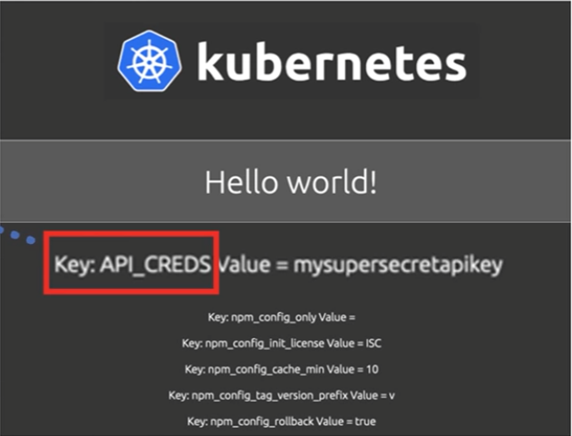

# Module 3 - Section 5: ConfigMaps and Secrets

## Introduction to ConfigMaps and Secrets


After this section, we will be able to:

- Identify important ConfigMap characteristics.
- Describe ConfigMap capabilities.
- Describe three ways to create a ConfigMap.
- Describe three ways to create a Secret.

## ConfigMaps

- Helps developers avoid hard-coding configuration variables in the application code: As software developers, a good practice to adopt is to avoid hard-coding configuration variables in application code by keeping the configuration variables separate so that any changes in configuration settings do not require code changes.
- Is an API object that stores non-confidential data in key-value pairs and is meant for non-sensitive information as they do not provide secrecy or encryption.
- Provides configuration data to pods and deployments so that the configuration data is not hard-coded inside the application code.
- Data stored in a ConfigMap cannot exceed one megabyte(1MB). 
  - For larger amounts of data, consider mounting a volume or use a separate database or file service.
- Has optional data and `binaryData` fields and in this case, there is no spec field in the template, and the ConfigName must be a valid DNS subdomain name.
- The config name must be a valid DNS subdomain name.

### ConfigMap capabilities

- Easy portable as a ConfigMap is reusable across the deployments: a ConfigMap is reusable for multiple deployments thus, decoupling the environment from the deployments themselves.
- Multiple ways to create:
  1. Using string literals.
  2. Using an existing properties or key equals value - `"key"="value"` file.
  3. Providing a ConfigMap YAML descriptor file.
  - The 1st and 2nd ways can help create such a YAML file.
- Multiple ways to reference from pod/deployment: the deployment or pods consume a ConfigMap by using environment variables with
  - Reference as an environment variable with the ConfigMap `keyRef` attribute.
  - Mount as a volume using the volumes plugin.
- Kubernetes applies the ConfigMap to the pod or the deployment just before running the pod or deployment.

### Configure Environment Variables

We will use the environment variable directly in the YAML file.


- The `message` variable is used in the JavaScript file as `process.env.message`.
  
  

  

  - Apply this development descriptor to our deployment and the application displays the string `Hello from the config file`.
  

- The result is excellent, but the message is hard-coded in the descriptor file.

-> To change this situation, we will use a ConfigMap.

### Configure ConfigMap string literal

The simplest way to provide a ConfigMap: is to provide a key-value pair in the center of the ConfigMap command.

**Step 1**: 


**Step 2**: After this first step, The second step is to tell our deployment about the new message variable and specify its location for pickup.

To do that, add the `env` section in the deployment descriptor as shown 


Use the `valueFrom` attribute to point to the ConfigMap created in the first step.


In this case, the deployment will look for a key named `message` in the ConfigMap named `my-config`.


### Configure ConfigMap from properties file

Another way to add the `message` variable in the ConfigMap is to use a file that contains all environment variables in the `key=value` format.

Such a file is useful for adding many variables instead of listing those variables one by one on the command line.

Below is a file with just one `message` key and value `hello from the my.properties file`.

```shell
>> cat my.properties
1 MESSAGE=hello from the my.properties file
```

To create the ConfigMap, use command `kubectl create cm` with the `--from-file` flag.

```shell
>> kubectl create configmap my-config --from-file=my.properties
ConfigMap/my-config created
```

Notice that the key is `my.properties` in the deployment descriptor section.

To use the ConfigMap in the `server.js` file, refer to it as `process.env.message.message`.

```js
var message = process.env.message.message;
```

Use the `describe` command to get the YAML output then view the `env` section.

```shell
>> kubectl describe Configmap my-config
Name:         my-config
Namespace:    default
Labels:       <none>
Annotations:  <none>
Data
===
my.properties:
----
MESSAGE=hello from the my.properties file
Events:  <none>
```

If we specify a directory to the `--from-file` flag, the entire directory is loaded into the ConfigMap.


We can also load a specific file with a key by using the `--from-file=key=file-name` format.

### Configure ConfigMap using YAML file

Finally, we can use a YAML file with the ConfigMap descriptor and apply that file.

In our below case, we have saved the output from `kubectl get configmap` as a YAML file called `my-config.yaml`.

The first command indicates that there is no ConfigMap to begin with.

```shell
 >> kubectl get cm
 No resources found in default namespace.
```

We are creating the `ConfigMap.yaml` file as follows:

```shell
>> cat my-config.yaml
  1 apiVersion: v1
  2 data:
  3   my.properties: MESSAGE=hello from the my.properties file
  4 kind: ConfigMap
  5 metadata:
  6   name: my-config
  7  namespace: default
```

Apply the YAML file to the cluster, which creates the ConfigMap.

```shell
>> kubectl apply -f my-config.yaml
ConfigMap/my-config created
```

Note the `message` in the ConfigMap file description.

```shell
>> kubectl describe configmap my-config

Name:        my-config
Namespace:   default
Labels:      <none>
Annotations: kubectl.kubernetes.io/last-applied-configuration: {"apiVersion":"v1","data":{"my.properties":"MESSAGE=hello from the my.properties file\n"},"kind":"ConfigMap","metadata":{"annotations":{},"name...
...
Data
====
my.properties:
----
MESSAGE=hello from the my.properties file
Events:  <none>
```

Using the YAML file will get you the same results as the other methods.

## Secrets

Working with a Secret is like working with a ConfigMap.

### Secret: Use with String Literal

Create a secret using a string literal.

```shell
>> kubectl create secret generic api-creds --from-literal=key=mysupersecretapikey
secret/api-creds created
```
Verify that the secret was created.

```shell
>> kubectl get secret
NAME                  TYPE                                  DATA   AGE
api-creds             Opaque                                1      5s
```

To prove that the secret is indeed a secret, use the `describe` command and check that we don't see any secret written using display text.

```shell
>> kubectl describe secret api-creds
Name:         api-creds
Namespace:    default
Labels:       <none>
Annotations:  <none>
Type:         Opaque
Data
====
key:  20 bytes
```

We can print out the secret in YAML format

```shell
>> kubectl get secret api-creds -o YAML
apiVersion: v1
data:
  key: bXlzdXBlcnNlY3JldGFya2V5aWQ=
kind: Secret
metadata:
  creationTimestamp: "2021-09-29T14:00:00Z"
  name: api-creds
  namespace: default
  resourceVersion: "196504"
  selfLink: /api/v1/namespaces/default/secrets/api-creds
  uid: 3b3b3b3b-3b3b-3b3b-3b3b-3b3b3b3b3b3b
type: Opaque

```

And we will see that the value is fully encoded: `key: bXlzdXBlcnNlY3JldGFya2V5aWQ=`

### Secret: Use with environment variables

To use the secret, add another environment to the deployment descriptor as shown.

```yaml
env:
- name: API_CREDS
  valueFrom:
    secretKeyRef:
      name: api-creds
      key: key
    
```

Then use the application key by referring to the application as `process.env.API_CREDS`.



The screenshot displays the secret along with other environmental variables from the node.js file.

### Secret: Use with volume mounts

Another way to use the secret key in your application is to use volume mounts.

Create the same secret as done previously.

```shell
>> kubectl create secret generic api-creds --from-literal=key=mysuperscretapikey
secret/api-creds created
```

In the descriptor YAML file, use a volume for the secret with a corresponding volume mount.

```yaml
spec:
  containers:
  - name: hello-kubernetes
    image: upkar/myapp:latest
    ports:
    - containerPort: 8080
    volumeMounts:
    - name: api-creds
      mountPath: /etc/api
  volumes:
  - name: api-creds
    secret:
      secretName: api-creds
```

Each container in the descriptor file has its volume mount but shares the volume.

The `api-creds` secret is mounted as a file at `/etc/api/api-creds` and the application will read and process the file to extract the secret.

## Conclusion - Recap

- Can use a ConfigMap to provide variables for your application.
- Can create a ConfigMap by using a string literal, by using a properties file, or by using YAML.
- Can use a Secret to provide sensitive information to the application.
- Can create a Secret by using a string literal, by using environment variables, or by using volume mounts.
