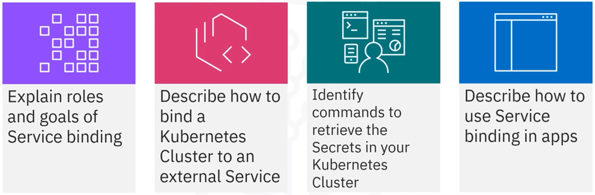
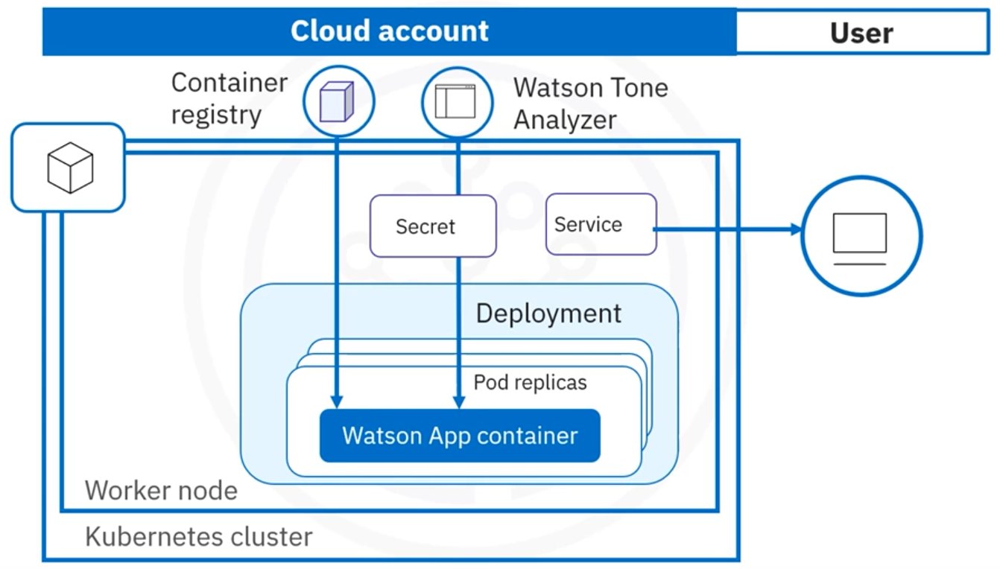
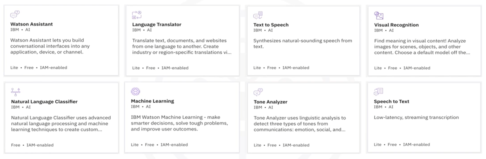

# Module 3 - Section 6: Service Binding

## Introduction to Service Binding



## Service Binding

### Service binding roles & goals

Service binding:

- Is the process needed to consume external services or backing services, including REST APIs, databases, and event buses in our applications.
- Service binding manages configuration and credentials for back end services while protecting sensitive data.
- In addition, service binding makes service credentials available to automatically as a Secret.
- Consumes the external service by binding the application to a deployment.
- The application code uses the credentials from the binding and calls the corresponding service.

### Service Binding Architecture

Here is an architectural diagram that illustrates the binding of a Kubernetes cluster to an external service.



Let's learn the steps required to bind the service to the application.

### IBM Cloud Service

Let's use an IBM Cloud Service example.

#### IBM Service binding

- Is a way to create Service credentials for an IBM Cloud service by using its Public Cloud service endpoint and storing these credentials in a Kubernetes Secret in the cluster.
  - Create the service credentials using IBM's Public Cloud service endpoint.
  - Store or bind the service credentials in a Kubernetes Secret in the cluster.

Here's how to bind an IBM Cloud service to the cluster:

1. Provision an instance of the Service
2. Bind the Service to the cluster to create service credentials for the service that use the Public Cloud service endpoint.
3. Store the credentials in a Kubernetes Secret.
4. Configure the app to access the service credentials in the Kubernetes Secret.

#### IBM Cloud Services Catalog



The IBM Cloud catalog provides various services that range from visual recognition to natural language processing and creating chat bots.

We are using the Tone Analyzer service to explain binding. This service uses linguistic analysis to detect tone in a given text. The service provides an SDK in JavaScript.

We bind the service to the deployment so that the credentials are automatically available. 

The code then uses the credentials from the binding and calls the Tone Analyzer service.

### Provision and bind the instance

Let's examine some code.

#### **Step 1.**: Provision an instance of the service using the CLI-Command line interface or IBM Cloud Catalog

Provision an instance of the service by creating the service instance using the command line interface.

Also, can provision an instance of the service by using the catalog on the IBM Cloud website.

```shell
# ibmcloud resource service-instance-create <service-name> <service-plan>
>> ibmcloud resource service-instance-create upkar-tone-analyzer tone-analyzer standard us-south
Creating service instance upkar-tone-analyzer in resource group default of account UPKAR LIDDERs Account as 123456@domain.com
OK
Service instance upkar-tone-analyzer was created.
  ```

#### **Step 2.**: Bind the service instance to the cluster using the service bind command.

In this step, we bind the newly created service instance to the cluster using the `service bind` command.

```shell
# ibmcloud ks cluster service bind --cluster <cluster-name> --namespace <namespace> --service <service-name>
>> ibmcloud ks cluster service bind --cluster upkar_cluster --namespace default --service upkar-tone-analyzer
Binding service instance upkar-tone-analyzer to cluster upkar_cluster in namespace default
OK

Namespace: default
Service Name: binding-upkar-tone-analyzer
```

IBM Cloud Service Binding automatically creates a Kubernetes Secret with the service credentials.

The credentials of a service instance are base64 encoded and stored inside the Secret in the JSON format.

Now that the service is bound to the cluster, we can verify the Secret object.

#### **Step 3.**: Verify the Secret object.

We can verify the Secret object using the `Get Secrets` command that shows all the Secrets in the Kubernetes cluster.

```shel
>> kubectl get secrets
NAME                          TYPE                                  DATA   AGE
binding-upkar-tone-analyzer   Opaque                                 1      1m
```
**Store and retrieve the secret**: we can retrieve the same Secrets 
  - in the **Kubernetes Dashboard user interface** as well as on the **IBM Cloud Kubernetes Service**.

#### **Step 4.** Configure the app using the Secret

To access the data in the Secret, choose one of the following options:

##### Method 1: Mount the Secret as a volume to the Pod

Based on the specifications provided in Step 1. This action creates a JSON formatted file named `binding` that is stored in the Volume Mounts directory. 

The `binding` file includes all information and credentials required to access the IBM Cloud Service.

```shell
volumeMounts:
    - mountPath: /opt/service-bind
    name: service-bind-volume
  volumes:
    - name: service-bind-volume
      secret:
        defaultMode: 420
        secretName: binding-tone
        # from the kubectl get secretes command above
```

##### Method 2: Reference the Secret in environment variables

The environment variables `binding.apikey`, `binding.username`, and `binding.password` correspond to the API Key, username, and password of the **Watson Tone Analyzer service** instance created in the previous step.

```shel
binding.apikey
binding.username
binding.password
```

The following resulting code snippet shows a sample **Node.js** application using the `binding.apikey`, the `binding.username`, and the `binding.password` environment variable inside an **Express.js** application that will be deployed to the IBM Cloud Kubernetes Service.

```js
const ToneAnalyzerV3 = require('ibm-watson/tone-analyzer/v3');
const { IamAuthenticator } = require('ibm-watson/auth');

var binding = JSON.parse(fs.readFileSync('/opt/service-bind/binding','utf8'));
const tone_analyzer = binding.apiKey ? new ToneAnalyzerV3({
  authenticator: new IamAuthenticator({
    apikey: binding.apiKey,
  }),
  url: binding.url,
  version: '2016-05-19'
}): new ToneAnalyzerV3({
  authenticator: new IamAuthenticator({
    username: binding.username,
    password: binding.password,
  }),
  url: binding.url,
  version: '2016-05-19'
});
```

## Conclusion - Recap

- Binding an external service to the deployment automatically provides the credentials to use the Service inside the code.
- Credentials are stored as a Secret that can be consumed using `volumeMounts` and volumes.
- Binding manages configuration and credentials for back end services while protecting sensitive data.
- Can configure the app to use the credentials stored in the Secret, either by mounting the Secret as a volume to the Pod or by referencing the Secret in environment variables.
