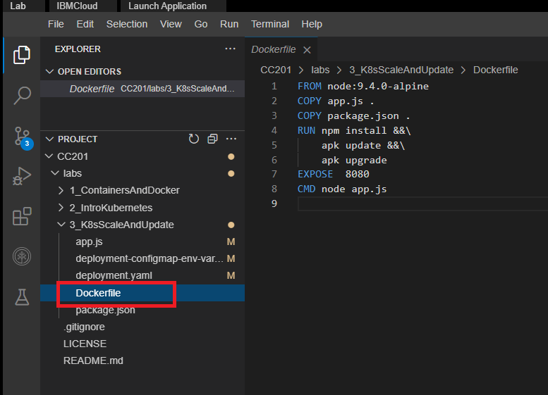

# 02 - Build and push application image to IBM Cloud Container Registry

1. Export your namespace as an environment variable so that it can be used in subsequent commands.

    ```shell
    >> export MY_NAMESPACE=sn-labs-$USERNAME
    ```

2. Use the Explorer to view the Dockerfile that will be used to build an image.

   

3. Build and push the image again, as it may have been deleted automatically since you completed the first lab.

   ```shell
   docker build -t us.icr.io/$MY_NAMESPACE/hello-world:1 . && docker push us.icr.io/$MY_NAMESPACE/hello-world:1
   ```

> NOTE: If you have tried this lab earlier, there might be a possibility that the previous session is still persistent. In such case, you will see a ‘Layer already Exists’ message instead of the ‘Pushed’ message in the above output. We would recommend you to continue with the further steps of the lab.