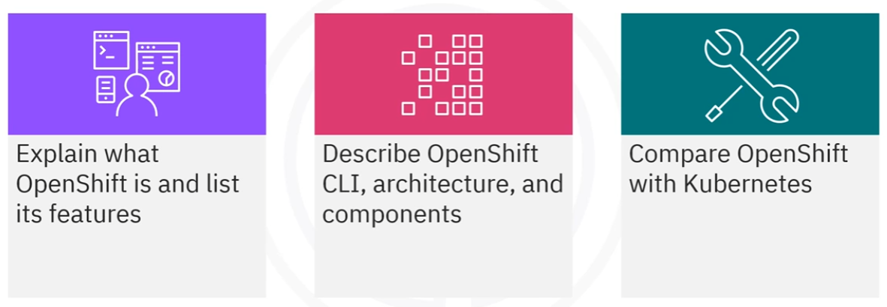
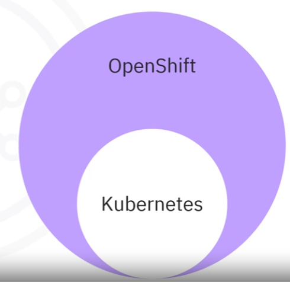
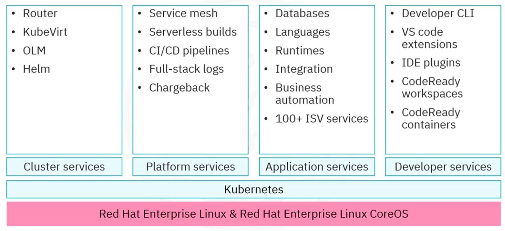

# Module 4 - Section 1 - Introduction to Red Hat OpenShift

## Introduction

In this section, we will learn about Red Hat OpenShift, a Kubernetes container platform:

- Define OpenShift and list its features.
- Its architecture
- How it compares to Kubernetes.

## What is Red Hat OpenShift?

OpenShift is an enterprise-ready Kubernetes container platform built for an open hybrid cloud strategy.

OpenShift, developed and supported by Red Hat.

- Consistent application platform to manage hybrid, multi-cloud, and edge deployments.
- Built on the technological foundation of Linux, containers, and automation.
- Provides full stack automated operations and self-service provisioning for developers to efficiently move ideas from
  development to production.
- Additional tooling around the complete lifecycle of applications, from build, to CI/CD, to monitoring, and logs.

## Kubernetes and OpenShift

Both Kubernetes and OpenShift are container orchestration platforms.

- Kubernetes is a critical component of OpenShift.
- OpenShift is used as an extension of Kubernetes to provide a more robust and comprehensive platform for containerized
  applications.

## OpenShift Features

Here is a selection of OpenShift features:

- **Scalable**:
    - Apps can scale to thousands of instances across hundreds of nodes in seconds.
- **Flexible** hybrid infrastructure options:
    - Simplify deployment and management.
- **Open source** standards use Kubernetes and Open Container Initiative (OCI) containers:
    - Development is familiar and containers are portable across multiple environments.
- **Enhanced developer development**:
    - Includes a comprehensive set of developer tools, multi-language support, command line, IDE integrations, and more.
- **Automated operations(installs & upgrade)**:
    - It supports over-the-air platform upgrades, and services from the operator hub can be fully configured and
      deployed with one-click upgrades.
- **Automation & streamlining**:
    - Container and app builds, deployments, scaling, and health management are streamlined and automated.
- **Edge architecture support**:
    - OpenShift also enhances support for smaller footprint topologies in edge scenarios for better mapping,
      connectivity, and availability.
- **Multi-cluster management**:
    - It easily manages and enforces policies across multiple clusters at scale.
- **Advanced security & compliance**:
    - It offers access controls, networking and enterprise registry, built-in scanner, enhanced threat detection,
      lifecycle vulnerability management, and risk profiling.
- **Persistent storage solutions**:
    - OpenShift supports enterprise persistent storage solutions for running stateful and stateless apps.
- **Robust partner ecosystem**:
    - The OpenShift partner ecosystem provides additional storage and network services, as well as IDE, CI,
      integrations, and more.

## OpenShift vs. Kubernetes

| Difference      | OpenShift                                 | Kubernetes                                                        |
|-----------------|-------------------------------------------|-------------------------------------------------------------------|
| Type            | Product                                   | Open Source Project                                               |
| Installation    | Limited options after installation starts | Installable on every/all Linux environment                        |
| Flexibility     | Some limitations                          | More flexible                                                     |
| Platforms       | Available online with Azure and Dedicated | Available on EKS, on AWS, GKE on GCP, and AKS on Azure            |
| Image Streams   | Easy: Better management                   | Not that easy                                                     |
| Security        | Not easy: very strict policy              | Easy: Security maintenance is easy                                |
| Routing/Ingress | External access using router objects      | External access to K8S cluster using Ingress objects              |
| Deployment      | Less flexible: Deployment Config command  | More flexible: Deployment objects                                 |
| User Experience | Good user experience                      | Requires extra tools for a better user experience                 |
| Networking      | Good networking solutions out of the box  | Provides 3rd-party plugins when network solutions are unavailable |
| Service Catalog | Good service catalog                      | Offers less provision for better services in clusters             |
| Console Layout  | User-friendly web console layout          | Difficult to learn for beginners                                  |
| CI & CD         | Integrates with Jenkins                   | Can be integrated, but not with Jenkins                           |

## OpenShift Platform Architecture

OpenShift runs on top of a Kubernetes cluster, with object data stored in the etcd key-value store.

OpenShift has a microservices-based architecture, with services as REST APIs and controllers. These services expose the
core objects, read the REST APIs, apply changes to the other objects, and report status or write back to the object.
They also maintain the cluster desired state.

## OpenShift Services

OpenShift provides a set of services to help users manage their workloads, build Cloud-native apps, and increase
developer productivity.

- **Rest APIs**:
    - Expose each of the core objects.
- **Controllers**:
    - Read the REST APIs
    - Apply changes to the other objects
    - Report status or write back to the object.
    - Maintain the cluster desired state.

When:
- **Docker**:
    - Provides abstraction for packaging and creating Linux-based lightweight container images.
- **Kubernetes**:
    - Provides cluster management and orchestrates containers on multiple hosts.

OpenShift adds:
- **Management of source code, builds, and deployments** for developers.
- **Managing and promoting images** at scale as they flow through the system.
- **Application management at scale**.
- **Team and user tracking management** of a large developer organization.
- **Networking infrastructure** that supports the cluster.

## OpenShift Components

In an OpenShift environment, the Kubernetes master runs on **Red Hat Enterprise Linux CoreOS**, while worker nodes support
**Red Hat Enterprise Linux** -> That is the Red Hat base layer.

Next, the Kubernetes architecture and a set of services:

- *Cluster services*:
    - Automated ops
    - Integrated monitoring
    - A private registry within the cluster
    - Networking solutions, and many others.
    - Router
    - KubeVirt
    - OLM
    - Helm
- *Platform services*: help users manage their workloads.
  - Service Mesh
  - Serverless builds
  - CI/CD pipelines
  - Full-stack logs
  - Chargeback
- *Application services*: help users build Cloud-native apps.
  - Databases
  - Languages
  - Runtimes
  - Integration
  - Business Automation
  - 100+ ISV services
- *Developer services*: increase developer productivity.
  - Developer CLI
  - VS Code extensions
  - IDE plugins
  - CodeReady Workspaces
  - CodeReady Containers

## OpenShift CLI

OpenShift offers a set of command-line interface (CLI) tools that let users perform various admin and development
operations from the terminal.

The OpenShift CLI or `oc` is the most commonly used CLI tool to perform end-to-end operations. It runs on Windows, Linux,
or Mac.

`oc` lets you work directly with project source code using command scripts, script OpenShift operations, and manage
projects during restricted bandwidth or availability of the web console.

Since OpenShift runs on top of a Kubernetes cluster, a copy of `kubectl` is also included with `oc`.

The `oc` and `kubectl` binary offer the same capabilities, but `oc` is further extended to natively support OpenShift
features: that are not available in standard Kubernetes.
- DeploymentConfigs
- BuildConfigs
- Routes
- ImageStreams and ImageStreamTags.
- Inbuilt log-in command for authentication.
- Additional commands: like `new-app` are also supported by `oc`, which makes it easier to get new applications started
  using existing source code or pre-built images.

## Conclusion - Recap

- Kubernetes and OpenShift are container orchestration platforms.
- OpenShift is an enterprise-ready Kubernetes container platform built for an open hybrid cloud.
- OpenShift runs on a Kubernetes cluster, with object data stored in the etcd key-value store.
- OpenShift is easier to use, integrates with Jenkins, and has more services and features.
- OpenShift provides a set of command-line interface (CLI) tools that let users perform various admin and development
  operations from the terminal.
