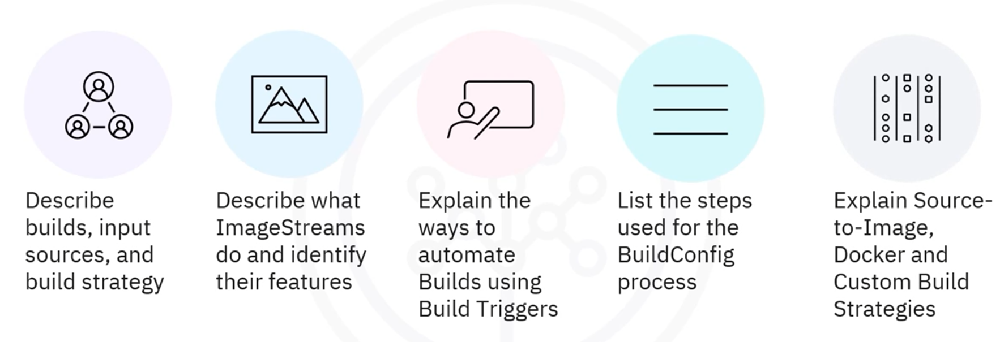
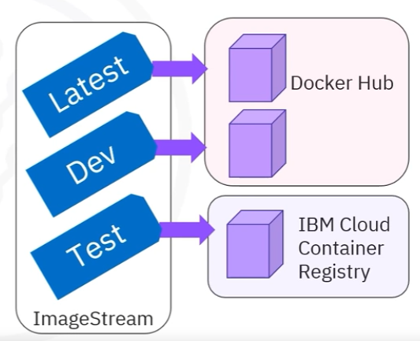
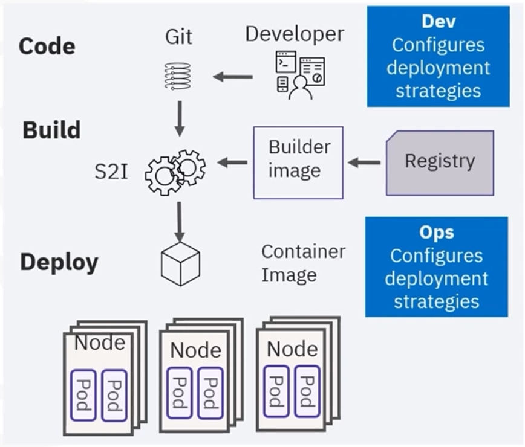

# Module 04 - Section 2 - Builds

## Introduction

In this section, we will learn about the **Builds** process in OpenShift:



## What is a Build?

A **build** is the process of transforming inputs into a resultant object. For example, transforming source code to a container image.

A build requires a **build configuration file** or **build config**, which defines the build strategy and input sources.

Commonly used build strategies are:

- **Source-to-image, or S2I**
- **Docker**
- **Custom**

## Build Input Sources

A **build input source** provides content for builds. The following build inputs listed in order of precedence:

- Inline Dockerfile definitions
- Content extracted from existing images
- Git repositories
- Binary or local inputs
- Input secrets
- External artifacts

**Note that**:
- Multiple inputs can be combined into a single build
- An inline Dockerfile takes precedence and overwrites any external Dockerfile.

## Image Streams

An **image stream** is an abstraction for referencing container images within OpenShift. 

- Continuously creates and updates container images.
- Does not contain actual image data but is merely a pointer
- Can store source images in different registries or other ImageStreams
- Can trigger builds and deployments when a new image is available

An image stream continuously creates and updates container images but does not contain actual image data. Instead, it points to images stored in internal and external registries or to other image streams.



A single image stream can consist of many different tags, such as `latest`, `dev`, and `test`, and each tag points to a certain image in a registry.

To deploy an application, you'll refer to the image stream tag rather than hardcode the registry URL and tag. If the source image location changes, you'll update the image stream definition rather than individually updating all the deployments.

An image stream also provides a trigger capability that automatically invokes builds and deployments when a new version of an image is available. Rather than running builds manually, automate the process using triggers.

## Build Triggers

Rather than running builds manually, automate the process using triggers:

- Webhook triggers
  - Sends a request to an OpenShift Container Platform API end-point.
  - Supports generic webhooks and the more often used **GitHub webhooks**.
- Image change trigger
  - - Useful for keeping base images up-to-date
  - New version of an image is available.
- Configuration change trigger
  - Build when create a new BuildConfig resource.

**Webhook triggers**: send a request to an API endpoint, and they also support generic webhooks and the more often used GitHub webhooks, which send the trigger request to the API endpoint on any new commit or a pull request or other circumstances.

Next is the **image change trigger**, which triggers builds when a new version of an image is available. For instance, if you build your application using a Node.js base image, that image is updated when security fixes are released and other updates occur.

Finally, a **configuration change trigger** causes a new build to run when you create a new build config resource.

## Build Config Process

Let's look at a sample configuration file for **BuildConfig**:

```yaml
kind: BuildConfig
apiVersion: build.openshift.io/v1
metadata:
  name: ruby-sample-build
spec:
  runPolicy: "Serial"
  triggers:
    - type: "Github"
      github:
        secret: "secret101"
    - type: "Generic"
      generic:
        secret: "secret101"
    - type: "ImageChange"
source:
  git:
    uri: "https://github.com/openshift/ruby-hello-world"
  strategy:
    sourceStrategy:
      from:
        kind: "ImageStreamTag"
        name: "ruby-20-centos7:latest"
  output:
    to:
      kind: "ImageStreamTag"
      name: "origin-ruby-sample:latest"
  postCommit:
    script: "bundle exec rake test"
```

1. New BuildConfig named `ruby-sample-build`: the specification creates a new build config named `ruby-sample-build`.
   - `kind`: `BuildConfig`
2. `runPolicy` shows build created sequentially: the field controls how builds created from a build configuration need to run values include the default, serial, or sequentially and simultaneously.
3. `triggers` section: you can also specify a list of triggers that creates a new build.
4. `source` section: defines the input build's source 
5. `sourceType`: determines the primary input, like a git repository, an inline Dockerfile, or binary payloads.
6. `strategy` section: shows which strategy was used to execute the build, such as source, docker, or custom strategy.
   -  This example uses source `strategy` is S2I (uses ruby-20-centos7)
7. `output` section: after the container image is built, the container image is pushed into the repository as described in this section
8. `postCommit` section: defines an optional build hook.

### Build 

## Build Strategy

### Source-to-Image (S2I) strategy

Another build strategy offered by OpenShift is called **Source-to-Image, or S2I**. 

- Is tool for building reproducible container images
- Injects application source into a container image to produce a ready-to-run image.
- Eliminates using a Dockerfile
- Go from Source to Image in one step
- OpenShift includes predefined builder images

The S2I tool builds reproducible container images and injects a container image with the app source to produce a ready-to-run image.

The new image is built by incorporating a builder image plus the source that avoids using a Dockerfile, which enables going from source-to-image in a single step.

OpenShift comes with a variety of available builder images, saving you time and development effort.



### Docker build strategy

**Docker Registry:**
- Requires a repository that contains a Dockerfile and the necessary artifacts
- Invokes the `docker build` command and creates an image
- Pushes image to the internal registry (OpenShift registry)

Using a **Docker build strategy** requires a repository that contains a Dockerfile and the necessary artifacts. When you kick off a build, OpenShift takes the input, invokes the Docker build command, and creates an image, which is then pushed to the internal OpenShift registry.

**Docker build strategy methods:**
- Replace Dockerfile FROM image
- Use Dockerfile path
- Use Docker environment variables
- Add Docker build arguments

### Custom Build Strategy

In a **custom build strategy**, you must define and create your own builder image required for the build process.

- Custom builder images are regular Docker images that contain the logic needed to transform the inputs into the expected outputs.
- Custom build strategy creates additional objects like JAR files and CI/CD deployment that performs unit or integration tests.
  - Both Docker and S2I strategies result in runnable images, but the custom build strategy creates additional objects like JAR files and CI/CD deployment that performs unit or integration tests.
- Custom builds are only available to cluster administrators
  - Custom builds are only available to cluster administrators because they run with high privileges.

## Build Automation

Cloud-native development requires greater automation throughout the container lifecycle. 
- CI/CD(Continuous Integration/Continuous Delivery) deployment pipeline provides automation
  - For example: OpenShift CI/CD process
    - Merges new code changes to the repository, then builds, tests, approves, and deploys a new version to different environments.
    

## Conclusion - Recap

- A build is a process that transforms inputs into an object
- Build inputs include inline Dockerfile definitions, content extracted from existing images, git repositories, binary (Local) inputs, input secrets, and external artifacts
- An image stream is an abstraction for referencing container images within OpenShift
- Can automate builds using Webhook, Image Change, or Configuration Change triggers
- Commonly used Build strategies include Source-toImage(S2I), Docker and Custom build strategies
- Builds require a configurations file (BuildConfig), which defines the build strategy and input sources


## Raw content

WEBVTT

1
00:00:07.280 --> 00:00:08.910
Welcome to Builds.

2
00:00:08.910 --> 00:00:13.964
After watching this video,
you will be able describe what a build is,

3
00:00:13.964 --> 00:00:17.134
build input sources and build strategy.

4
00:00:17.134 --> 00:00:21.270
Describe what image streams do and
identify their features.

5
00:00:21.270 --> 00:00:24.894
Explain how to automate
builds using build triggers.

6
00:00:24.894 --> 00:00:28.564
List the steps used for
the build config process and

7
00:00:28.564 --> 00:00:33.754
explain source to image docker and
custom build strategies.

8
00:00:33.754 --> 00:00:38.674
A build is the process of transforming
inputs into a resultant object,

9
00:00:38.674 --> 00:00:43.210
for example, transforming source
code to a container image.

10
00:00:43.210 --> 00:00:47.581
A build requires a build
configuration file or build config,

11
00:00:47.581 --> 00:00:51.754
which defines the build strategy and
input sources.

12
00:00:51.754 --> 00:00:56.443
Commonly used build strategies
are source-to-image, or S2I,

13
00:00:56.443 --> 00:00:58.564
Docker, and custom.

14
00:00:58.564 --> 00:01:02.500
A build input source provides content for
builds.

15
00:01:02.500 --> 00:01:07.594
You can use the following build
inputs listed in order of precedence,

16
00:01:07.594 --> 00:01:13.208
inline Dockerfile definitions,
content extracted from existing images,

17
00:01:13.208 --> 00:01:19.812
Git repositories, binary or local inputs,
input secrets, and external artifacts.

18
00:01:19.812 --> 00:01:24.358
Note that multiple inputs can be
combined into a single build, and

19
00:01:24.358 --> 00:01:30.474
an inline Dockerfile takes precedence and
overwrites any external Dockerfile.

20
00:01:30.474 --> 00:01:32.761
An image stream is an abstraction for

21
00:01:32.761 --> 00:01:36.090
referencing container
images within OpenShift.

22
00:01:36.090 --> 00:01:38.856
An image stream continuously creates and

23
00:01:38.856 --> 00:01:43.602
updates container images, but
does not contain actual image data.

24
00:01:43.602 --> 00:01:47.166
Instead, it points to images
stored in internal and

25
00:01:47.166 --> 00:01:50.914
external registries or
to other image streams.

26
00:01:50.914 --> 00:01:56.963
A single image stream can consist of many
different tags, such as latest dev and

27
00:01:56.963 --> 00:02:02.114
test, and each tag points to
a certain image in a registry.

28
00:02:02.114 --> 00:02:07.021
To deploy an application, you'll
refer to the image stream tag rather

29
00:02:07.021 --> 00:02:09.986
than hardcode the registry URL and tag.

30
00:02:09.986 --> 00:02:14.756
If the source image location changes,
you'll update the image stream definition

31
00:02:14.756 --> 00:02:18.298
rather than individually
updating all the deployments.

32
00:02:18.298 --> 00:02:23.077
An image stream also provides a trigger
capability that automatically invokes

33
00:02:23.077 --> 00:02:27.974
builds and deployments when a new
version of an image is available.

34
00:02:27.974 --> 00:02:33.014
Rather than running builds manually
automate the process using triggers.

35
00:02:33.014 --> 00:02:36.848
Webhook triggers send a request
to an API endpoint, and

36
00:02:36.848 --> 00:02:42.151
they also support generic webhooks and
the more often used GitHub webhooks,

37
00:02:42.151 --> 00:02:46.884
which send the trigger request to
the API endpoint on any new commit or

38
00:02:46.884 --> 00:02:50.334
a pull request or other circumstances.

39
00:02:50.334 --> 00:02:52.383
Next is the image change trigger,

40
00:02:52.383 --> 00:02:56.542
which triggers builds when a new
version of an image is available.

41
00:02:56.542 --> 00:03:01.344
For instance, if you build your
application using a node JS base image,

42
00:03:01.344 --> 00:03:07.054
that image is updated when security fixes
are released and other updates occur.

43
00:03:07.054 --> 00:03:12.048
Finally, a configuration change trigger
causes a new build to run when you

44
00:03:12.048 --> 00:03:15.134
create a new build config resource.

45
00:03:15.134 --> 00:03:19.224
Let's look at a sample
configuration file for BuildConfig.

46
00:03:19.224 --> 00:03:25.454
The specification creates a new build
config named Ruby Sample build.

47
00:03:25.454 --> 00:03:31.016
The run policy field controls how builds
created from a build configuration need

48
00:03:31.016 --> 00:03:37.006
to run values include the default, serial,
or sequentially and simultaneously.

49
00:03:37.006 --> 00:03:41.294
You can also specify a list of
triggers that creates a new build.

50
00:03:41.294 --> 00:03:46.530
The source section defines the build's
source, and the source type determines

51
00:03:46.530 --> 00:03:52.474
the primary input, like a git repository,
an inline Dockerfile, or binary payloads.

52
00:03:52.474 --> 00:03:57.332
The strategy section shows which
strategy was used to execute the build,

53
00:03:57.332 --> 00:04:00.634
such as source, docker,
or custom strategy.

54
00:04:00.634 --> 00:04:05.367
This example uses the ruby-20-centos7
container image and

55
00:04:05.367 --> 00:04:10.834
source-to-image, or S2I,
strategy for the application build.

56
00:04:10.834 --> 00:04:16.218
So after you build the container image, it
is pushed into the repository described in

57
00:04:16.218 --> 00:04:21.984
the output section, and the postCommit
section defines an optional build hook.

58
00:04:21.984 --> 00:04:27.363
Another build strategy offered by
OpenShift is called source-to-image,

59
00:04:27.363 --> 00:04:28.168
or S2I.

60
00:04:28.168 --> 00:04:32.071
The s two I tool builds
reproducible container images and

61
00:04:32.071 --> 00:04:37.512
injects a container image with the app
source to produce a ready to run image.

62
00:04:37.512 --> 00:04:42.899
The new image is built by incorporating a
builder image plus the source that avoids

63
00:04:42.899 --> 00:04:48.640
using a Dockerfile, which enables going
from source-to-image in a single step.

64
00:04:48.640 --> 00:04:52.582
Openshift comes with a variety
of available builder images,

65
00:04:52.582 --> 00:04:55.864
saving you time and development effort.

66
00:04:55.864 --> 00:05:01.534
Using a Docker build strategy requires a
repository that contains a Dockerfile and

67
00:05:01.534 --> 00:05:03.592
the necessary artifacts.

68
00:05:03.592 --> 00:05:07.042
When you kick off a build,
Openshift takes the input,

69
00:05:07.042 --> 00:05:10.717
invokes the Docker build command,
and creates an image,

70
00:05:10.717 --> 00:05:14.814
which is then pushed to
the internal OpenShift registry.

71
00:05:14.814 --> 00:05:18.430
Here are four ways to implement
the Docker build strategy.

72
00:05:18.430 --> 00:05:22.384
Replace Dockerfile from image,
use Dockerfile path,

73
00:05:22.384 --> 00:05:28.214
use Docker environment variables,
or add Docker build arguments.

74
00:05:28.214 --> 00:05:31.124
In a custom build strategy,
you must define and

75
00:05:31.124 --> 00:05:35.454
create your own builder image required for
the build process.

76
00:05:35.454 --> 00:05:40.111
Custom builder images are regular
docker images that contain the logic

77
00:05:40.111 --> 00:05:44.126
needed to transform the inputs
into the expected outputs.

78
00:05:44.126 --> 00:05:48.564
Both Docker and S2I strategies
result in runnable images, but

79
00:05:48.564 --> 00:05:53.579
the custom build strategy creates
additional objects like JAR files and

80
00:05:53.579 --> 00:05:58.174
CI/CD deployment that performs unit or
integration tests.

81
00:05:58.174 --> 00:06:01.830
Custom builds are only available
to cluster administrators

82
00:06:01.830 --> 00:06:05.134
because they run with high privileges.

83
00:06:05.134 --> 00:06:09.717
Cloud-native development requires greater
automation throughout the container

84
00:06:09.717 --> 00:06:10.598
lifecycle.

85
00:06:10.598 --> 00:06:14.736
Automation is available using
the continuous integration and

86
00:06:14.736 --> 00:06:17.876
continuous delivery pipeline, or CI/CD.

87
00:06:17.876 --> 00:06:22.627
For example, the OpenShift CI/CD
process automatically merges new

88
00:06:22.627 --> 00:06:27.540
code requests to the repository,
then builds, tests, approves, and

89
00:06:27.540 --> 00:06:31.884
deploys a new version to
different environments.

90
00:06:31.884 --> 00:06:32.984
In this video,

91
00:06:32.984 --> 00:06:38.572
you learned that a build is a process
that transforms inputs into an object.

92
00:06:38.572 --> 00:06:44.248
Build inputs in order of precedence
include inline Dockerfile definitions,

93
00:06:44.248 --> 00:06:48.806
content extracted from existing images,
git repositories,

94
00:06:48.806 --> 00:06:53.902
binary or local inputs, input secrets,
and external artifacts.

95
00:06:53.902 --> 00:06:56.091
An image stream is an abstraction for

96
00:06:56.091 --> 00:06:59.294
referencing container
images within Openshift.

97
00:06:59.294 --> 00:07:03.316
You can automate builds using a webhook,
image change, or

98
00:07:03.316 --> 00:07:05.766
configuration change trigger.

99
00:07:05.766 --> 00:07:10.493
Commonly used build strategies
include source-to-image, or S2I,

100
00:07:10.493 --> 00:07:13.434
Docker, and custom build strategies.

101
00:07:13.434 --> 00:07:18.049
And finally, builds require a build
configuration file or build config,

102
00:07:18.049 --> 00:07:21.354
which defines the build strategy and
input sources.