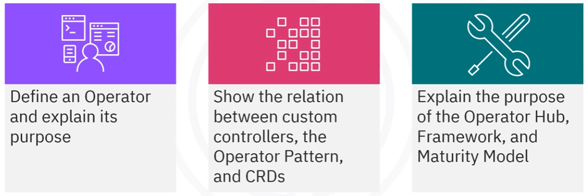
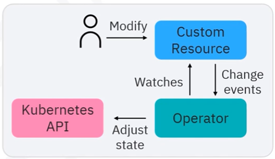
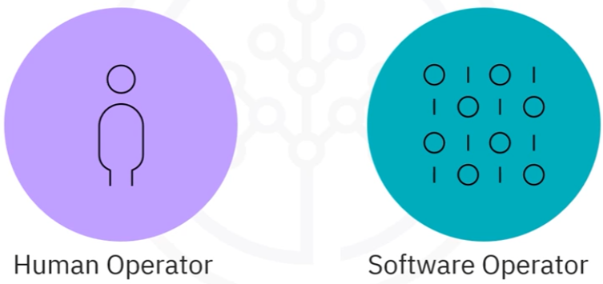
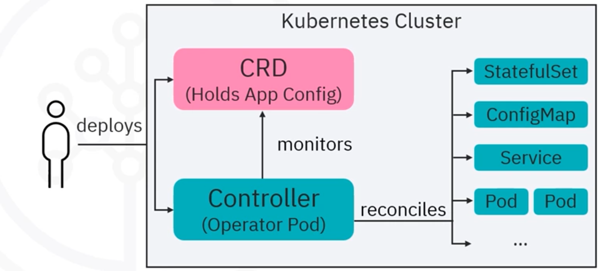
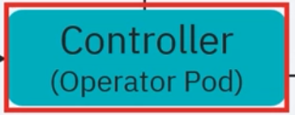
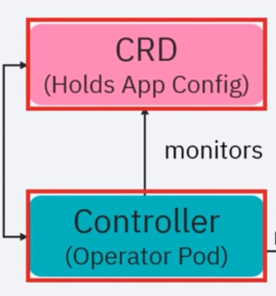
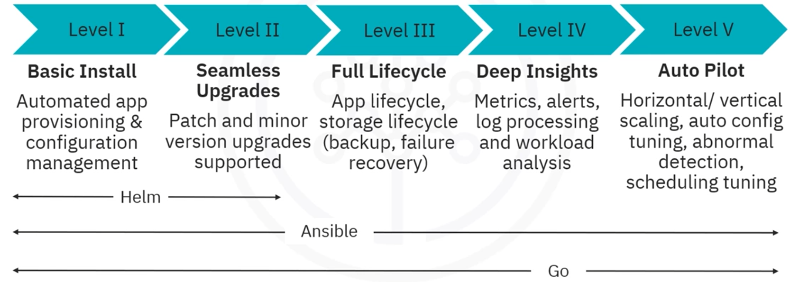
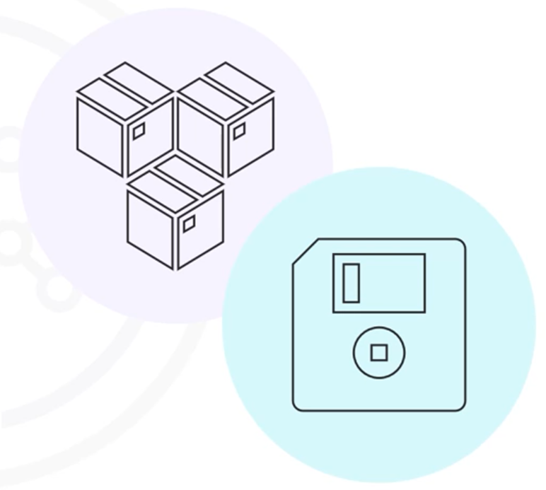
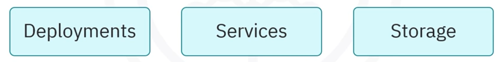

# Module 04 - Section 3 - OpenShift:Operators

## Introduction

## Operator - Introduction

Operators automate cluster tasks and act as a custom controller to extend the Kubernetes API.

- Operator run in a Pod, interact with the API server
- Package, deploy, and manage Kubernetes applications
- Automate app creation, configuration, and management via continuous real-time decisions

### Human Operators vs Software Operators

Operators package, deploy, and manage native apps in Kubernetes, automate other tasks, and ensure all relevant
components are included.

- Human operators understand the system they control. They know how to deploy services and how to recognize and fix
  problems.
- Software operators try to capture the knowledge of human operators and automate the same processes.

### Why use Operators?

Operators provide the following features:

- Repeatable installs and upgrades
- Regular full-system health checks
- Over-the-air(OTA) updates for components and software vendors content
- Communication tools: a way to collect and spread knowledge from field engineers to all users
- Integration: with APIs and CLI tools such as `kubectl` and `oc` commands

### Service Brokers vs Operators

| Service Brokers provide                                                                                        | Operators provide                                                                                   |
|----------------------------------------------------------------------------------------------------------------|-----------------------------------------------------------------------------------------------------|
| A Short-running process that cannot perform consecutive days operations such as upgrades, failover, or scaling | A Long-running process that can perform operations like upgrades, failover, or scaling every day.   |
| Customizations and parameterization only at the time of installation,                                          | Customizations and parameterization as operators constantly watch the current state of the cluster. |
| Off-cluster services                                                                                           | Off-cluster services                                                                                |

## Custom Resource Definition (CRD)

Custom resource definitions (or CRDs) store and retrieve objects in the Kubernetes API.

- CRDs extend Kubernetes functionality beyond built-in resources like deployments and pods.
- Make the Kubernetes API more modular and flexible.
- Can be installed in clusters
- Once installed, CRD objects are accessible using `kubectl`, similar to pods and other resources.

## Custom Controllers

To change the state of a cluster, **custom controllers** are used. Controllers reconcile a cluster's actual state with its desired state.

- Custom controllers do the same reconciling for custom resources(CRD).
  - 
- Combining CRDs and custom controllers creates a declarative API.
  - 
- This combination is known as the **operator pattern**.

Custom controllers interpret CRD data as the desired state and reconcile a cluster's actual state to match the CRD data.

## Operator Framework

The **Operator Framework** is an open-source toolset that covers coding, testing, delivery, and operator updates.

- **Operator SDK**: which includes Helm, Go, and Ansible helps authors build, test, and package their operators without requiring knowledge of Kubernetes API complexities.
- **Operator Lifecycle Manager (OLM)**: controls the install, upgrade, and role-based access control (RBAC) of operators in a cluster.
- **Operator Registry**: stores CRDs, Cluster Service Versions (CSVs), and operator metadata for packages and channels. It runs in Kubernetes or OpenShift clusters to provide the operator catalog data to OLM.
- **OperatorHub**: web console lets cluster administrators find operators to install on their cluster.

## Operator Maturity Model

The sophistication of operator management logic varies depending on the type of service represented by the operator.

The **operator maturity model** defines the phases of maturity for general day-to-operation activities and ranges from basic install to auto-pilot. 

It also shows which activities are supported by the Helm, Go, and Ansible capabilities of the Operator SDK.

### Operator Examples

Some operator examples include:
- **Deploying an application to the OpenShift cluster**: this can go beyond deployments to include secrets, config maps, and storage resources.
- **Scaling the application with the help of multiple replicas** based on the application type.[subtitles-en (5).vtt](..%2F..%2F..%2FUsers%2Fthanhbui_ctr%2FOneDrive%20-%20Fortna%20Inc%2FDownloads%2Fsubtitles-en%20%285%29.vtt)
- **Automation of backup/restore tasks**: Automation of routine tasks in a cluster like taking and restoring backups of an application state.
- Integration

#### Operator in practice

To deploy a complete application:
1. Create a custom resource for that app
2. Create a custom controller for that CRD
3. The operator logic determines how to reconcile the actual and configure states.
4. A CRD requires the creation of deployments, services, storage, and other objects.
  

## OperatorHub

- Install Operators with a simple click: The **OperatorHub** view of the OpenShift web console enables operator installation with one click.
- Many operators available: OperatorHub has many different types of operators available, including Red Hat operators, certified operators from independent service vendors partnered with Red Hat, community operators from the open-source community but not officially supported by Red Hat, and custom operators defined by users.
  - Red Hat operators
  - Certified operators
  - Community operators
  - Custom operators
- Can install many tools from the Kubernetes ecosystem via the OperatorHub.
  - An example is the **Istio service mesh**.

## Conclusion - Recap

- CRDs extend the Kubernetes API.
- CRDs paired with custom controllers create new declarative APIs in Kubernetes.
- Operators use CRDs and custom controllers to automate cluster tasks.
- The operator framework covers coding, testing, delivery, and updates.
- The operator maturity model defines the phases of maturity for activities.
