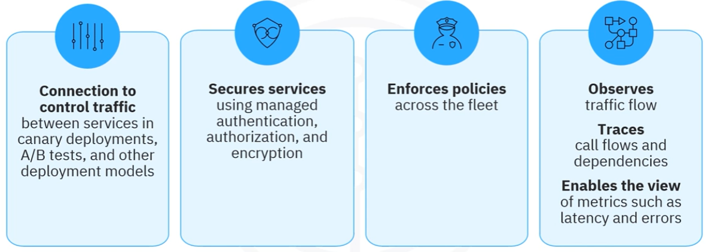
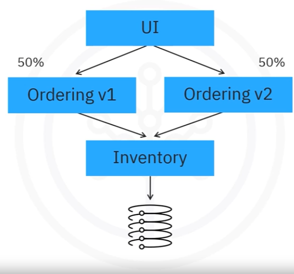
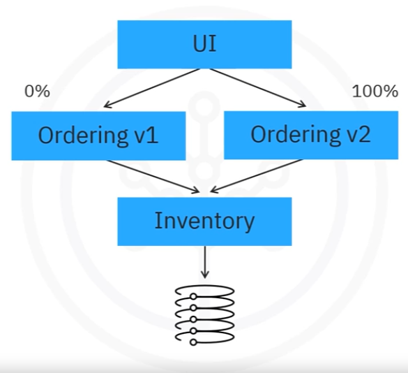
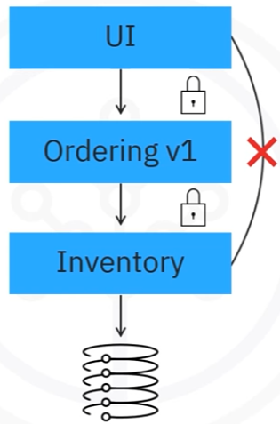
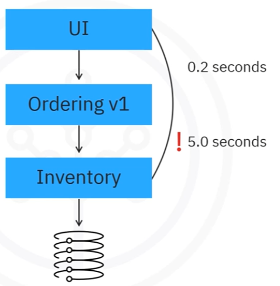

# Module 04 - Section 4 - Istio

## Introduction

After this section, we'll be able to describe a service mesh, identify the four concepts that Istio supports, describe the benefits and challenges of using Istio with microservices, and identify the four basic communication service monitoring metrics.

## What is a service mesh?

A service mesh is a dedicated layer for making service-to-service communication secure and reliable. Among other things, service meshes provide traffic management to control the flow of traffic between services, security to encrypt traffic between services, and observability of service behavior to troubleshoot and optimize applications.

- A dedicated infrastructure layer that ensures secure and reliable service-to-service communication. It provides
  - Traffic management: to control the flow of traffic between services.
  - Security: to encrypt traffic between services.
  - Observability: of service behavior to troubleshoot and optimize applications.
- The service mesh term describes a software that creates a security or network domain with a pattern for achieving the above capabilities.

## What is Istio and what does it do?

Istio is a platform-independent service mesh often used on Kubernetes. In keeping with the definition of a service mesh, Istio exhibits these four concepts:
- **Connection to control traffic** between services in canary deployments, A/B tests, and other deployment models.
- **Security** to secure services through authentication, authorization, and encryption.
- **Enforces policies** across the fleet: Istio also provides enforceability and provides control by enforcing policies across an entire fleet.
- **Observability** to observe the traffic flow in your mesh
  - **Traces** call flows and dependencies
  - **Enable the view** of metrics such as latency and errors.

### Istio Features

Istio features transport security layer encrypted communications between services in a cluster, combined with the appropriate authentication and authorization. 

Istio load balances traffic for different protocols, including HTTP, TCP, gRPC, and web socket traffic. 

Istio supports granular configuration of traffic flow known as routing rules and supports control with continuous retries, fault injection methods, and automatic failovers. 

Along with policies in API support for access controls, rate limits, and quotas

Istio also provides automatic monitoring, logging, and tracking of both inbound and outbound traffic. Istio is extensible and can handle a diverse range of deployment needs. Istio runs on Kubernetes, where you can add applications of a cluster to the mesh, extend the mesh to additional clusters, or connect to virtual machines or other endpoints running outside of Kubernetes.

### Istio and Kubernetes

Istio is:
- Extensible
- Can handle a diverse range of deployment needs

Istio runs on Kubernetes, where you can:
- The addition of applications of a cluster to the mesh
- The extension of the mesh to additional clusters
- Connections to virtual machines or other endpoints running outside of Kubernetes

### How Istio works

There are two main components in Istio:
- The control plane
- The data plane. 

Communication between services is handled by the data plane. If the service mesh is absent, the network cannot identify the type of traffic that flows, the source, or the destination, and cannot make necessary decisions. 

All network traffic is subject to or intercepted by a proxy called envoy, which is used by the service mesh and allows many features depending on the configuration.

The control plane takes the desired configuration and its view of the services and dynamically programs and updates the proxy servers as the environment changes.

### Microservices with Istio

A cornerstone of cloud-native development is microservices architecture. The benefits of microservices are multiple.

- Cloud-native architectural approach
- Single application composed of loosely coupled and independently deployable smaller components or services
- Well-defined APIs for communicating with each other
- Benefits include
  - Code updates are easy as only the relevant service needs to be updated instead of the entire application.
  - Allow teams to use different technology stacks for each component.
  - Components can be scaled independently instead of the entire application.
- Challenges range from/include from traffic encryption, Canary deployments, A/B testing to cascading failures(retries, circuit-breaking).
  - Encryption of traffic to ensure secure communication.
  - Canary Deployments & A/B Testing: Development teams might want to roll out new features to a subset of users or compare two versions of features in their application to see which engages users the most.
  - Communication between microservices also leads to cascading failures if one service is unreachable or particularly slow.
  - Developers need retries and circuit breaking to prevent errors in one microservice from cascading to others.

Consider the application architecture shown above, in which the UI talks to an ordering microservice. 

The ordering microservice interacts with the inventory microservice, which then talks to a database. Service-to-service communication enables any microservice architecture. 

But as that communication gets more complex, a service mesh can help improve it. Let's check out some more of Istio's capabilities.

## Istio Capabilities

### Traffic Management

Istio performs traffic shifting by gradually migrating the traffic from one version of a microservice to other versions. 

Say a team working on the **ordering microservice** has a new update to that microservice. 

The team begins by sending 5% of traffic to that second version. 

Over time, the team can increase this to 50%

and eventually to 100%.

Similarly, Istio request routing allows you to perform A/B testing and direct a particular version of a microservice to a subset of users while sending the original version to the remaining users. 
The process ensures that a new version increases user engagement or performance.

### Security

Istio also provides a variety of security measures for your microservices, including encryption. 

Istio defends from man-in-the-middle attacks by encrypting traffic between microservices.

In addition, Istio makes it easier to implement policies for service access control so that services can only talk to the other required services.
In this example, the UI service would be unable to directly communicate with the inventory service, even if it tried.

### Observability

Istio provides service communication metrics for basic service monitoring needs, including latency, traffic, errors, and saturation.

For example, Istio provides metrics on request counts so that you can see 

how much traffic your requests are receiving 

and request duration, shown here in seconds so that you can find bottlenecks and ensure that there are prompt responses.

## Conclusion - Recap

- A Service mesh provide traffic management to control the flow of traffic between services, security to encrypt traffic between services, and observability of service behavior to troubleshoot and optimize applications.
- Istio supports the four concepts of **connection**, **security**, **enforcement**, and **observability**.
- Istio is commonly used with Microservices applications.
- Istio provides service communication metrics for basic service monitoring needs, including latency, traffic, errors, and saturation.

## Raw content

WEBVTT

1
00:00:06.280 --> 00:00:08.660
Welcome to Istio.

2
00:00:08.660 --> 00:00:10.220
After watching this video,

3
00:00:10.220 --> 00:00:13.350
you'll be able to
describe a service mesh,

4
00:00:13.350 --> 00:00:16.755
identify the four concepts
that Istio supports,

5
00:00:16.755 --> 00:00:18.680
describe the benefits
and challenges

6
00:00:18.680 --> 00:00:22.800
of using Istio with
microservices, and identify

7
00:00:22.800 --> 00:00:26.085
the four basic communication
service monitoring metrics.

8
00:00:26.085 --> 00:00:28.890
A service mesh is a
dedicated layer for making

9
00:00:28.890 --> 00:00:32.150
service-to-service communication
secure and reliable.

10
00:00:32.150 --> 00:00:35.010
Among other things,
service meshes provide

11
00:00:35.010 --> 00:00:36.650
traffic management to control

12
00:00:36.650 --> 00:00:38.670
the flow of traffic
between services,

13
00:00:38.670 --> 00:00:41.290
security to encrypt
traffic between services,

14
00:00:41.290 --> 00:00:43.550
and observability
of service behavior

15
00:00:43.550 --> 00:00:46.210
to troubleshoot and
optimize applications.

16
00:00:46.210 --> 00:00:49.650
The service mesh term describes
a software that creates

17
00:00:49.650 --> 00:00:51.290
a security or
network domain with

18
00:00:51.290 --> 00:00:53.900
a pattern for achieving
the above capabilities.

19
00:00:53.900 --> 00:00:57.090
Istio is a platform-independent
service mesh

20
00:00:57.090 --> 00:00:59.090
often used on Kubernetes.

21
00:00:59.090 --> 00:01:01.955
In keeping with the
definition of a service mesh,

22
00:01:01.955 --> 00:01:04.775
Istio exhibits these
four concepts.

23
00:01:04.775 --> 00:01:07.030
First, there's connection.

24
00:01:07.030 --> 00:01:09.680
Connection enables
Istio to intelligently

25
00:01:09.680 --> 00:01:10.940
control the traffic between

26
00:01:10.940 --> 00:01:12.905
services in canary deployments,

27
00:01:12.905 --> 00:01:16.300
A/B tests, and other
deployment models.

28
00:01:16.300 --> 00:01:18.100
Next is security.

29
00:01:18.100 --> 00:01:20.180
Istio secures services through

30
00:01:20.180 --> 00:01:23.340
authentication, authorization,
and encryption.

31
00:01:23.340 --> 00:01:26.160
Istio also provides
enforceability and

32
00:01:26.160 --> 00:01:27.860
provides control by enforcing

33
00:01:27.860 --> 00:01:30.025
policies across an entire fleet.

34
00:01:30.025 --> 00:01:33.510
Finally, Istio supports
observability.

35
00:01:33.510 --> 00:01:35.220
Using Istio, you can

36
00:01:35.220 --> 00:01:37.265
observe the traffic
flow in your mesh,

37
00:01:37.265 --> 00:01:39.425
trace call flows
and dependencies,

38
00:01:39.425 --> 00:01:42.490
and view metrics such
as latency and errors.

39
00:01:42.490 --> 00:01:45.320
Istio features transport
security layer

40
00:01:45.320 --> 00:01:48.360
encrypted communications
between services in a cluster,

41
00:01:48.360 --> 00:01:49.660
combined with the appropriate

42
00:01:49.660 --> 00:01:51.340
authentication and
authorization.

43
00:01:51.340 --> 00:01:54.660
Istio load balances traffic
for different protocols,

44
00:01:54.660 --> 00:01:58.815
including HTTP, TCP, gRPC,

45
00:01:58.815 --> 00:02:00.750
and web socket traffic.

46
00:02:00.750 --> 00:02:03.130
Istio supports
granular configuration

47
00:02:03.130 --> 00:02:04.620
of traffic flow known

48
00:02:04.620 --> 00:02:06.210
as routing rules and

49
00:02:06.210 --> 00:02:08.690
supports control with
continuous retries,

50
00:02:08.690 --> 00:02:12.390
fault injection methods,
and automatic failovers.

51
00:02:12.390 --> 00:02:16.050
Along with policies in API
support for access controls,

52
00:02:16.050 --> 00:02:17.720
rate limits, and quotas,

53
00:02:17.720 --> 00:02:20.690
Istio also provides
automatic monitoring,

54
00:02:20.690 --> 00:02:22.410
logging, and tracking of

55
00:02:22.410 --> 00:02:24.990
both inbound and
outbound traffic.

56
00:02:24.990 --> 00:02:27.170
Istio is extensible and can

57
00:02:27.170 --> 00:02:29.640
handle a diverse range
of deployment needs.

58
00:02:29.640 --> 00:02:31.655
Istio runs on Kubernetes,

59
00:02:31.655 --> 00:02:35.510
where you can add applications
of a cluster to the mesh,

60
00:02:35.510 --> 00:02:38.230
extend the mesh to
additional clusters,

61
00:02:38.230 --> 00:02:40.910
or connect to
virtual machines or

62
00:02:40.910 --> 00:02:43.930
other endpoints running
outside of Kubernetes.

63
00:02:43.930 --> 00:02:48.230
Next, let's check out how Istio
works with microservices.

64
00:02:48.230 --> 00:02:50.840
There are two main
components in Istio

65
00:02:50.840 --> 00:02:53.210
: the control plane
and the data plane.

66
00:02:53.210 --> 00:02:55.190
Communication
between services is

67
00:02:55.190 --> 00:02:56.755
handled by the data plane.

68
00:02:56.755 --> 00:02:58.940
If the service mesh is absent,

69
00:02:58.940 --> 00:03:00.620
the network cannot identify

70
00:03:00.620 --> 00:03:02.300
the type of traffic that flows,

71
00:03:02.300 --> 00:03:04.580
the source, or the destination,

72
00:03:04.580 --> 00:03:07.240
and cannot make
necessary decisions.

73
00:03:07.240 --> 00:03:10.040
All network traffic
is subject to or

74
00:03:10.040 --> 00:03:13.260
intercepted by a
proxy called envoy,

75
00:03:13.260 --> 00:03:15.360
which is used by the
service mesh and

76
00:03:15.360 --> 00:03:18.140
allows many features depending
on the configuration.

77
00:03:18.140 --> 00:03:19.600
The control plane takes

78
00:03:19.600 --> 00:03:21.000
the desired configuration and

79
00:03:21.000 --> 00:03:22.480
its view of the services and

80
00:03:22.480 --> 00:03:24.380
dynamically programs and updates

81
00:03:24.380 --> 00:03:27.110
the proxy servers as the
environment changes.

82
00:03:27.110 --> 00:03:29.285
A cornerstone of
cloud-native development

83
00:03:29.285 --> 00:03:31.495
is microservices architecture.

84
00:03:31.495 --> 00:03:34.850
Microservices are a cloud-native
architectural approach

85
00:03:34.850 --> 00:03:37.150
in which a single
application contains many,

86
00:03:37.150 --> 00:03:39.830
loosely coupled, and
independently deployable,

87
00:03:39.830 --> 00:03:41.795
smaller components or services.

88
00:03:41.795 --> 00:03:44.230
Microservices have
well-defined APIs

89
00:03:44.230 --> 00:03:45.690
for communicating
with each other.

90
00:03:45.690 --> 00:03:48.490
The benefits of
microservices are multiple.

91
00:03:48.490 --> 00:03:50.070
Code updates are easy,

92
00:03:50.070 --> 00:03:52.070
as only the relevant
service needs to be

93
00:03:52.070 --> 00:03:54.850
updated instead of the
entire application.

94
00:03:54.850 --> 00:03:56.290
They allow teams to use

95
00:03:56.290 --> 00:03:58.770
different technology
stacks for each component.

96
00:03:58.770 --> 00:04:01.330
In addition, components
can be scaled

97
00:04:01.330 --> 00:04:04.090
independently instead of
the entire application.

98
00:04:04.090 --> 00:04:06.310
Challenges of
microservices include

99
00:04:06.310 --> 00:04:09.525
encryption of traffic to
ensure secure communication.

100
00:04:09.525 --> 00:04:11.880
Development teams
might want to roll out

101
00:04:11.880 --> 00:04:14.180
new features to a
subset of users or

102
00:04:14.180 --> 00:04:15.860
compare two versions
of features in

103
00:04:15.860 --> 00:04:19.160
their application to see
which engages users the most.

104
00:04:19.160 --> 00:04:21.460
In these cases, teams need

105
00:04:21.460 --> 00:04:23.950
canary deployments
and A/B testing.

106
00:04:23.950 --> 00:04:26.380
The communication
between microservices

107
00:04:26.380 --> 00:04:27.740
also leads to cascading

108
00:04:27.740 --> 00:04:29.420
failures if one service is

109
00:04:29.420 --> 00:04:31.740
unreachable or
particularly slow.

110
00:04:31.740 --> 00:04:34.940
Developers need retries
and circuit breaking to

111
00:04:34.940 --> 00:04:37.075
prevent errors in
one microservice

112
00:04:37.075 --> 00:04:39.155
from cascading to others.

113
00:04:39.155 --> 00:04:41.550
Consider the application
architecture

114
00:04:41.550 --> 00:04:42.830
shown on the screen,

115
00:04:42.830 --> 00:04:45.950
in which the UI talks to
an ordering microservice.

116
00:04:45.950 --> 00:04:48.130
The ordering
microservice interacts

117
00:04:48.130 --> 00:04:49.830
with the inventory microservice,

118
00:04:49.830 --> 00:04:51.965
which then talks to a database.

119
00:04:51.965 --> 00:04:54.470
Service-to-service
communication enables

120
00:04:54.470 --> 00:04:56.290
any microservice architecture.

121
00:04:56.290 --> 00:04:58.850
But as that communication
gets more complex,

122
00:04:58.850 --> 00:05:00.990
a service mesh can
help improve it.

123
00:05:00.990 --> 00:05:03.870
Let's check out some more
of Istio's capabilities.

124
00:05:03.870 --> 00:05:07.170
Istio performs traffic shifting
by gradually migrating

125
00:05:07.170 --> 00:05:08.550
the traffic from one version of

126
00:05:08.550 --> 00:05:11.140
a microservice to
other versions.

127
00:05:11.140 --> 00:05:12.850
Say a team working on

128
00:05:12.850 --> 00:05:14.570
the ordering microservice has

129
00:05:14.570 --> 00:05:16.670
a new update to
that microservice.

130
00:05:16.670 --> 00:05:18.320
The team begins by sending

131
00:05:18.320 --> 00:05:20.845
5% of traffic to
that second version.

132
00:05:20.845 --> 00:05:23.480
Over time, the team
can increase this to

133
00:05:23.480 --> 00:05:26.540
50% and eventually to 100%.

134
00:05:26.540 --> 00:05:29.115
Similarly, Istio request routing

135
00:05:29.115 --> 00:05:31.900
allows you to perform
A/B testing and direct

136
00:05:31.900 --> 00:05:35.020
a particular version of a
microservice to a subset of

137
00:05:35.020 --> 00:05:37.320
users while sending
the original version

138
00:05:37.320 --> 00:05:38.925
to the remaining users.

139
00:05:38.925 --> 00:05:41.290
The process ensures
that a new version

140
00:05:41.290 --> 00:05:44.070
increases user engagement
or performance.

141
00:05:44.070 --> 00:05:46.490
Istio also provides a variety of

142
00:05:46.490 --> 00:05:48.650
security measures for
your microservices,

143
00:05:48.650 --> 00:05:51.350
including encryption.
Istio defends

144
00:05:51.350 --> 00:05:52.950
from man-in-the-middle attacks

145
00:05:52.950 --> 00:05:55.590
by encrypting traffic
between microservices.

146
00:05:55.590 --> 00:05:57.130
In addition, Istio makes

147
00:05:57.130 --> 00:05:58.830
it easier to implement
policies for

148
00:05:58.830 --> 00:06:01.250
service access control
so that services

149
00:06:01.250 --> 00:06:03.990
can only talk to the
other required services.

150
00:06:03.990 --> 00:06:07.210
In this example, the UI
service would be unable to

151
00:06:07.210 --> 00:06:09.590
directly communicate with
the inventory service,

152
00:06:09.590 --> 00:06:10.890
even if it tried.

153
00:06:10.890 --> 00:06:12.230
Among other metrics,

154
00:06:12.230 --> 00:06:15.365
Istio provides service
communication metrics.

155
00:06:15.365 --> 00:06:17.480
These metrics cover
the four basic

156
00:06:17.480 --> 00:06:20.020
service monitoring
needs: latency,

157
00:06:20.020 --> 00:06:22.800
traffic, errors, and saturation.

158
00:06:22.800 --> 00:06:26.660
For example, Istio provides
metrics on request counts

159
00:06:26.660 --> 00:06:28.520
so that you can see
how much traffic

160
00:06:28.520 --> 00:06:31.120
your requests are receiving
and request duration,

161
00:06:31.120 --> 00:06:33.780
shown here in seconds
so that you can find

162
00:06:33.780 --> 00:06:37.390
bottlenecks and ensure that
there are prompt responses.

163
00:06:37.390 --> 00:06:40.990
In this video, you learned
that a service mesh

164
00:06:40.990 --> 00:06:42.410
provides traffic management to

165
00:06:42.410 --> 00:06:44.790
control the flow of
traffic between services,

166
00:06:44.790 --> 00:06:47.530
security to encrypt
traffic between services,

167
00:06:47.530 --> 00:06:49.930
and observability
of service behavior

168
00:06:49.930 --> 00:06:52.690
to troubleshoot and
optimize applications.

169
00:06:52.690 --> 00:06:55.830
Istio supports the four
concepts of connection,

170
00:06:55.830 --> 00:06:58.870
security, enforcement,
and observability.

171
00:06:58.870 --> 00:07:01.130
One of the examples
where Istio is

172
00:07:01.130 --> 00:07:04.960
commonly used is with
microservices applications.

173
00:07:04.960 --> 00:07:08.030
Istio provides service
communication metrics

174
00:07:08.030 --> 00:07:09.990
for basic service
monitoring needs,

175
00:07:09.990 --> 00:07:15.190
including latency, traffic,
errors, and saturation.