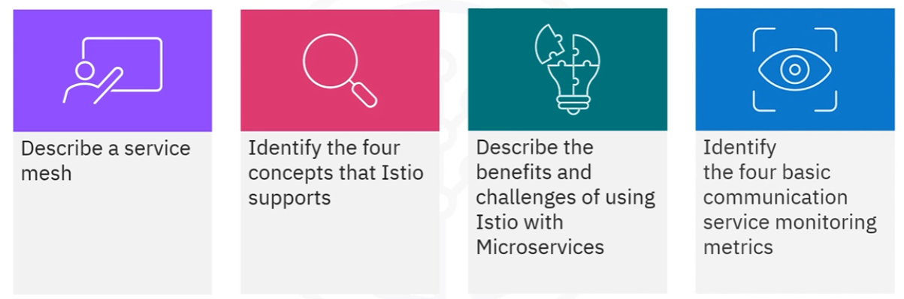
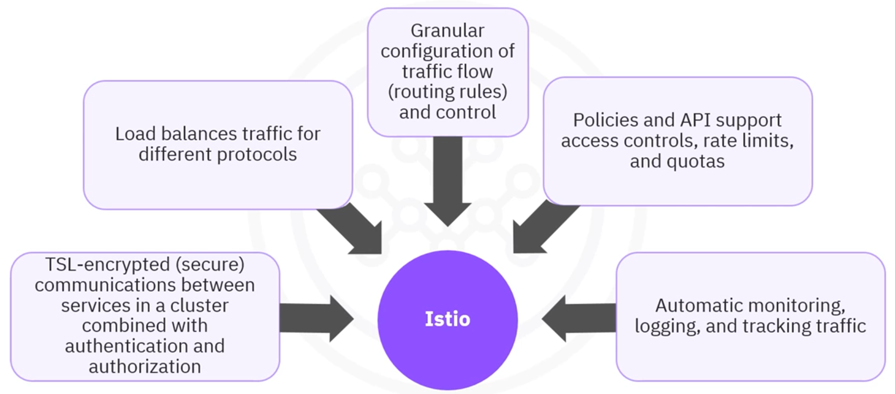
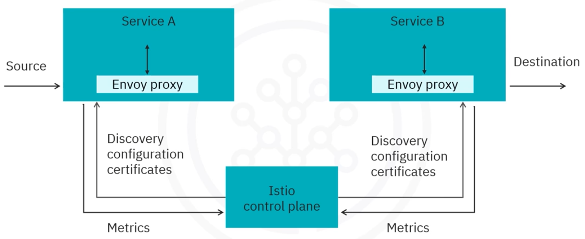
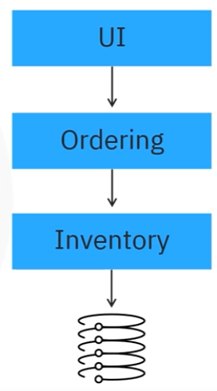
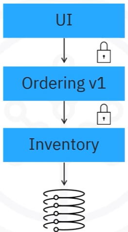
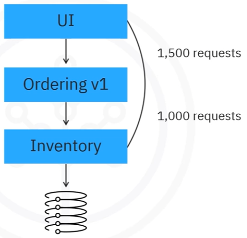

# Module 04 - Section 4 - Istio

## Introduction

By the end of this section, you'll be able to:
- Describe what a service mesh is.
- Identify the four core concepts of Istio.
- Discuss the benefits and challenges of using Istio with microservices.
- Recognize the four essential service monitoring metrics supported by Istio.

---

## What is a Service Mesh?

A **service mesh** is a dedicated infrastructure layer designed to make service-to-service communication:
- **Secure**
- **Reliable**

A service mesh offers several key features:
- **Traffic Management**: Controls traffic flow between services.
- **Security**: Encrypts traffic between services.
- **Observability**: Provides visibility into service behavior to troubleshoot and optimize applications.

In short, a service mesh creates a software layer that ensures:
- Reliable traffic control.
- Secure communication.
- Better insight into service interactions and performance.

---

## Introduction to Istio

**Istio** is a platform-independent service mesh commonly used with **Kubernetes**. It provides the following core functionalities:

1. **Traffic Control**: Manages service interactions in scenarios like canary deployments and A/B testing.
2. **Security**: Provides authentication, authorization, and encryption for secure service communication.
3. **Policy Enforcement**: Ensures policies are applied consistently across services.
4. **Observability**: Offers tools for monitoring traffic flow, tracing dependencies, and collecting performance metrics (e.g., latency, errors).

### Key Features of Istio

- **Transport Layer Security**: Encrypts communication between services in the cluster.
- **Load Balancing**: Supports load balancing for multiple protocols (HTTP, TCP, gRPC, WebSocket).
- **Traffic Management**: Implements routing rules with retries, fault injections, and automatic failovers.
- **Access Control**: Provides API support for access controls, rate limits, and quotas.
- **Monitoring & Logging**: Automates traffic monitoring, logging, and tracking for inbound and outbound traffic.

Istio integrates seamlessly with Kubernetes and can extend the mesh to additional clusters or virtual machines outside Kubernetes.

---

## How Istio Works

Istio operates through two main components:
1. **Control Plane**: Manages the overall configuration and updates to the proxy servers.
2. **Data Plane**: Handles communication between services, ensuring secure, reliable interactions.

In the absence of a service mesh, the network cannot easily identify traffic types, sources, or destinations, which can lead to inefficient communication. Istio solves this by using the **Envoy proxy**, which intercepts network traffic and applies desired configurations and policies.

---

## Microservices with Istio

Microservices, a foundational element of cloud-native architectures, benefit significantly from Istio’s features.

### Microservices Architecture
- Microservices are small, independently deployable components of an application.
- Each service communicates via well-defined APIs.
- **Benefits** include:
  - Independent scaling and updates for each service.
  - Flexibility in using different technology stacks for each component.
- **Challenges** include:
  - Traffic encryption between services.
  - Managing deployments (e.g., canary deployments, A/B testing).
  - Handling cascading failures, where one slow or failing service can affect others.

As service-to-service communication becomes more complex, a service mesh like Istio improves management, security, and observability.

---

## Istio Capabilities

### Traffic Management

**Istio** supports traffic shifting, enabling gradual traffic migration between microservice versions.

For example, a team working on the **Ordering microservice** might initially route 5% of traffic to a new version, then gradually increase it to 50%, and eventually 100%.

This gradual process can be used for canary deployments and A/B testing, ensuring that any new features or versions increase engagement or performance before full roll-out.

### Security

Istio provides robust security measures for microservices, including:
- **Encryption**: Defends against man-in-the-middle attacks by encrypting traffic between services.
- **Access Control Policies**: Restricts communication between services. For instance, the **UI service** cannot communicate directly with the **Inventory service**, even if an attempt is made.

### Observability

Istio provides essential metrics for service monitoring, including:
- **Latency**: Measures the time taken to respond to requests.
- **Traffic**: Shows the number of requests each service handles.
- **Errors**: Identifies any failures in service interactions.
- **Saturation**: Measures how well the system is utilizing resources.

Example metrics include request counts and response times, helping to identify bottlenecks and ensure optimal performance.

---

## Conclusion - Recap

- A **service mesh** manages service-to-service traffic, ensures secure communication, and provides observability.
- **Istio** supports four key concepts: **Connection**, **Security**, **Policy Enforcement**, and **Observability**.
- Istio is commonly used with microservices architectures for traffic management, security, and service monitoring.
- Istio provides metrics such as latency, traffic, errors, and saturation to enhance monitoring and troubleshooting.

---