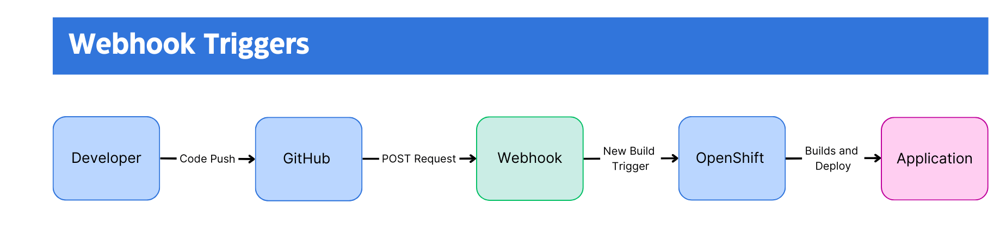
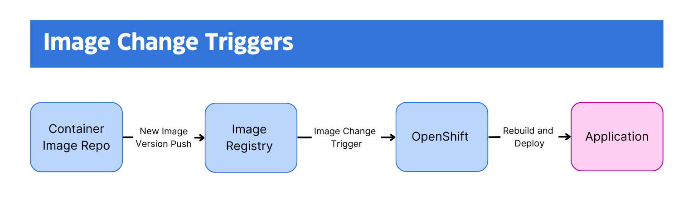

# Module 04 - Section 3 - Reading: Automating Builds with Build Triggers in OpenShift

## Objectives
After completing this reading, you will be able to:
- Understand the concept and importance of build triggers in OpenShift.
- Identify and describe the different types of build triggers available in OpenShift.
- Explain how webhook triggers work and their key features.
- Describe the process and benefits of image change triggers.
- Understand the functionality and advantages of configuration change triggers.

---

## Introduction to Build Triggers
In OpenShift, build triggers are essential for automating the build process, ensuring that applications are continuously updated and built efficiently. This reading will explore the different types of build triggers available in OpenShift, explaining each trigger in detail and how they contribute to a streamlined build process.

## Understanding Build Triggers
Build triggers in OpenShift are mechanisms that automatically initiate a build process based on specific events or conditions. By using these triggers, developers can automate and simplify the process of updating and deploying applications, leading to faster development cycles and reduced manual intervention.

---

## Types of Build Triggers
OpenShift offers several types of build triggers, each designed to respond to different events or changes in your environment. The main types of build triggers are:
- Webhook Triggers
- Image Change Triggers
- Configuration Change Triggers

### 1. Webhook Triggers
Webhook triggers are a powerful feature that allows builds to be initiated via HTTP requests. These triggers are commonly used to integrate with external systems, such as GitHub, to automate builds based on specific repository events.

#### How Webhook Triggers Work
When a webhook trigger is configured, it sets up an endpoint in OpenShift that listens for HTTP POST requests. For instance, GitHub can be configured to send a request to this endpoint whenever a new commit is pushed to a repository, a pull request is merged, or other specified events occur. This request triggers the build process in OpenShift, ensuring that the latest code changes are automatically built and deployed.

#### Key Features
- **Integration with Git Repositories:** Supports triggers from popular repositories like GitHub, GitLab, and Bitbucket.
- **Event-Driven:** Initiates builds based on various events such as commits, merges, or tag creations.
- **Flexibility:** Supports both generic and GitHub-specific webhooks, making it versatile for different use cases.

#### Example Workflow

Below is a basic workflow diagram illustrating how a GitHub webhook trigger operates:

- A developer pushes new code to the GitHub repository.
- GitHub sends a POST request to the OpenShift webhook endpoint.
- The webhook triggers a new build in OpenShift.
- OpenShift builds the application and updates the deployment.

---

### 2. Image Change Triggers
Image change triggers automatically initiate builds when a new version of a container image becomes available. This type of trigger is particularly useful for maintaining up-to-date applications with the latest dependencies or security patches.

#### How Image Change Triggers Work
When an image change trigger is set up, it monitors a specified container image for updates. For example, if your application relies on a Node.js base image, an image change trigger can be configured to detect updates to this base image. When a new version of the image is available, the trigger initiates a build process to incorporate the updated image into your application.

#### Key Features
- **Automated Dependency Management:** Ensures that applications are automatically rebuilt with the latest base images or libraries.
- **Security and Maintenance:** Helps in quickly responding to security vulnerabilities by initiating builds with updated base images.
- **Continuous Updates:** Keeps applications up-to-date with the latest changes in dependent images.

#### Example Workflow

Here is a simple workflow diagram illustrating how an image change trigger functions:

- A new version of the base image (e.g., Node.js) is pushed to the image registry.
- The image change trigger detects the update.
- OpenShift initiates a new build process using the updated base image.
- The application is rebuilt and redeployed with the latest image.

---

### 3. Configuration Change Triggers
Configuration change triggers initiate builds when a new BuildConfig resource is created or an existing one is modified. These triggers allow builds to automatically reflect changes in the build configuration, such as updates to source code repositories or changes in build strategies.

#### How Configuration Change Triggers Work
Configuration change triggers monitor the BuildConfig resources in OpenShift. Whenever a new BuildConfig is created or an existing one is updated, the trigger automatically starts a new build. The triggers ensure that any changes in the build configuration are immediately applied to the application, keeping it in sync with the latest configuration settings.

#### Key Features
- **Automatic Build Updates:** Ensures builds reflect the latest configuration changes without manual intervention.
- **Simplified Configuration Management:** Helps in managing and applying build configurations efficiently.
- **Flexibility:** Allows for a wide range of configuration changes to trigger builds, such as updates to source repositories, build strategies, or output settings.

#### Example Workflow

Below is a basic workflow diagram showing how a configuration change trigger operates:

- A new BuildConfig resource is created or an existing one is updated.
- The configuration change trigger detects the change.
- OpenShift initiates a new build process based on the updated BuildConfig.
- The application is rebuilt and redeployed with the new configuration.

---

## Conclusion
Build triggers in OpenShift provide a robust mechanism for automating the build and deployment process. By using webhook, image change, and configuration change triggers, you can ensure that your applications are continuously built and updated based on the latest changes and events. This automation leads to more efficient development cycles, quicker response times to updates or issues, and reduced manual overhead, ultimately contributing to a more streamlined and reliable development workflow.
