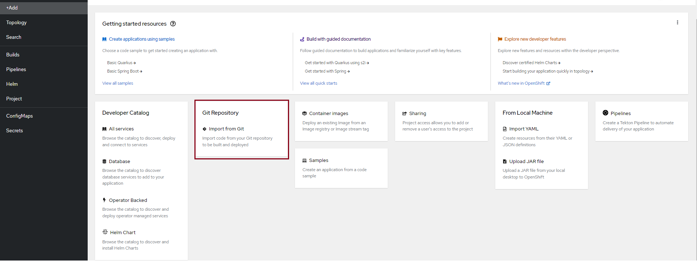
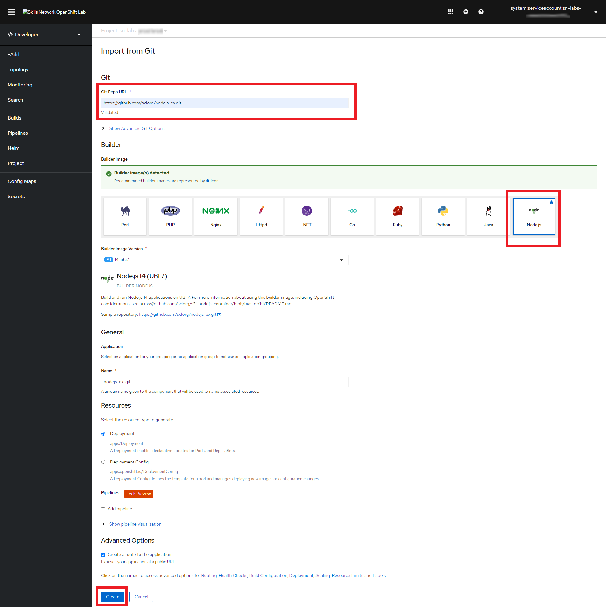
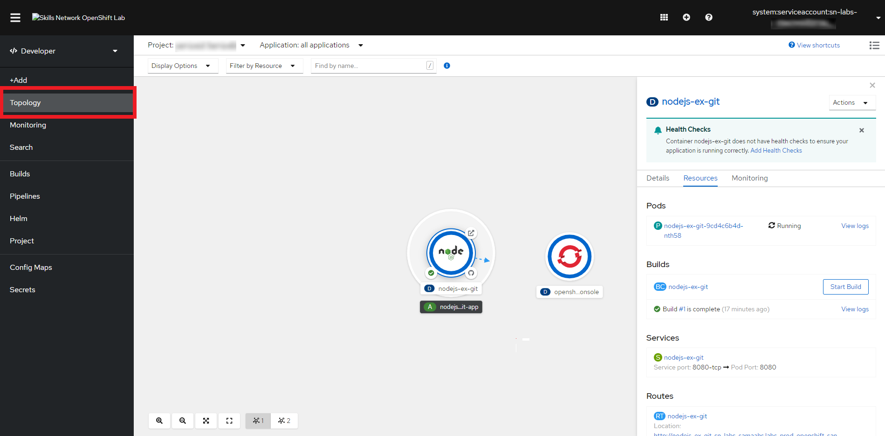

# 04 - Deploy an application in the web console

The Developer perspective provides workflows specific to developer use cases, such as the ability to create and deploy applications. Let's start here! You are likely in the “Topology” view, which provides a visual representation of applications. If not, switch to it to take a look.

1. Let us add a new application to this project. There are several ways to add a new application in Openshift.
2. Click the +Add button to add a new application.
3. Select **Git Repository (Import from Git)** among the options.

   

4. You will be redirected to **Import from Git** window. OpenShift will deploy an application using only one input from you: the application source.
5. In the **Git Repo URL** box, paste the sample one mentioned below.

    ```shell
    https://github.com/sclorg/nodejs-ex.git
    ```

    In the Builder section, scroll down to see the various builder images. We shall be using the Node.js image for our application. Ensure that this image has been selected.

   

6. Keep the rest of the default options as they already are. Then scroll down and click **Create**.

   In the Topology view, you should now see your newly created application.

   > NOTE: It will take several minutes for the application to appear. Refresh the browser if within 3 minutes, you don't see any application.

   

