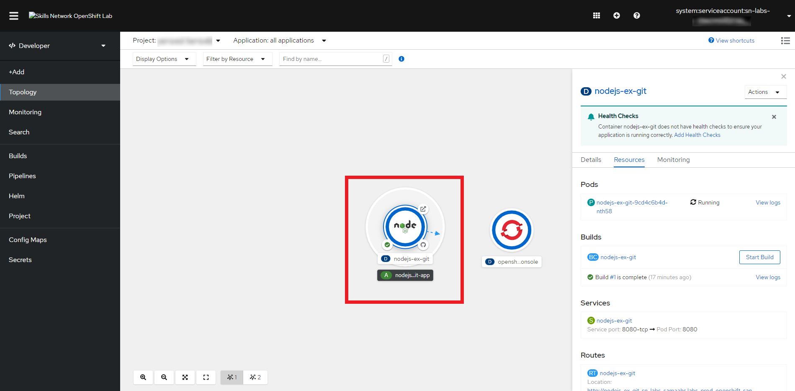
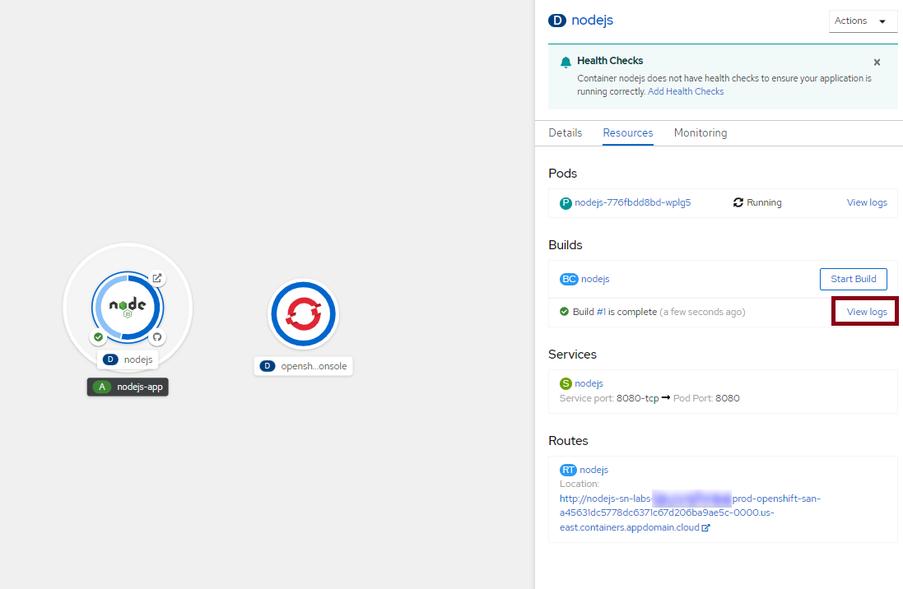
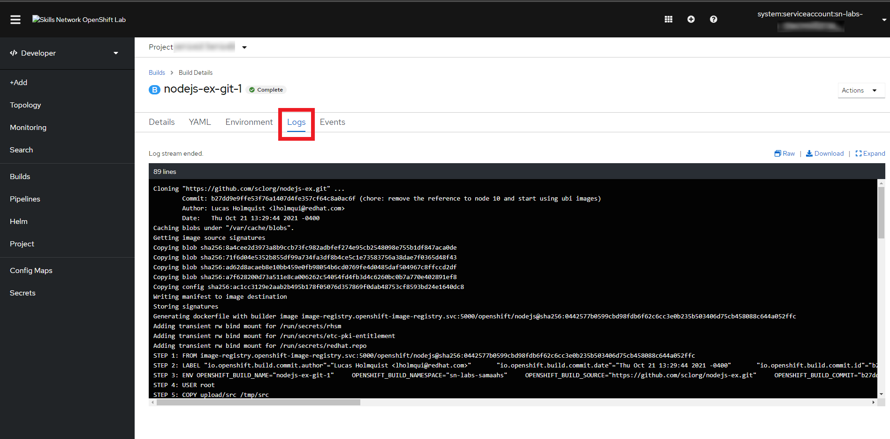
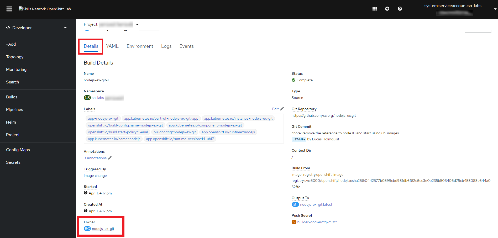
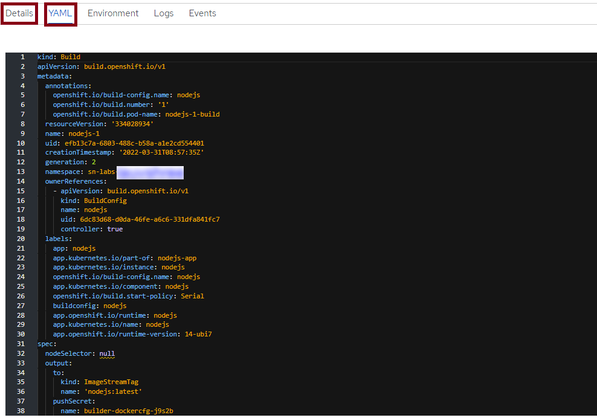
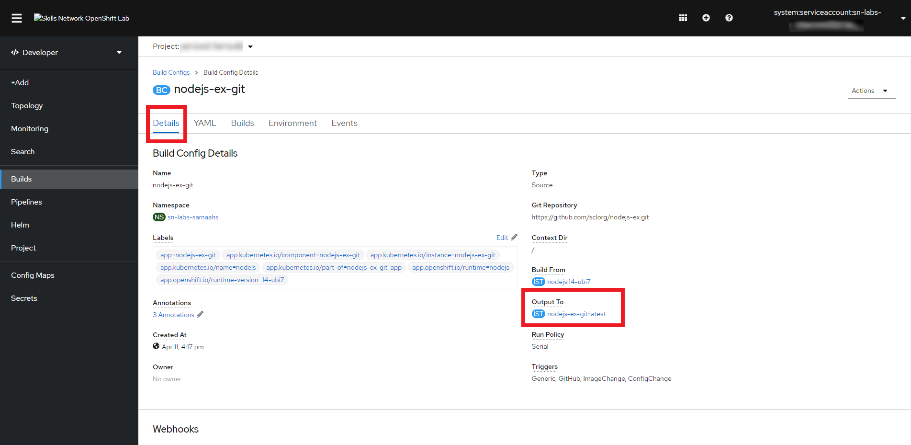
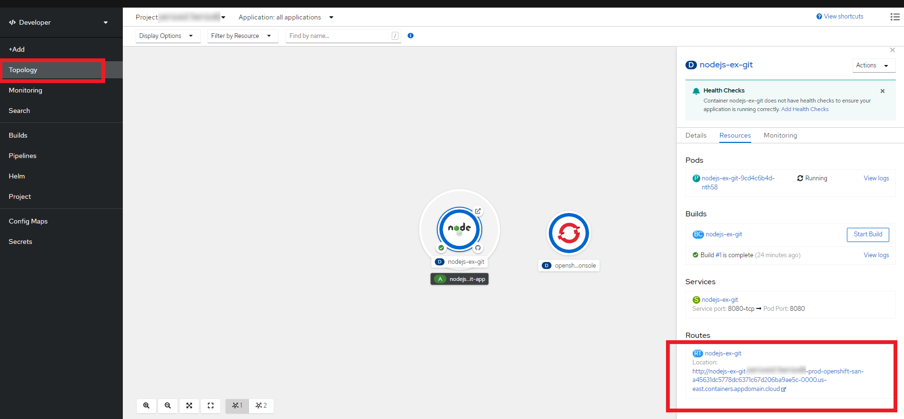

# 05 - View application in the web console

The Topology view provides quick links to a lot of important parts of an application:

* The outer circle gets the information on the application.
* The inner circle with the Node.js logo gives information about the Deployment.
* The GitHub icon is used to access the code repository.
* The check mark shows the most recent build (you will see circular arrows if the build is in progress).
* The arrow coming out of a box can be used to view the application in the browser if the application is externally available.

Let's try some specific steps:

1. Click the inner circle with the Node.js logo to bring up information on the Deployment and observe the four resources associated with this Deployment: a Pod that runs the containerized application; a Build that uses the s2i strategy to build the application into a container image; a Service that exposes the application as a network service; and a Route that provides an externally reachable hostname.

    
    > Note: Please wait for status of the pod to change to 'Running' and for the Build to complete.

2. Click **View logs** on the line that says **Build #1**.

    
   
3. Read the logs to see a few key completed steps. The repository is cloned, a Dockerfile is generated, an image is built, and the image is pushed to the internal registry.

   

4. Click the Details tab for this Build.

5. And then click the link under Owner (at the very bottom) that says BC (Build Config).

   

6. If you look at the **Details** and **YAML** tabs, you'll see many concepts that we talked about in this module: triggers, build strategy, webhooks, and more.
    

7. On the **Details** tab, click the link under **Output To** that says IST (ImageStreamTag).

8. You can now see the ImageStreamTag that was created as an output of the build. Click the History tab to see the image in the internal registry to which this ImageStreamTag points.
   

9. Return to the Topology view and click on your Deployment info. Click the Route that OpenShift automatically created for you. This will open the application in the browser.

   > Note: Please note down this URL as it will be used in the next section
   
