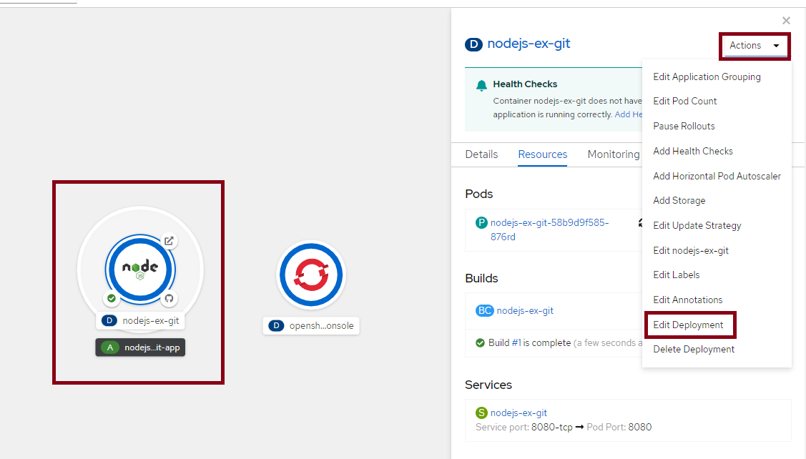
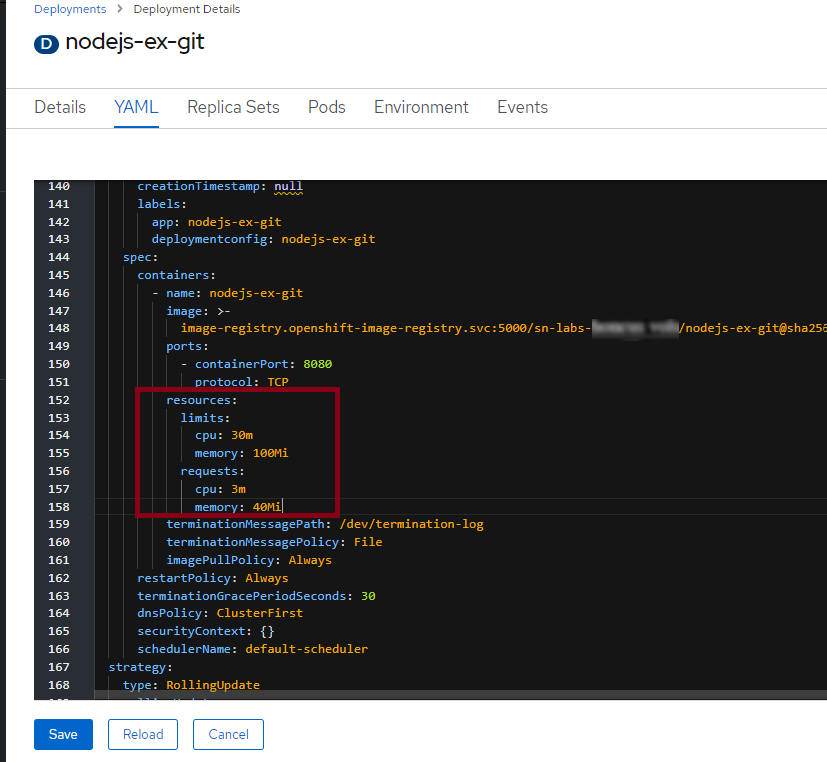
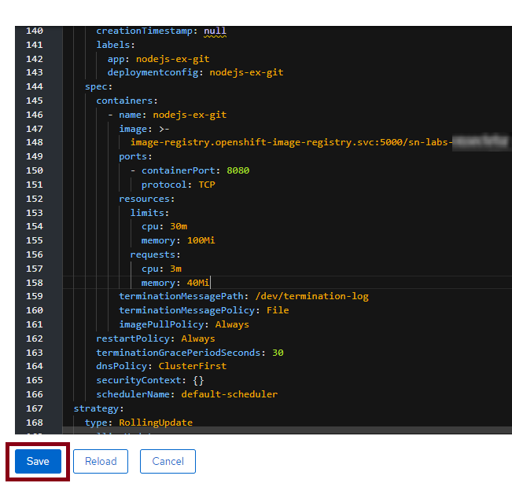
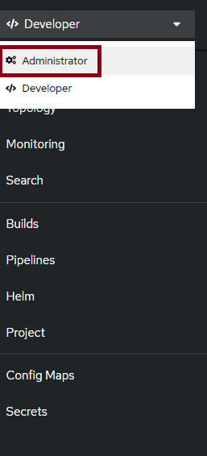
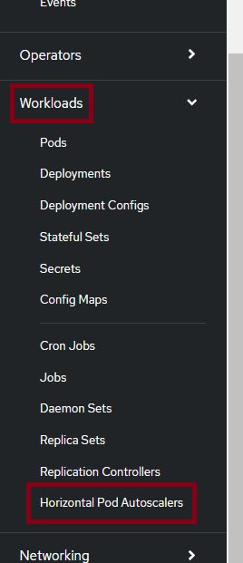
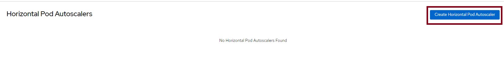
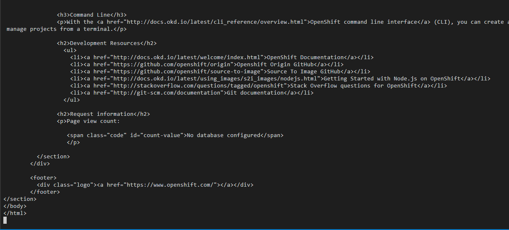
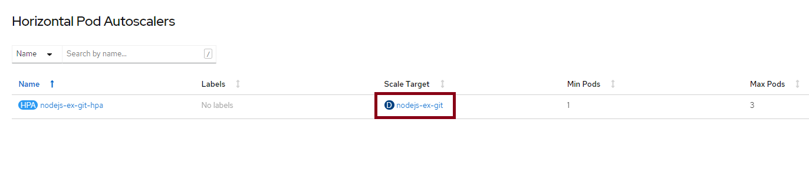
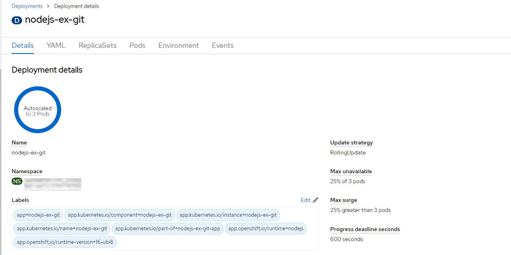

# 06 - Autoscaling the nodejs-ex-git application

Now that the `nodejs-ex-git` app is successfully up and running, let's set up a horizontal pod autoscaler (HPA) so that it can handle any load that comes its way. 
Make sure to keep the `nodejs-ex-git` app open in a browser tab so that it continues to make requests and consume resources so that it can be successfully autoscaled.

First, we need to set resource requests and limits for the containers that will run. If a container requests a resource like CPU or memory, Kubernetes will only schedule it on a node that can give it that resource. On the other hand, limits prevent a container from consuming more than a certain amount of a resource.

In this case, we're going to request 3 millicores of CPU and 40 MB of RAM. We'll limit the containers to 30 millicores and 100 MB. These numbers are contrived in order to ensure that the app scales.

1. From the Topology view, click the `nodejs-ex-git` Deployment. Then click Actions > Edit Deployment.

    

2. In the template.spec.containers section, find resources: {}. Replace that with the following text. Make sure the spacing is correct as YAML uses strict indentation.

    ```shell
    resources:
      limits:
        cpu: 30m
        memory: 100Mi
      requests:
        cpu: 3m
        memory: 40Mi
    ```
    

3. Click Save.

    

4. Switch to the Administrator perspective.
    

5. Select Workloads > Horizontal Pod Autoscalers

    

6. Click Create Horizontal Pod Autoscaler

    

7. Paste the following YAML into the editor

    ```shell
    apiVersion: autoscaling/v2
    kind: HorizontalPodAutoscaler
    metadata:
      name: nodejs-ex-git-hpa
    spec:
      scaleTargetRef:
        apiVersion: apps/v1
        kind: Deployment
        name: nodejs-ex-git
      minReplicas: 1
      maxReplicas: 3
      metrics:
        - type: Resource
          resource:
            name: cpu
            target:
              type: Utilization
              averageUtilization: 10
   ```
    This HPA indicates that we're going to scale based on CPU usage. Generally you want to scale when your CPU utilization is in the 50-90% range. For this example, we're going to use 10% so that the app is more likely to need scaling. The minReplicas and maxReplicas fields indicate that the Deployment should have between one and three replicas at any given time depending on load.

8. Click Create

9. Run the below command on the terminal in Theia to increase the load on the nodejs-ex-git and view the Autoscaling:

    `for i in `seq 1000`; do curl -L <your app URL>; done`
    > Note: Replace <your app URL> with the URL that you obtained in Step 9 of the previous section.
    
   
    The command will keep giving an output as below indicating successful load generation:

    > Note: You can also verify autoscaling by directly executing your app URL in your browser. Add some fruit names along with their quantities on the application UI, and click 'Save'. Although the added fruits may not appear on the UI, this action will trigger a load change, causing the pods to autoscale to 3 after some time.

10. Click on nodejs-ex-git under Scale Target.
   

11. If you wait, you'll see both Current Replicas and Desired Replicas become three. This is because the HPA detected sufficient load to trigger a scale up to the maximum number of Pods, which is three. You can also view the Last Scale Time as well as the current and target CPU utilization. The target is obviously 1% since that's what we set it to. Note that it can take a few minutes to trigger the scale up.
   


Wow! OpenShift did some pretty incredible work on your behalf. All it needed was a code repository and it was able to build the code into a container image, push that image to a registry, create a Deployment that references that image, and also expose the application to the internet with a hostname.
